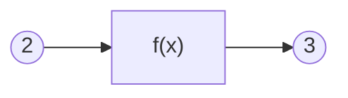

# 什么是函数

什么是函数？不同的领域有许多不同的定义。

在数学中，函数的传统定义是这样的：

> 在一个变化过程中，设有两个变量x、y，如果对于任意一个x都有唯一确定的一个y和它对应，那么就称x是自变量，y是x的函数。

而函数的近代定义是这样的：

> 设A，B是非空数集，如果按照某种确定的对应关系f，使得对于集合A中的任意一个数x，在集合B中都有唯一确定的数y和它对应，那么就称映射f：A->B为从集合A到集合B的一个函数，记作y=f(x)。

多元函数的定义是这样的：

> 设D为一个非空的n元有序数组的集合，f为某一确定的对应规则。若对于每一个有序数组(x1,x2,...,xn)∈D，通过对应规则f，都有唯一确定的实数y与之对应，则称对应f为定义在D上的n元函数

计算机科学中函数的定义是这样的：

> 计算机的函数，是一个固定的程序段，或称其为一个子程序，它在可以实现固定运算功能的同时，还带有一个入口和一个出口，所谓的入口就是函数所带的各个参数，我们可以通过这个入口，把函数的参数值代入子程序，供计算机处理；所谓出口，就是指函数的函数值，在计算机求得之后，由此口带回给调用它的程序。

我们不难发现，函数是一种极其抽象的概念。

传统与近代的函数定义分别从运动与映射的角度认识函数。多元函数将函数的定义域扩展到了向量。

此外，数学中还有泛函与算子的概念，可以实现函数与数的映射，函数与函数的映射……

计算机科学中的函数可以具备内部状态，还能完成特定功能。数学中无内部状态的抽象函数，在计算机科学中被称为“纯函数”。

为什么它们都是函数？函数的本质特征是什么？我们需要以更加简单的角度认识函数，抓住不同函数概念共有的特征。

也许你已经注意到了，函数的定义非常强调函数的“唯一确定性”。对于一个自变量的值，函数必须给出一个唯一确定的值，才能称之为函数。

例如在平面直角坐标系中，一个以原点为圆心的圆解析式是 $x^2+y^2=r^2$ 。这个解析式，只能称其为圆的方程，而不是圆的函数。因为对于每个 $x∈(-r,r)$ ，都有两个y与之对应，不满足唯一确定性。

唯一确定性是我们认识函数的关键。

例如 $y=x+2$ 是一个函数。如果代入x=1，便得到y=3。函数的唯一确定性意味着，不管何时何地何种环境，只要把1代入x，总能得到3，不会得到其它的值。

函数是可重复使用的黑箱。x是自变量，也即函数的输入。y是因变量，也即函数的输出。对相同的输入，函数总能给出相同的输出，与其它任何条件无关。

如图所示，函数是中间的黑箱部分，具有输入输出的接口。

可见，**函数具备三个最基本的要素：输入、输出、处理。**