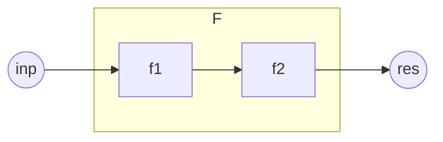

# 命令也是一种函数

命令也是一种函数。

在命令执行前，世界中与之相关的因素看作是命令的输入(包括随机种子等所有因素在内)，那么命令就会有确定的处理，最后得到一个确定的命令执行后的mc世界的状态。

例如：`scoreboard players add n int 1`，这条命令接收执行前的记分板分数`<n,int>`作为输入，进行+1处理，输出到记分板分数`<n,int>`。再例如：`kill @e[type=sheep]`，这条命令接收执行前已加载区块中全部活着的羊作为输入，对这些羊的血量(Health)进行置0的处理，输出到活着的羊的血量。

::: details 对int的说明

int将会是本书最常用的记分板。我们对int的定义如下：

1. 对于命名是一个整数的虚拟玩家，它们的int值是对应整数值。例如`<2,int>`;的值是2，`<-1,int>`的值是-1。
2. 对于其它命名的虚拟玩家，它们的int用于表示记分板形式的临时对象。其中，命名中含有子字符串"temp"的称为临时分数。临时对象与临时分数的概念将在本章<命令处理>部分进行详细介绍。
3. 由于玩家名就是虚拟玩家名，必然属于以上情况之一，故玩家在int上的值不作定义。
4. 对于处于实体组中的实体，如果它有自己的上级实体，首先它不是玩家。那么它的int定义为自己的上级实体编号(一般是id记分板)。实体组与上级实体的概念将在<数理计算>章节进行详细介绍。
5. 对于其它非玩家实体，它们的int可以定义为自己最重要的整数数据，也可以留空。例如粒子实体的int可以定义为自己的存在时间。

:::

:::details 对kill命令与@e选择器的说明

读者对kill命令与@e选择器，应该已经有了比较通俗的理解：kill的作用是“清除”实体，而@e的作用是选择全部实体。那么，为什么笔者在上文的清除绵羊一例中要进行繁琐的叙述呢？主要是为了严谨考虑。现在，我们需要更加深入地了解这两个概念。

1. @e不一定是全部实体。
   - ①血量为0的红体状态生物无法被@e选中。
   - ②非生物实体被kill命令作用后被标记，无法被@e选中。
   - ③处于未加载区块中的实体无法被@e选中。

    使用@s、@a等选择器可以选中以上三种情况。
    而直接使用UUID表示法只能选中①情况实体。
2. kill不一定能清除实体。
   - ①如果是生物实体，kill的作用相当于把血量置0，如果此时利用@s选中生物，把Health重新回升，可以实现生物复活。否则生物将在红体时间结束后被真正清除。
   - ②如果是非生物实体，kill的作用相当于把实体作标记，使其无法被@e选中，并在下1tick之前被清除。这期间，没有手段使实体复活，但在kill命令执行后，仍然可以在同一个函数内使用@s选择器选中该实体，在清除之前对其进行操作。

:::

因此可以说，**命令具备函数的基本要素(输入、输出、处理)**。我们将在本章<命令函数的基本要素>部分详细介绍命令的输入输出与处理。

另外，mcfunction是命令体系中重要的组成部分，也是更为特殊的函数。它允许将多条命令写到同一个文件中，并依次执行。调用mcfunction的命令是function。前文已经论述，命令是一种函数，又因为function是一种命令，所以function也是一种函数。这说明，借助mcfunction我们可以将多条命令合成为一个新的函数。下图中的模型可以阐释该原理：

图中f1和f2是基本的命令函数，f1的输出即为f2的输入。F同样可以看成一个具有输入与输出的黑箱结构，而f2(f1())即为F确定的处理规则。因此，F具备了函数的基本要素，它是一个复合函数。

因此可以说，命令函数不仅具备函数的基本要素，**命令函数之间还可以通过一定的组织方式复合为新的函数。** 我们将在本章<命令函数的组织方式>部分进行详细介绍。

本节完。