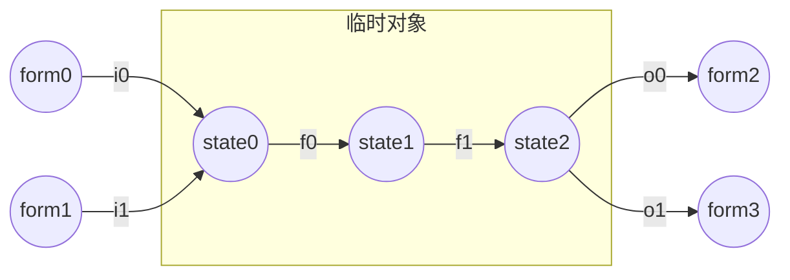

# 临时对象

## 命令处理

本节我们介绍命令中最基本的处理方式。“临时”是命令处理的核心思想。在命令中，同一类型的数据可能会存在许多不同的形式，其中一些形式是用于储存而非运算的，而另外一些形式是便于我们运算的。例如对于坐标这种类型的数据，它的形式可能是实体的Pos标签，可能是执行方式中的执行坐标，也可能是以记分板表示的小数。

在命令处理中，我们通常需要将储存形式通过转换操作变成临时的运算形式，再进行处理，最后将处理完成的运算形式转换成所需的储存形式。下面的模型图可以阐释这个理论：



这里需要注意将这个模型图与我们之前的函数模型图区分。在函数模型图中，节点是函数，数据沿着箭头流动。但在命令处理模型图中，圆节点是不同的数据形式，圆节点之间转换的方块节点才是函数。i0、i1函数将储存形式form0、form1转换成了易于运算处理的临时对象初始形式state0；f0和f1是针对临时对象编写的状态转移函数，它们将临时对象从初始的state0状态转移到了处理完成的state2状态；o0、o1函数将临时对象形式的state2转换到了输出所需的储存形式form2、form3。

由此，我们可以引出本节最为重要的两个概念：形式转换网与临时对象。i0、i1、o0、o1函数以及它们连接的数据形式形成的网络称为形式转换网。数据state0、state1、state2与状态转移函数f0、f1的有机组合称为临时对象。也就是说，**临时对象是易于处理的运算形式**，而**形式转换网是将其它形式与临时对象形式进行相互转化的转换函数网络**。

## 临时对象

分类：

* 临时分数
* 临时nbt
* 临时实体
* 临时物品
* 临时方块
* 世界实体
* 广义临时实体
* 广义临时对象

临时分数：用记分板分数表示的数值类型临时对象。本书中，我们使用含有子字符串"temp"的虚拟玩家在记分板int上的分数来表示一个临时分数。例如：`<tempx,int>,<templ,int>,<temp_id,int>,<temp,int>`。就像输入输出形式那样，小数数值的临时分数需要事先规定好一个倍率例如1k。由此可以看出，**临时对象类型的定义不仅包含mc中存在的表示形式，还包含人为的规定，相同表示形式但人为规定不同的形式不能认为是同一类型。**

\#例1：将输入的整数类型nbt转化为临时对象后进行+1处理返还

```mcfunction
execute store result score temp int run data get storage math:io input
scoreboard players add temp int 1
execute store result storage math:io input int 1 run scoreboard players get temp int 1
```

由于**记分板运算命令的返回值是运算结果**，我们通常做以下简化处理

```mcfunction
execute store result score temp int run data get storage math:io input
execute store result storage math:io input int 1 run scoreboard players add temp int 1
```

在这个例子中，临时分数充分展现了它易于运算的特性。但是，我们是不是非借助临时分数进行运算不可呢？其实不然，看下面的例子：

```mcfunction
execute store result storage math:io input int -1 run data get storage math:io input -1.0001
```

这条命令巧妙地利用倍率与向下取整的性质，直接在原nbt上实现了一定范围内的加1运算，并没有借助临时分数。不过，目前没有证据显示这样做对性能有优化作用，所以在命令的可读性方面考虑，我们不推荐这种写法。在实际开发中，利用倍率实现乘法运算是更为正常的做法：

\#例2：绕开临时分数，直接对浮点数进行乘10运算

```mcfunction
execute store result storage math:io input double 0.001 run data get storage math:io input 10000
```

另外，请读者思考：把浮点数乘10，用以下命令是否可行？命令的返回值是一种什么类型的数据？

```mcfunction
execute store result storage math:io input 10 run data get storage math:io input
```

利用临时分数进行数值运算的理论，我们将在<数值运算基础>这一章进行深入讲解。

临时nbt：用storage表示的临时对象，其数据通常具有复杂的层次或顺序结构。本书中，我们使用在storage math:io中带有子字符串"temp"的标签表示一个临时nbt，例如：storage math:io temp_cmp，storage math:io temp_list等。

\#例：交换输入的两项nbt

```mcfunction
data modify storage math:io temp set from storage math:io input[0]
data modify storage math:io input[0] set from storage math:io input[1]
data modify storage math:io input[1] set from storage math:io temp
```

利用临时nbt进行数据处理的理论，我们将在<数据处理基础>这一章进行深入讲解。

临时实体：使用tag对实体进行指代，表示一个实体类型的临时对象。本书中，我们使用带有子字符串"tmp"的标签指代一个临时实体，例如@e[tag=tmp,limit=1]。注意本书中对“临时”的缩写习惯，使用了两种不同的表示：temp、tmp，而它们的用法有所不同。当被指代的是一个确切的值(例如记分板分数、nbt值)，强调值的可重复属性时(例如不同的变量可能具有相同的值是2)，我们使用temp进行指代；当被指代的是一个对象(通常是一个实体)，强调其独一无二的属性时(例如实体的位置和朝向几乎不可能相同)，我们使用tmp进行指代。这样使用两种不相同的指代方法可以增加不同类型元素的区分度，方便辨别，增加命令的可读性(至少不会一眼望去全是temp了)。

\#例：召唤一只分数level为5的村民

```mcfunction
summon villager ~ ~ ~
scoreboard players set @e[type=villager,limit=1,sort=nearest] level 5
```

在不了解tag指代的情况下，我们可能就会像上面这样做：召唤一只村民，利用选择器参数选择最近的那只村民进行分数赋值。抛开偌长的选择器有失优雅性不谈，这种方法的漏洞也是非常明显的：不同村民位置重合时有误选的风险。不过，利用tag指代进行命令处理，我们可以这样做：

```mcfunction
summon villager ~ ~ ~ {Tags:["tmp"]}
scoreboard players set @e[tag=tmp,limit=1] level 5
tag @e remove tmp
```

就像人工维护输入输出的input和result标签，规定使用前必须移除，我们对临时tmp标签也进行了一种维护：规定使用后tmp必须移除。这样便可以保证，下次使用tmp标签时，世界上不存在其它的tmp标签实体(这是命令处理顺序的单线程导致的)，@e[tag=tmp,limit=1]也就准确地指代了上文的实体，不会出现误选风险。或许读者已经注意到了，前三项基本的临时对象与<人工维护的输入输出>中讲到的三种常用输入输出形式十分相似，有的甚至只有命名上的区别。是的，输入输出形式本质上就是临时对象的一种，它们就是来自"高层"的临时对象。关于输入输出与临时对象的关系，函数层级的概念，以及前文提到的“单线程”一事，我们将在本章<命令函数的组织方式>中的顺序部分进行详细讲解。

临时物品：物品形式的临时对象。在对物品进行处理时，我们便需要引入临时物品。这里，我们使用0 0 0坐标的箱子的0号栏位存放临时物品，使用block 0 0 0 container.0或block 0 0 0 Items[0]即可指代临时物品。

\#例：把玩家手持物品数量修改为64个

```mcfunction
item replace block 0 0 0 container.0 from entity @s weapon.mainhand
data modify block 0 0 0 Items[0].Count set value 64b
item replace entity @s weapon.mainhand from block 0 0 0 container.0
```

此外，利用物品修饰器也是一种处理物品的方法，可以绕开临时物品。不过由于临时物品的操作更加灵活，这里不再介绍物品修饰器法。

临时方块：方块形式的临时对象。在对方块进行处理时，我们需要引入临时方块，另外在对文本进行处理时，我们还需要引入一种特殊的临时方块：告示牌。本书使用0 11 0坐标放置所有的临时方块。为了避免此前的临时方块与当前临时方块id相同导致setblock失败，我们规定使用0 11 0放置临时方块之前首先应在0 11 0放置空气。

\#例1：告示牌解析分数文本，输出到执行者实体的CustomName

```mcfunction
setblock 0 11 0 air
setblock 0 11 0 oak_sign{Text1:'[{"text":"Entity_"},{"score":{"name":"inp","objective":"int"}}]'}
data modify entity @s CustomName set from block 0 11 0
```

当我们输入一个僵尸，输入分数inp int为303，可以发现僵尸的名字变为Entity_303。

:::details 对告示牌作用的说明

告示牌是解析JSON文本的常用手段。

JSON文本除了text之外的其它组件，有很多是需要解析的，例如score、nbtselector。许多JSON文本显示位置无法解析这类组件，例如：CustomName、display.Name、display.Lore，这时我们便需要利用告示牌的解析作用，把解析完成的JSON文本输出到所需位置。

除了告示牌，也可以用战利品表的手段进行JSON文本解析，这里不再介绍。

:::

\#例2：输入两个坐标，把坐标0位置的方块输出到坐标1位置。

```mcfunction
summon marker 0 11 0 {Tags:["tmp"]}
data modify entity @e[tag=tmp,limit=1] Pos set from storage math:io input.pos0
```

我们首先生成一个临时实体用于坐标访问逻辑，把它的坐标设置为坐标0。

```mcfunction
setblock 0 11 0 air
execute at @e[tag=tmp,limit=1] run clone ~ ~ ~ ~ ~ ~ 0 11 0
```

然后利用clone指令把坐标0位置的方块变为0 11 0临时方块。

```mcfunction
data modify entity @e[tag=tmp,limit=1] Pos set from storage math:io input.pos1
execute at @e[tag=tmp,limit=1] run clone 0 11 0 0 11 0 ~ ~ ~
kill @e[tag=tmp]
```

然后我们把临时实体的坐标设置为pos1，用于访问坐标1，把0 11 0临时方块复制到坐标1。最后为了维护以后的临时实体形式的唯一指代性，把当前临时实体清除掉。

世界实体：用于提供坐标访问服务的永驻临时实体。在上一个例子中，我们使用了临时实体进行坐标访问，生成后清除。但是在坐标访问次数非常大的情况下，每次坐标访问都需要summon然后kill一个临时实体，会对性能造成很大的拖累，这是十分不划算的。因此，我们需要引入一个永驻的世界实体，直接使用它进行坐标访问，而无需summon/kill。本书中，我们使用@e[tag=math_marker,limit=1]来指代世界实体。以下为世界实体的维护命令：

```mcfunction
#math_marker
kill @e[tag=math_marker]
summon math_marker 0 11 0 {Tags:["math_marker"],UUID:[I;0,0,0,0]}

#_init
function #math_marker

#tick
execute store result score temp int if entity @e[tag=math_marker]
execute unless score temp int matches 1 run function #math_marker
```

这里之所以在tick中进行math_marker数量的检查，是因为在运行过程中math_marker有进入未加载区块的风险，这时可以在tick中进行自动补充。另外，math_marker的UUID设置为固定值，对性能追求极致的开发者也可以使用UUID直接指代世界实体，节省选择器检索带来的性能浪费。不过，为了可读性考虑，本书还是使用math_marker标签进行指代，在需要节省选择器开销时尽量使math_marker变为执行者实体，使用@s对世界实体进行指代。

有了世界实体后，前面例子中的方块复制函数便可以优化了：

```mcfunction
#block_trans
#传入math_marker为执行者
data modify entity @s Pos set from storage math:io input.pos0
execute at @s run clone ~ ~ ~ ~ ~ ~ 0 11 0
data modify entity @s Pos set from storage math:io input.pos1
execute at @s run clone 0 11 0 0 11 0 ~ ~ ~
```

广义临时实体：多个临时实体，以及全世界全部已有实体组成的整体形式。当命令处理多项数据时，即使是世界上已经存在的与当前处理任务无关的实体，也可以被临时用于记录数据，节省过多的临时实体生成开销。假设当前任务所需临时实体数量为`<n,int>`，我们使用以下命令生成数量为n的广义临时实体(限定为marker类型)：

```mcfunction
#process
execute store result score loop int run tag @e[type=marker] add tmp
execute if score loop int < n int run function #loop0
execute if score loop int > n int run function #loop1
#operations with @e[tag=tmp]...
kill @e[tag=tmp_kill]
tag @e remove tmp

#loop0
summon marker 0 11 0 {Tags:["tmp","tmp_kill"]}
scoreboard players add loop int 1
execute if score loop int < n int run function #loop0

#loop1
tag @e[tag=tmp,limit=1] remove tmp
scoreboard players remove loop int 1
execute if score loop int > n int run function #loop1
```

这里的#loop0和#loop1函数调用了自己，这种技巧我们称之为递归。这种递归我们将在本章<命令函数的组织方式>中<递归>一节中<尾递归>的部分进行讲解。

广义临时对象：任意多个临时对象组合而成的临时对象。一组临时对象可以通过人为规定的约束，组合成新的临时对象。例如：三个临时分数`<tempx,int>,<tempy,int>,<tempz,int>`可以组合为临时坐标这种新的临时对象。再例如：如果我们规定`<particle,int>`是表示粒子类型的临时对象，临时坐标与`<particle,int>`的组合又可表示临时粒子这种广义临时对象。

临时对象的关键属性与属性扩展：

如果一组属性刚好能够完全确定一个临时对象，少了不行，多了不必，那么这一组属性我们称之为临时对象的关键属性。那么理论上，我们把关键属性作为临时对象的表示，就已经获得了临时对象的全部信息，足够进行任何运算处理。例如空间中使用三个坐标`<3vec_x,int>,<3vec_y,int>,<3vec_z,int>`足够确定一个三维向量。

当我们使用关键属性表示临时对象，进行各种各样的运算时，偶尔会发现很多重复出现的非关键属性。例如对三维向量的计算中，我们可能经常在计算过程中使用到它的方向角属性`<3vec_rot0,int>,<3vec_rot1,int>`和长度属性`<3vec_l,int>`。由关键属性计算非关键属性的运算被重复执行，造成了额外的开销。因此，我们需要引入临时对象中属性扩展的概念。

扩展函数：接收以关键属性表示的临时对象作为输入，计算临时对象的非关键属性作为扩展属性，输出完整的临时对象。限制函数：只能接收完整的临时对象作为输入，进行相应处理，得到预期的输出；对于不完整的临时对象输入，输出不定。属性扩展：在进行所需运算前，首先调用扩展函数处理临时对象，再调用限制函数进行相应运算，以省去重复运算，达到节省开销的目的。

此外，关键属性的选取并不是唯一的。还是以三维向量为例，如果我们以直角坐标系的方式来表示一个三维向量，那么我们可以把属性`<3vec_x,int>,<3vec_y,int>,<3vec_z,int>`作为三维向量的关键属性，编写三维向量的方向角与长度扩展函数。如果我们以球坐标系的方式来表示一个三维向量，那么我们可以把属性`<3vec_rot0,int>,<3vec_rot1,int>,<3vec_l,int>`作为三维向量的关键属性，编写三维向量的直角坐标扩展函数。

这里以三维向量作为例子，展示它的两种扩展函数：

```mcfunction
#math:3vec/_ex-xyz
#扩展函数：对3vec进行直角坐标属性扩展
#输入：3vec{<3vec_rot0,int>,<3vec_rot1,int>,<3vec_l,int>}
#输出：3vec{<3vec_x,int>,<3vec_y,int>,<3vec_z,int>,<3vec_rot0,int>,<3vec_rot1,int>,<3vec_l,int>}
#需要传入世界实体为执行者
#获得单位方向向量
execute store result entity @s Rotation[0] float 0.001 run scoreboard players get 3vec_rot0 int
execute store result entity @s Rotation[1] float 0.001 run scoreboard players get 3vec_rot1 int
execute rotated as @s positioned 0.0 0.0 0.0 run tp @s ^ ^ ^1.0

#对单位向量的x分量乘模长得到x坐标
execute store result score 3vec_x int run data get entity @s Pos[0] 10000
scoreboard players operation stemp0 int = 3vec_l int
scoreboard players operation stemp1 int = 3vec_l int
scoreboard players operation stemp0 int /= 10000 int
scoreboard players operation stemp1 int %= 10000 int
scoreboard players operation stemp1 int *= 3vec_x int
scoreboard players operation stemp1 int /= 10000 int
scoreboard players operation 3vec_x int *= stemp0 int
scoreboard players operation 3vec_x int += stemp1 int

#对单位向量的y分量乘模长得到y坐标
execute store result score 3vec_y int run data get entity @s Pos[1] 10000
scoreboard players operation stemp0 int = 3vec_l int
scoreboard players operation stemp1 int = 3vec_l int
scoreboard players operation stemp0 int /= 10000 int
scoreboard players operation stemp1 int %= 10000 int
scoreboard players operation stemp1 int *= 3vec_y int
scoreboard players operation stemp1 int /= 10000 int
scoreboard players operation 3vec_y int *= stemp0 int
scoreboard players operation 3vec_y int += stemp1 int

#对单位向量的z分量乘模长得到z坐标
execute store result score 3vec_z int run data get entity @s Pos[2] 10000
scoreboard players operation stemp0 int = 3vec_l int
scoreboard players operation stemp1 int = 3vec_l int
scoreboard players operation stemp0 int /= 10000 int
scoreboard players operation stemp1 int %= 10000 int
scoreboard players operation stemp1 int *= 3vec_z int
scoreboard players operation stemp1 int /= 10000 int
scoreboard players operation 3vec_z int *= stemp0 int
scoreboard players operation 3vec_z int += stemp1 int
```

```mcfunction
#math:3vec/_ex-rot
#扩展函数：对3vec进行球坐标属性扩展
#输入：3vec{<3vec_x,int>,<3vec_y,int>,<3vec_z,int>}
#输出：3vec{<3vec_x,int>,<3vec_y,int>,<3vec_z,int>,<3vec_rot0,int>,<3vec_rot1,int>,<3vec_l,int>}
#需要传入世界实体为执行者
#获得单位方向向量以及朝向
execute store result entity @s Pos[0] double 0.001 run scoreboard players get 3vec_x int
execute store result entity @s Pos[1] double 0.001 run scoreboard players get 3vec_y int
execute store result entity @s Pos[2] double 0.001 run scoreboard players get 3vec_z int
execute positioned 0.0 0.0 0.0 facing entity @s feet run tp @s ^ ^ ^1.0 ~ ~

#把朝向输出到方向角
execute store result score 3vec_rot0 int run data get entity @s Rotation[0] 1000
execute store result score 3vec_rot1 int run data get entity @s Rotation[1] 1000

#单位方向向量转换为临时分数
execute store result score stempi0 int run data get entity @s Pos[0] 10000
execute store result score stempi1 int run data get entity @s Pos[1] 10000
execute store result score stempi2 int run data get entity @s Pos[2] 10000

#求坐标的绝对值和
scoreboard players operation 3vec_l int = 3vec_x int
execute if score 3vec_x int matches ..-1 run scoreboard players operation 3vec_l int *= -1 int
execute if score 3vec_y int matches 1.. run scoreboard players operation 3vec_l int += 3vec_y int
execute if score 3vec_y int matches ..-1 run scoreboard players operation 3vec_l int -= 3vec_y int
execute if score 3vec_z int matches 1.. run scoreboard players operation 3vec_l int += 3vec_z int
execute if score 3vec_z int matches ..-1 run scoreboard players operation 3vec_l int -= 3vec_z int

#求单位向量坐标的绝对值和
execute if score stempi0 int matches ..-1 run scoreboard players operation stempi0 int *= -1 int
execute if score stempi1 int matches ..-1 run scoreboard players operation stempi1 int *= -1 int
execute if score stempi2 int matches ..-1 run scoreboard players operation stempi2 int *= -1 int
scoreboard players operation stempi0 int += stempi1 int
scoreboard players operation stempi0 int += stempi2 int

#绝对值相除获得模长
scoreboard players operation stemp0 int = 3vec_l int
scoreboard players operation 3vec_l int /= stempi0 int
scoreboard players operation 3vec_l int *= 10000 int
scoreboard players operation stemp0 int %= stempi0 int
scoreboard players operation stemp0 int *= 10000 int
scoreboard players operation stemp0 int /= stempi0 int
scoreboard players operation 3vec_l int += stemp0 int
```

如果是初学命令的读者，不必被上面复杂的运算吓到。这里，我们仅仅是提供一个例子来展现属性扩展的思想，不必关注其中复杂的处理细节。这些复杂的运算处理，我们将在章节<数值运算基础>与章节<数理计算>中深入讲解。