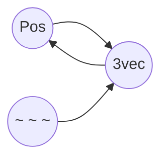

# 形式转换网

转换函数是形式转换网的骨架。在同一个类型的形式转换网络中，假设有n种形式，那么理论上完整的形式转换网应该包括n*(n-1)个转换函数，即每种形式都有到其它形式的直达路径。

但在实际情况中，我们往往不会写出全部的转换函数。理由有两点：一是，不是全部的转换函数都有用，我们可以根据需要只写出部分转换函数；二是，有一些转换函数甚至是不可实现的。我们以三维向量的形式转换网为例子来进行说明：



在这个形式转换网中，n=3，理论上应该有3*2=6个转换函数，然而实际只有3个转换函数。首先，在输入输出章节中，我们提到过，执行方式具有单向传递性，无法作为输出，因此3vec到`~ ~ ~`和Pos到`~ ~ ~`的转换函数不可实现。其次，`~ ~ ~`到Pos的转换函数是单条命令：`tp @s ~ ~ ~`，不需要写成函数文件记录下来。那么，我们就以剩下的三个转换函数作为形式转换网的例子进行展示：

```mcfunction
#math:3vec/_topos
#转换函数：将3vec转换为执行者坐标
#输入：3vec{<3vec_x,int>,<3vec_y,int>,<3vec_z,int>}
#输出：执行者坐标
execute store result entity @s Pos[0] double 0.001 run scoreboard players get 3vec_x int
execute store result entity @s Pos[1] double 0.001 run scoreboard players get 3vec_y int
execute store result entity @s Pos[2] double 0.001 run scoreboard players get 3vec_z int
```

```mcfunction
#math:3vec/_posto
#转换函数：将执行者坐标转换为3vec
#输入：执行者坐标
#输出：3vec{<3vec_x,int>,<3vec_y,int>,<3vec_z,int>}
execute store result score 3vec_x int run data get entity @s Pos[0] 1000
execute store result score 3vec_y int run data get entity @s Pos[1] 1000
execute store result score 3vec_z int run data get entity @s Pos[2] 1000
```

```mcfunction
#math:3vec/_coordto
#转换函数：将执行坐标转换为3vec
#需要传入世界实体为执行者
#输入：执行坐标
#输出：3vec{<3vec_x,int>,<3vec_y,int>,<3vec_z,int>}
tp @s ~ ~ ~
execute store result score 3vec_x int run data get entity @s Pos[0] 1000
execute store result score 3vec_y int run data get entity @s Pos[1] 1000
execute store result score 3vec_z int run data get entity @s Pos[2] 1000
```

# 处理总结

在本章的第三部分，我们讲解了命令处理的两个基本概念：临时对象与形式转换网。由此，我们可以得到命令处理的基本方法：首先将处理的类型进行形式表示与划分；然后找到容易运算的形式作为临时对象，根据临时对象的分类去编写相应的处理函数；最后构造形式转换网，完成临时对象与其它表示形式的转换。

另外，这里还有几点需要注意：

1. 临时对象的选取不定。例如：对点进行数值运算时，临时分数无疑是最佳的运算形式，那么此时我们应该选择临时分数形式作为临时对象；但在对点进行空间几何运算时，`~ ~ ~`与Pos通过facing和tp的运算可能会发挥巨大的威力，那么此时我们应选择这两种形式作为临时对象。对这三种形式的灵活运用将贯彻整个<数理计算>章节。
2. 形式转换函数未必以函数文件的形式存在，也可能是以一段命令的形式存在于某个函数之中(复合函数的理论)。例如，在本部分<临时对象>一节中，对临时分数处理浮点数的讲解中的例1，`<temp,int>`这个临时分数是临时对象，而对nbt输入输出的data get和execute store本质上也是一种形式转换网。

除了基本的命令处理方法以外，本书还会深入讲解在命令中最灵活常用的两种处理：数值运算与数据处理，分别在章节<数值运算基础>与<数据处理基础>。

本节完。