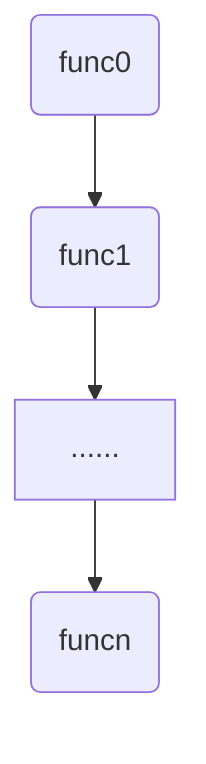
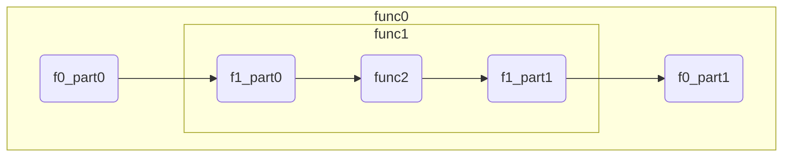

# function构造

## 命令函数的组织方式

在学习了命令函数的基本要素之后，我们可以自己构造一个一个独立的函数。但是想要让这些独立的函数按照我们预期的方式组织起来，组成新的复合函数，我们还需要学习命令函数的组织方式。

根据开发中的经验，我们把组织方式分为四类：顺序、分支、递归、回调。不同的函数依次复合，此所谓顺序；两个或者多个函数形成了分岔路口，在不同的输入下有不同的函数进行复合，此所谓分支；当同一个函数复合了自己，形成了具有自相似性的组织结构，此所谓递归；当函数被作为参数进行传递，在需要的时候调用，此所谓回调。

在mc命令中选择合适的元素，构造以上四种组织方式的框架，是本章第三部分的任务。同时，对于第二部分中命令的基本要素，把它们组织在一起后，可能会出现冲突的现象。探究这些冲突何时会发生，以及如何维护来避免冲突的发生，也是第三部分的重要任务。

## 顺序

顺序是命令函数最常见的组织方式，例如：所有的单条命令都是依次执行的。单条命令总是在一条执行完之后再执行另一条，不存在“同时”的概念(单线程)。因此，命令函数总是依照某种顺序来执行。我们通常使用function与execute遍历两种方法来构造命令函数顺序。

## function构造

在mcfunction文件中，按行依次写下函数f0,f1,f2......fn，运行这个function，将会依次执行f0,f1,f2......fn。设一个自然数i，`i<n`。函数fi+1总是在fi运行完后再运行，且两个函数之间不可能会有其它函数运行。我们称这种顺序为依次执行，模型图如下：



如果funci是一段命令，我们可以把它重新划分成不同的部分，或是放进多个连续mcfunction文件进行重组，或是把许多连续的不同部分合并成一段，都不改变处理规则，整体函数与原函数等价。另外，给两段函数funca和funcb，如果funca的输出与funcb的输入无关，funcb的输出也与funca的输入无关，那么它们还可以交换顺序，改变顺序后整体函数也与原函数等价。

\#例：

```mcfunction
#计算1/l*(pos+uvec)模长平方
scoreboard players operation tempx int += tempi int
scoreboard players operation tempy int += tempj int
scoreboard players operation tempz int += tempk int
scoreboard players operation tempx int /= templ int
scoreboard players operation tempy int /= templ int
scoreboard players operation tempz int /= templ int
scoreboard players operation tempx int *= tempx int
scoreboard players operation tempy int *= tempy int
scoreboard players operation tempz int *= tempz int
scoreboard players operation tempd int = tempx int
scoreboard players operation tempd int += tempy int
scoreboard players operation tempd int += tempz int
```

经过我们交换顺序并重组后：

```mcfunction
#x坐标
scoreboard players operation tempx int += tempi int
scoreboard players operation tempx int /= templ int
scoreboard players operation tempx int *= tempx int

#y坐标
scoreboard players operation tempy int += tempj int
scoreboard players operation tempy int /= templ int
scoreboard players operation tempy int *= tempy int

#z坐标
scoreboard players operation tempz int += tempk int
scoreboard players operation tempz int /= templ int
scoreboard players operation tempz int *= tempz int

#获得模长平方
scoreboard players operation tempd int = tempx int
scoreboard players operation tempd int += tempy int
scoreboard players operation tempd int += tempz int
```

可以看出，我们需要根据命令段的前后逻辑，合理地重组依次执行顺序，在合适的地方加上空行，使命令段具有更好的可读性。

现在我们来探讨输入输出和临时对象在依次执行中的兼容性问题。

对于执行方式表示的输入，由于执行方式具有局部性，每条命令都有属于自己的执行方式，冲突不会发生，完全兼容。

\#例：

```mcfunction
setblock ~ ~1 ~ stone
setblock ~ ~2 ~ glass
```

两条命令都使用了执行方式，输入了不同的坐标，石头的玻璃均被放置在正确的位置。

对于人工维护的输入输出，任意两个函数funci和funcj，如果funci与funcj使用了相同的表示，例如funci在funcj之前，当funci执行结束后再执行funcj，由于输入输出每次使用都被重新赋值(例如tag @e remove input)，与之前的输入输出使用情况无关，因此冲突不会发生，完全兼容。

\#例：

```mcfunction
scoreboard players set inp int 16
function math:_sqrt
scoreboard players get res int

scoreboard players set inp int 64
function math:sqrt/_3sqrt
scoreboard players get res int
```

这里使用了相同的输入形式`<inp,int>`，分别用16和64去调用了两个不同的开根号函数，分别都得到了正确答案4和8000。

对于临时对象形式，任意两个函数funci和funcj，如果funci与funcj的处理使用了相同的表示，例如funci在funcj之前，当funci执行结束后再执行funcj，由于临时对象每次使用要么被重新赋值(例如临时方块的`setblock 0 11 0 air`)，要么被规定在使用完成后清除(例如临时实体的`kill @e[tag=tmp]`)，与之前的临时对象使用情况无关，因此冲突不会发生，完全兼容。

\#例：

```mcfunction
scoreboard players operation temp int = inp0 int
scoreboard players operation temp int += inp1 int
tellraw @a {"score":{"name":"temp","objective":"int"}}

scoreboard players operation temp int = inp2 int
scoreboard players operation temp int += inp3 int
tellraw @a {"score":{"name":"temp","objective":"int"}}
```

这里处理了两组不同的输入`{<inp0,int>,<inp1,int>}`和`{<inp2,int>,<inp3,int>}`，却使用了同一个临时分数temp，分别使用tellraw输出了两组输入的和。

因此，我们得到结论：如果不同的命令函数使用了相同的基本要素表示，在依次执行中完全兼容。

除了依次执行，利用mcfunction，我们还可以在一段命令函数的中间插入另一个函数。例如整段函数是f0，插入的函数是f1，那么f1将f0划分为了三部分：f0_part0,f1,f0_part1。执行f0也即依次执行f0_part0,f1,f0_part1。我们把f0与f1的顺序称为嵌套执行。嵌套执行的模型图如下：



在嵌套模型中，我们探究这两个概念：函数层级，输入输出的本质。

函数层级：我们假设func0函数是直接面向用户的命令环境（例如聊天框、命令方块、tick/load中调用的函数），规定func0函数为0级函数。当i级函数嵌套执行了函数funci+1，那么函数funci+1的层级是i+1。例如在这个模型中func1是1级函数，func2是2级函数。

输入输出的本质：在嵌套模型中我们可以发现，func0将自己中间处理过程中的数据作为输入，调用了func1。而func1用自己中间处理过程中的数据作为输入，调用了func2。总结起来，对于i>0，i级函数的输入是调用自己的i-1级函数的临时对象，而i级函数的输出将会被用作i-1级函数的的临时对象。因此我们说，输入输出的本质是来自高层的临时对象。特别地，对于0级函数，它的输入输出来自于用户(玩家交互与mc世界)。

现在我们来探究输入输出与临时对象在嵌套执行中的兼容性问题。

对于执行方式表示的输入，由于它具有局部性，完全兼容（与依次执行同理，不再论述）。

对于人工维护的输入输出，因为本质是来自高层的临时对象，它们与人工构造的临时对象具有相同的兼容性。由于临时对象具有全局性，那么我们在嵌套了func1的func0函数中，如果使用了与func1或func2中相同表示的临时对象，那么冲突就发生了：f0_part0中使用的临时对象，在func1中被修改，那么在f0_part1中无法继续f0_part0中对临时对象的计算。为了解决这种冲突，我们需要引入一种命名机制来避免临时对象的冲突。在本书中使用的命名机制是s命名法。

s命名法：在n级函数的临时对象命名前加上n-1个字符's'。例如1级函数中使用临时分数`<tempx,int>`，在2级函数中对应`<stempx,int>`，在3级函数中对应`<sstempx,int>`。s意为"support"，底层函数是对高层函数的支持。指的注意的是，由于2级函数的输入输出是来自1级函数的临时对象，因此2级函数的输入输出是一个1级表示：`<inp,int>,<res,int>`。同理，3级函数的输入输出是一个2级表示：`<sinp,int>,<sres,int>`。

s命名法中的"越级上报"现象：高层函数可以直接调用更底层函数，不会引起冲突(例如0级函数调用2级函数)。底层函数可以直接拿取高层函数的数据作为输入，不会因此冲突(例如2级函数可以直接获取玩家数据，而玩家数据属于用户层的0级环境)。