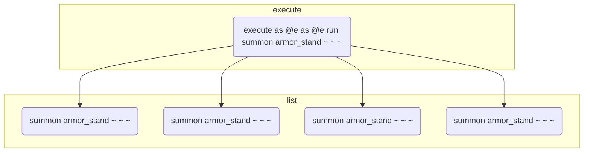
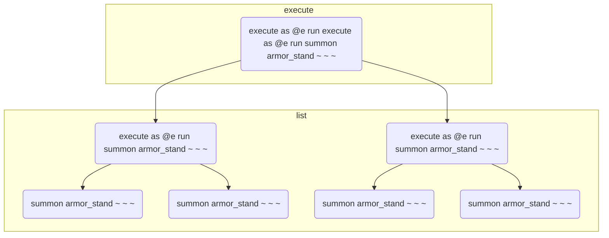

# execute构造

使用execute遍历是另外一种构造命令函数顺序的方法。例如世界上有5个实体，ABCDE(这里默认为选择器未指定sort参数时的实体加载顺序，例如先summon A，那么A会第一个被选择)，使用命令`execute as @e run say hi`可以遍历这5个实体，让它们分别输出hi。那么execute的顺序只是依次执行A say hi , B say hi，C say hi，D say hi，E say hi吗？为了更加深入地理解一条execute的处理顺序，让我们来实现<人工维护的输入输出>例子中引用到的entity:_kill_each_other函数。

```mcfunction
#entity:_kill_each_other
tag @e remove result
execute as @e[tag=input,sort=random] run function entity:kill_another
tag @e[tag=input,limit=1] add result

#entity:kill_another
tag @s add tmp
kill @e[tag=input,tag=!tmp,limit=1,sort=random]
tag @s remove tmp
```

我们让输入池中的实体按随机顺序去执行kill_another函数，而kill_another函数的功能是杀死除自己以外的随机一个输入实体。那么，我们预期会有随机一名实体活下来，把它打上result标签输出。

然而，当我们实际运行后发现，并没有实体活下来。为了解释这种现象，我们需要引入实时解析与预解析的概念。

实时解析：如果A有BC，A结束后立即BC。同理，如果B有DE，B结束后立即DE，那么实际的顺序是ABDEC。我们称ABCDE之间是实时解析的。

预解析：如果A有BC，D有EF，A结束后先是把BC加入一个队列，D结束后又把EF加入队列，AD结束后再依次处理队列中的BCEF，那么实际顺序是ADBCEF。我们称AD相对于BCEF是预解析的。

我们把execute子命令中，右边的子命令看作是左边的子命令的从属，把if/unless、run子命令定义为"可返回子命令"。

在一条execute命令中，最右边的子命令必然是一个可返回子命令。而execute中可能存在的store子命令，它统计的是最右边的可返回子命令的返回值。把store的运行分为两个过程：1.解释store本身的含义，把返回值的去处像标签一样“贴”到最右边的可返回子命令上；2.运行把返回值赋值到去处。

那么一条execute命令的运行过程可以被我们划分为两部分：1.对左边的子命令进行解析，进行执行方式的状态转移，进行条件的判断来中断或继续，进行store含义的解析；2.执行最右边的可返回子命令，将可返回子命令的返回值赋值到store的去处。

我们的结论是：1、2过程中的子命令之间分别是实时解析的，而1过程相对于2过程是预解析的。

那么不难看出，在之前的_kill_each_other函数的execute命令中，所有的实体在预解析过程中都被分配了执行kill_another函数的任务，而此时kill_another函数还未运行，它们全部存活。

预解析的过程结束后，开始执行所有的kill_another函数，即使是已经被kill标记死亡的实体仍然会执行已被分配的kill_another函数任务，随机杀死一个未被标记死亡的实体。如果有n只实体，"随机杀死一个未被标记死亡的实体"，这个过程进行了n次，最终结果也即全部实体被杀死。

我们再举例几个execute的用法，希望读者能够加深对execute运行的理解，并能成功解释它们的运行结果。

\#例1：有n个实体，获取它们的x坐标。

```mcfunction
execute store result score last_x int as @e[sort=furthest] store result score @s x run data get entity @s Pos[0]
```

运行结果：所有实体把自己的x坐标获取到了自己的x记分板，last_x int记分板记录了最远的实体的x坐标。

\#例2：假设两个输入实体位置不同，交换它们的位置。

```mcfunction
execute as @e[tag=input] at @s at @e[tag=input,limit=1,sort=furthest] run tp @s ~ ~ ~
```

运行结果：两实体成功交换位置。读者试分析两个at分别的作用。

\#例3：假设有n个实体位置不同，让它们像环一样转圈。

```mcfunction
#给所有实体编号
scoreboard players set temp int 0
execute as @e store result score @s int run scoreboard players add temp int 1
#目的地是自己的编号+1
execute as @e run scoreboard players operation @s tp = @s int
scoreboard players add @e tp 1
#n号实体的目的地是1
scoreboard players operation @e tp %= temp int
#运行传送
execute as @e at @e if score @s tp = @e[sort=nearest,limit=1] int run tp @s ~ ~ ~
```

运行结果：所有实体到达了目的地。1号实体到了原来2号实体的位置，2号实体到了原来3号实体的位置，......，n-1号实体到了原来n号实体的位置，n号实体到了原来1号实体的位置。

\#例4：n个实体，奇偶交替

```mcfunction
scoreboard players set test int 0
execute as @e if score test int matches 0 store result score test int if score test int matches 0
```

运行结果：如果n是奇数，`<test,int>`变为1，如果n是偶数，`<test,int>`变为0。运行过程中`<test,int>`的值在01之间交替，第一个if score test int matches 0形同虚设，没有中断命令的运行。

其实，实时解析与预解析的概念在命令中普遍存在。例如在<function构造>中，我们利用mcfunction实现命令函数的复合，这些命令函数之间便是实时解析的。在<回调>一节中，我们会发现使用mcfunction调用命令方块时，mcfunction相对于命令方块是预解析的。如果读者有一定的算法基础，也可以把实时解析和预解析的概念与深度优先搜索(DFS)和广度优先搜索(BFS)的概念进行类比。

由于使用execute构造多条命令函数的顺序时，这些命令函数之间遵循我们在function构造中讲到的"依次执行"模型，输入输出和临时对象的兼容性与那个模型相同，这里不再论述。

最后，我们来介绍execute与function的互相嵌套问题。让我们假设世界上只有x个实体，它们全是盔甲架，如果做三次实验，每次分别运行以下函数，分别会得到几个盔甲架？

\#例1

```mcfunction
execute as @e as @e run summon armor_stand ~ ~ ~
```

根据实时解析与预解析的理论，在预解析阶段，两层as @e构造了一个 x^2 次数的顺序，把 x^2 条summon命令加入了执行队列，然后处理执行队列，执行了 x^2 次生成盔甲架，因此最后会有x^2+x个盔甲架。



\#例2

```mcfunction
execute as @e run execute as @e run summon armor_stand ~ ~ ~
```

首先根据实时解析与预解析的理论，第一层execute as @e run把x条"execute as @e run summon armor_stand ~ ~ ~"加入了执行队列。处理执行列表时，一边处理前面的x条"execute as @e run summon armor_stand ~ ~ ~"，一边在执行列表后面加入新的summon命令，每条"execute as @e run summon armor_stand ~ ~ ~"都会加入x条summon命令，总共有x条，因此依然会有 x^2 条summon命令，最后会有x^2+x个盔甲架。



\#例3

```mcfunction
#test1
execute as @e run function #test2

#test2
execute as @e run summon armor_stand ~ ~ ~
```

首先根据实时解析与预解析理论，#test1函数分发了x条function #test2命令。而function具有一个特性是：内部全部命令结束后整个function命令才会结束。因此，第二条execute as @e run summon armor_stand ~ ~ ~开始执行时，第一条execute as @e run summon armor_stand ~ ~ ~已经全部执行结束，第二条接收了第一条已经生成的盔甲架作为输入，会生成更多的盔甲架，这是与#例2不同的地方。function的结束特性，使得我们可以把function看作一个个独立的功能，例如test2抽象为“把盔甲架数量翻倍”。在这里，x个盔甲架，运行了x次“把盔甲架数量翻倍”，因此最后会得到x*2^x个盔甲架。

function的"独立功能"特性，可以使以上逻辑在n个test函数中依然成立。我们把 $f^{(n)}(x)$ 作为 $f(f(f(...f(x)...)))$ 这里有n个f的表示，那么在n层function+execute嵌套后实体的数量可以表示为:

$$
f_{n}(x) =
\begin{cases} 
2x&,\ \ n=1\\
f^{(x)}_{n-1}(x)&,\ \ n> 1\\
\end{cases}
$$