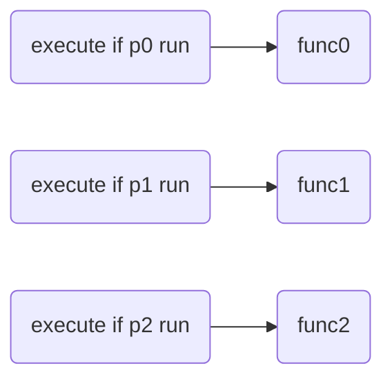

# 简单分支

## 分支

我们通过execute if/unless控制命令的执行与中断来选择不同的命令函数与之前的命令函数进行复合，从而实现分支结构。

如果分支较少，我们称这种分支为简单分支。简单分支的实现离不开条件的运算，因此我们在简单分支中还要讲解条件逻辑运算的实现与开销优化问题。

如果分支较多，我们的实现方法是记分板树。对一棵纯的记分板树，我们关注它的开销问题，因此引入分支因子x并探究x的最佳取值。对一棵其它类型参数的记分板树，我们要找到这种类型转化为分数的转换函数。

## 简单分支

前后无关性：

前后无关性是分支结构的重要特性。由于在mcfunction中，我们用依次执行execute if/unless的方式来构造简单分支，如下图：



如果条件p0返回成功，首先执行func0，再去判断条件p1，p2。这意味着，条件判定与命令执行之间的关系是实时解析的。但在我们预期的分支模型中，条件判定相对于命令执行是预解析的，即先判断所有的条件，再选择一个路口继续执行。

二者的不同发生在命令的运行效果会改变条件的判定结果时，也即前后发生了关联。

\#例：金币多的队伍获胜并结束游戏。

```mcfunction
#coin_judge
execute if score red_coin int > blue_coin int run function #red_win
execute if score red_coin int = blue_coin int run function #score_draw
execute if score red_coin int < blue_coin int run function #blue_win

#end_game
scoreboard players set red_coin int 0
scoreboard players set blue_coin int 0
#else operations
```

在coin_judge函数中，逻辑看似十分正确，金币多的队伍获胜，如果金币一样就判定为平局。但是red_win、score_draw、blue_draw都会调用结束游戏的函数end_game，其中包括重置金币数的操作。也就是说命令执行的结果反过来影响了条件判定，发生了前后关联。那么如果红队的金币比较多，将会看到红队获胜与平局都会发生，十分诡异。

因此，为了保证简单分支的正常运行，维护它的前后无关性是十分重要的。我们通常有三种维护方法：

1.直接维护：删除反作用于条件的操作。上述获胜判定一例中，金币数量的重置操作完全可以放到游戏开始而不是游戏结束。

2.重组顺序：如果条件i执行的操作会影响到条件j，我们就先判定条件j后判定条件i。上述获胜判定一例中，我们只需要调整coin_judge函数的判定顺序就可以避开前后关联：

```mcfunction
#coin_judge
execute if score red_coin int = blue_coin int run function #score_draw
execute if score red_coin int > blue_coin int run function #red_win
execute if score red_coin int < blue_coin int run function #blue_win
```

3.转移数据：把判定条件的数据先转移到一个临时对象，条件改为判定临时对象，那么反作用不会涉及临时对象。上述获胜判定一例，我们可以把coin_judge修改为：

```mcfunction
#coin_judge
scoreboard players operation temp int = red_coin int
scoreboard players operation temp int -= blue_coin int
execute if score temp int matches 1.. run function #red_win
execute if score temp int matches 0 run function #score_draw
execute if score temp int matches ..-1 run function #blue_win
```

当然，为了维护临时对象temp的兼容性，这里与顺序中<嵌套执行>同理，需要遵循s命名法。

顺序化分支：

分支会带来函数的嵌套。函数嵌套不仅会让函数文件变多，导致前后文逻辑不连贯，还会带来上面所说的前后关联陷阱。嵌套的兼容性需要使用s命名法来维护，十分不方便。总的来说，嵌套较多的命令是丑陋的，可维护性差的。

简单分支的函数嵌套有时是可以被化解的。这种化解方法我们称之为顺序化。顺序化的基本思想是“以不变应万变”。对于不同的分支，我们找到它们相同的部分，汇聚在一起处理。根据不变部分的处理的前后，顺序化处理可以分为两种：不变在前、不变在后。以下几个例子可以演示顺序化处理的两种方法：

\#例1：出门买一个西瓜，看见卖包子的就买两个。

```mcfunction
#test_buy
scoreboard players set buy_count int 1
execute if entity @e[tag=ssbun_trader] run scoreboard players set buy_count int 2
execute as @e[tag=wmelon_trader,limit=1] run function trader:_buy
```

\#例2：过大门，警察要有警察证，医生要有医生证，农民要有农民证，工人要有工人证，有证可以过，没证不让过。

```mcfunction
#gate_access
execute if score inp int matches 1 if entity @s[tag=license_1] run scoreboard players set res int 1
execute if score inp int matches 1 if entity @s[tag=!license_1] run scoreboard players set res int 0
execute if score inp int matches 2 if entity @s[tag=license_2] run scoreboard players set res int 1
execute if score inp int matches 2 if entity @s[tag=!license_2] run scoreboard players set res int 0
execute if score inp int matches 3 if entity @s[tag=license_3] run scoreboard players set res int 1
execute if score inp int matches 3 if entity @s[tag=!license_3] run scoreboard players set res int 0
execute if score inp int matches 4 if entity @s[tag=license_4] run scoreboard players set res int 1
execute if score inp int matches 4 if entity @s[tag=!license_4] run scoreboard players set res int 0
```

可以看到，写了一坨if，非常丑陋。经过“不变在前”的顺序化优化后：

```mcfunction
#gate_access
scoreboard players set res int 0
execute if score inp int matches 1 if entity @s[tag=license_1] run scoreboard players set res int 1
execute if score inp int matches 2 if entity @s[tag=license_2] run scoreboard players set res int 1
execute if score inp int matches 3 if entity @s[tag=license_3] run scoreboard players set res int 1
execute if score inp int matches 4 if entity @s[tag=license_4] run scoreboard players set res int 1
```

不变在前的顺序化其实是提供了一种“默认值”的功能。凡是结果为默认值的条件都不需要再判断了。

\#例3：如果奖池里有奖品，就从奖池里抽一个奖品。如果奖池里没奖品，就刷新奖池，再从奖池里抽一个奖品。

```mcfunction
#test_loot
execute if data storage math:io loot_list[0] run function #test_loop0
execute unless data storage math:io loot_list[0] run function #test_loot1

#test_loot0
summon item ~ ~ ~ {Item:{id:"minecraft:glass",Count:1b},Tags:["tmp"]}
data modify entity @e[tag=tmp,limit=1] Item set from storage math:io loot_list[0]
tag @e remove tmp
data remove storage math:io loot_list[0]

#test_loot1
#math:class loot_list为奖池的数据模板。
data modify storage math:io list set from storage math:class loot_list
#_shuffle是列表的洗牌算法。我们将在章节<数据处理基础>中实现它。
function math:list/_shuffle
data modify storage math:io loot_list set from storage math:io list
summon item ~ ~ ~ {Item:{id:"minecraft:glass",Count:1b},Tags:["tmp"]}
data modify entity @e[tag=tmp,limit=1] Item set from storage math:io loot_list[0]
tag @e remove tmp
data remove storage math:io loot_list[0]
```

采用一般的简单分支，额外开了两个函数，指令十分臃肿。

更加令人恼火的是，这里踩中了简单分支的前后关联陷阱：如果奖池里只剩一项奖品，抽出这个奖品后将会立即刷新奖池并抽出另一个奖品，这不符合我们一次只抽一个奖品的需要。

不过，我们使用“不变在后”的顺序化处理后，就可以让这个分支得到很简洁的优化了：

```mcfunction
#test_loot
#如果奖池没奖品就刷新，保证奖池有奖品。
execute unless data storage math:io loot_list[0] run function #loot_refresh
#生成奖品
summon item ~ ~ ~ {Item:{id:"minecraft:glass",Count:1b},Tags:["tmp"]}
data modify entity @e[tag=tmp,limit=1] Item set from storage math:io loot_list[0]
tag @e remove tmp
data remove storage math:io loot_list[0]

#loot_refresh
data modify storage math:io list set from storage math:class loot_list
function math:list/_shuffle
data modify storage math:io loot_list set from storage math:io list
```

顺序化分支更典型的应用是二分法施加某种“可叠加的影响”。这种影响的数值可以拆分为若干二进制位，我们从高位开始依次施加这种影响，每次把高位拆除掉，原来的“次高位”就变成了新的高位。

\#例：二分法给予执行者玩家指定数量，并且最多63个金锭。

```mcfunction
#give_coin
#防止改变函数输入
scoreboard players operation temp int = inp int

#拆分各二进制位
execute if score temp int matches 32.. run give @s gold_ingot 32
execute if score temp int matches 32.. run scoreboard players remove temp int 32
execute if score temp int matches 16.. run give @s gold_ingot 16
execute if score temp int matches 16.. run scoreboard players remove temp int 16
execute if score temp int matches 8.. run give @s gold_ingot 8
execute if score temp int matches 8.. run scoreboard players remove temp int 8
execute if score temp int matches 4.. run give @s gold_ingot 4
execute if score temp int matches 4.. run scoreboard players remove temp int 4
execute if score temp int matches 2.. run give @s gold_ingot 2
execute if score temp int matches 2.. run scoreboard players remove temp int 2
execute if score temp int matches 1.. run give @s gold_ingot 1
```

与或非逻辑：

简单分支的构造离不开条件，有时我们需要实现条件的逻辑运算。我们来实现三种常见的逻辑运算：与或非，并讨论它们的兼容性。

非：

1.if/unless互相改写。一般情况下，条件在execute的if/unless互为非，不过这也是有例外的。例如if score与unless score，如果记分板不存在，二者都返回0；if block与unless block，如果判断坐标在虚空，二者都返回0。

if/unless与执行方式一样，具有完美的兼容性。

2.记分板取反。我们使用记分板的0/1值表示真假，只需要对它进行加1模2的操作就能取反。

```mcfunction
#not_implement
execute store success score res int if <condition>
scoreboard players add res int 1
scoreboard players operation res int %= 2 int
```

```mcfunction
#not_implement
execute store success score res int if <condition>
execute store success score res int if score res int matches 0
```

记分板方法的兼容性与<嵌套执行>相同，需要s命名。

或：

我们使用一个顺序化分支来实现或逻辑。或的默认值是0，每个条件都只能把或的结果置1。

```mcfunction
#or_implement
scoreboard players set res int 0
execute if <condition0> run scoreboard players set res int 1
execute if <condition1> run scoreboard players set res int 1
#......
execute if <conditioni> run scoreboard players set res int 1
```

我们还可以利用短路原理对或逻辑进行开销优化。短路原理利用之前判断的结果，如果结果已经被置1，则后面无需判断。

```mcfunction
#or_implement
scoreboard players set res int 0
execute if <condition0> run scoreboard players set res int 1
execute if score res int 0 if <condition1> run scoreboard players set res int 1
execute if score res int 0 if <condition2> run scoreboard players set res int 1
#......
execute if score res int 0 if <conditioni> run scoreboard players set res int 1
```

短路原理能够优化的前提是：`<conditioni>`的开销较大，比if score的开销大的多，那么使用if score进行提前截断才有优化价值。否则会适得其反，徒增if score开销。

该方法的兼容性与<嵌套执行>相同，需要s命名。

与：

```mcfunction
#and_implement
scoreboard players set res int 0
execute if <condition0> if <condition1> if <condition2> ... if <conditioni> run scoreboard players set res int 1
```

注意：这里没有使用store法获取结果，这是因为store统计最右边的<可返回子命令>，如果condition0不通过，最右边的conditioni其实不会被判断，store也就不会对结果进行赋值。

我们重点关注与逻辑的开销问题。在execute中，熔断机制是存在的。前面的条件不通过，后面的条件就不会进行运算。

这意味着，我们将不同的条件安排在不同的位置，虽然效果同样是实现了与逻辑，但开销是不同的。

现在，我们的任务就是找到让开销最少的条件排列。对于命令 `execute if c0 if c1 if c2 ...... if ci` ，我们假设条件ci通过的概率是pi，开销是wi，且不同条件通过与否相互独立。

那么，命令只判断条件c0的概率是 $(1-p_0)$ ，只判断条件c0,c1的概率是 $p_0(1-p_1)$，只判断条件c0,c1,c2的概率是 $p_0p_1(1-p_2)$ ......

我们把每种情况乘上对应的概率进行求和，即可求得开销的总期望值。

也换一种方式进行理解：条件c0的开销必然被运行，无论失败或成功；条件c1的开销只能在c0成功后运行；条件c2的开销只能在c0成功并且c1成功后运行......因此总期望为：

$$
w_0+p_0w_1+p_0p_1w_2+......+p_0p_1p_2......w_i
$$

对于相邻两项相加：

$$
p_0p_1p_2......p_{i-1}w_i+p_0p_1p_2......p_{i-1}p_iw_{i+1}
$$

提取公共部分后：

$$
(p_0p_1p_2......p_{i-1})(w_i+p_iw_{i+1})
$$

我们将(j,k)分别代入(i,i+1)和(i+1,i)。如果说j条件在前开销更小，那么两者作差应该小于0，可以得到：

$$
(1-p_k)w_j<(1-p_j)w_k
$$

也就是说，对于两个相邻的条件，我们可以分别计算它们的开销乘上对方的反概率，较小者优先放到前面。

事实上，任意多个条件，我们发现，可以使用数值 $w_i/(1-p_i)$ 来度量条件ci的开销权重，权重小的条件优先放到前面，即可得到统计上最优的开销。如果对这个结论感兴趣，读者自证不难。

当然，在实际开发中我们不可能严格测出wi和pi的准确数值，假设“条件相互独立”也不一定成立。不过这个推导仍然具有指导意义：我们在编写指令时可以估计条件的概率与开销，开销小或是概率低的条件可以放到前面。