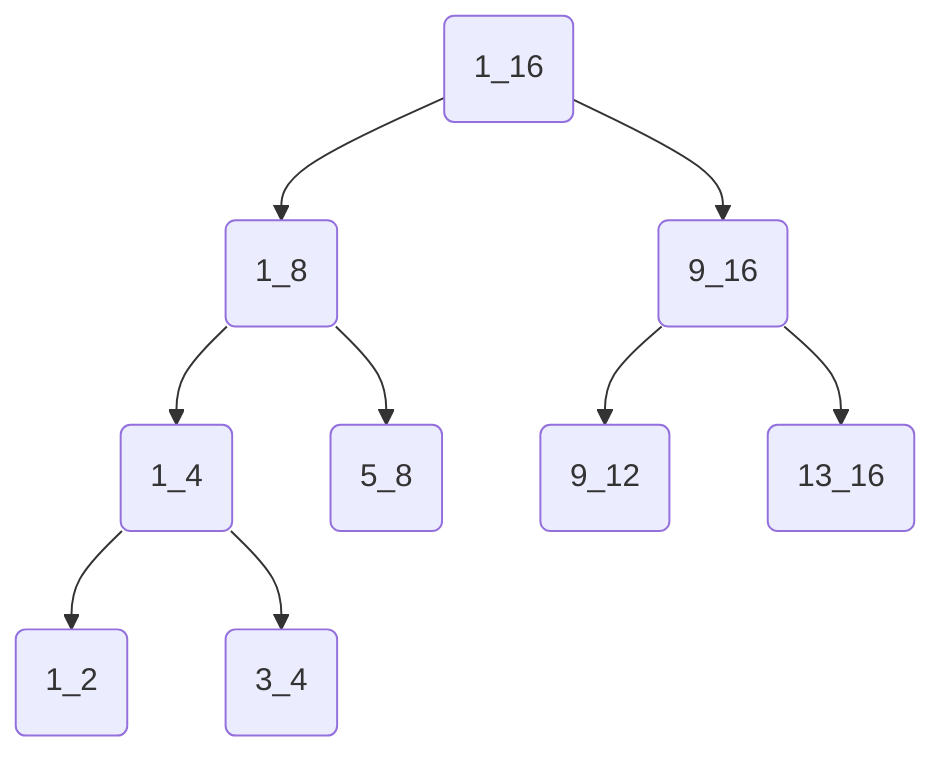

# 记分板树

记分板树是分支情况较多的高级分支。由于记分板判断的性能较好，能表示的不同值也足够多，我们使用记分板分数来控制一棵记分板树的路径。



\#例：输入光照强度，输出对应等级光源方块

```mcfunction
#setlight
execute if score inp int matches 0 run setblock ~ ~ ~ light[level=0]
execute if score inp int matches 1 run setblock ~ ~ ~ light[level=1]
execute if score inp int matches 2 run setblock ~ ~ ~ light[level=2]
execute if score inp int matches 3 run setblock ~ ~ ~ light[level=3]
execute if score inp int matches 4 run setblock ~ ~ ~ light[level=4]
execute if score inp int matches 5 run setblock ~ ~ ~ light[level=5]
execute if score inp int matches 6 run setblock ~ ~ ~ light[level=6]
execute if score inp int matches 7 run setblock ~ ~ ~ light[level=7]
execute if score inp int matches 8 run setblock ~ ~ ~ light[level=8]
execute if score inp int matches 9 run setblock ~ ~ ~ light[level=9]
execute if score inp int matches 10 run setblock ~ ~ ~ light[level=10]
execute if score inp int matches 11 run setblock ~ ~ ~ light[level=11]
execute if score inp int matches 12 run setblock ~ ~ ~ light[level=12]
execute if score inp int matches 13 run setblock ~ ~ ~ light[level=13]
execute if score inp int matches 14 run setblock ~ ~ ~ light[level=14]
execute if score inp int matches 15 run setblock ~ ~ ~ light[level=15]
```

这是一棵长度为16，分支因子为16的记分板树，也即通常所说的“穷举”。我们可以发现，穷举法的性能浪费是十分严重的。如果是n种情况的穷举，它要进行n次分数判断，而其中仅仅只有1次是成功的。

实际上我们可以实现开销更低的记分板树，这就是为什么需要引入分支因子的概念。

分支因子x：

每个记分板树搜索函数内，仅写x条if score，分成许多不同的函数，以达到减少性能浪费的目的。例如我们把上述setlight函数改写成分支因子为4的记分板树：

```mcfunction
#setlight/0_15
execute if score inp int matches 0..3 run function #setlight/0_3
execute if score inp int matches 4..7 run function #setlight/4_7
execute if score inp int matches 8..11 run function #setlight/8_11
execute if score inp int matches 12..15 run function #setlight/12_15

#setlight/0_3
execute if score inp int matches 0 run setblock ~ ~ ~ light[level=0]
execute if score inp int matches 1 run setblock ~ ~ ~ light[level=1]
execute if score inp int matches 2 run setblock ~ ~ ~ light[level=2]
execute if score inp int matches 3 run setblock ~ ~ ~ light[level=3]

#setlight/4_7
execute if score inp int matches 4 run setblock ~ ~ ~ light[level=4]
execute if score inp int matches 5 run setblock ~ ~ ~ light[level=5]
execute if score inp int matches 6 run setblock ~ ~ ~ light[level=6]
execute if score inp int matches 7 run setblock ~ ~ ~ light[level=7]

#setlight/8_11
execute if score inp int matches 8 run setblock ~ ~ ~ light[level=8]
execute if score inp int matches 9 run setblock ~ ~ ~ light[level=9]
execute if score inp int matches 10 run setblock ~ ~ ~ light[level=10]
execute if score inp int matches 11 run setblock ~ ~ ~ light[level=11]

#setlight/12_15
execute if score inp int matches 12 run setblock ~ ~ ~ light[level=12]
execute if score inp int matches 13 run setblock ~ ~ ~ light[level=13]
execute if score inp int matches 14 run setblock ~ ~ ~ light[level=14]
execute if score inp int matches 15 run setblock ~ ~ ~ light[level=15]
```

经过4分支因子的优化，现在每次查询只需要进行8次if score而不是16次。事实上，对于x^y种情况的记分板树，使用x分支因子只需要进行x*y次if score判断。(每层执行一个函数进行x次，总共y层)

现在我们来探究x的最佳取值。

如果总情况数固定不变为n，即n=x^y，那么y=log(x,n)。每个搜索函数，我们要进行x次execute if score操作和1次function调用操作。经过实验测定，二者的开销数值分别为1.3cc和1.4cc（见附录-命令开销表）。因此总开销关于x的函数：

$$
cost(x)=(1.3x+1.4)log_x(n)
$$

如果限定x只取正整数，可以发现cost(4)最小。因此从开销的角度分析，分支因子的最佳取值是4。

当然，分支因子较小会导致文件数和空间占用过多。如果不希望文件过多，也可以适当增大分支因子的取值。

非整数输入转化为分数：

记分板树对于非整数的输入有变形。最为常见的是针对字符串输入的记分板树。

\#例：用字符串参数指定生物类型

```mcfunction
#mob:_new
tag @e remove result
execute if data storage math:io input{type:"spider"} run summon spider ~ ~ ~ {Tags:["result"]}
execute if data storage math:io input{type:"zombie"} run summon zombie ~ ~ ~ {Tags:["result"]}
execute if data storage math:io input{type:"creeper"} run summon creeper ~ ~ ~ {Tags:["result"]}
execute if data storage math:io input{type:"villager"} run summon villager ~ ~ ~ {Tags:["result"]}
execute if data storage math:io input{type:"skeleton"} run summon skeleton ~ ~ ~ {Tags:["result"]}
execute if data storage math:io input{type:"iron_golem"} run summon iron_golem ~ ~ ~ {Tags:["result"]}
execute as @e[tag=result,limit=1] run function mob:set
```

对于字符串形式的输入，我们可以通过data get命令的返回值获得字符串长度，建立与长度相关的记分板树，从而实现筛选，减少if data次数（访问nbt的操作开销较大），实现优化开销：

```mcfunction
#mob:_new
tag @e remove result
execute store result score temp_l int run data get storage math:io input.type
execute if score temp_l int matches 6 run function mob:new/length_6
execute if score temp_l int matches 7 run function mob:new/length_7
execute if score temp_l int matches 8 run function mob:new/length_8
execute if score temp_l int matches 10 run function mob:new/length_10
execute as @e[tag=result,limit=1] run function mob:set

#mob:new/length_6
execute if data storage math:io input{type:"spider"} run summon spider ~ ~ ~ {Tags:["result"]}
execute if data storage math:io input{type:"zombie"} run summon zombie ~ ~ ~ {Tags:["result"]}

#mob:new/length_7
execute if data storage math:io input{type:"creeper"} run summon creeper ~ ~ ~ {Tags:["result"]}

#mob:new/length_8
execute if data storage math:io input{type:"villager"} run summon villager ~ ~ ~ {Tags:["result"]}
execute if data storage math:io input{type:"skeleton"} run summon skeleton ~ ~ ~ {Tags:["result"]}

#mob:new/length_10
execute if data storage math:io input{type:"iron_golem"} run summon iron_golem ~ ~ ~ {Tags:["result"]}
```

记分板树的兼容性与适用性：

兼容性与嵌套执行同理，需要s命名，不再赘述。

我们来重点讨论记分板树的适用性。读者可能发现，记分板树本质上和“n分法”的思想是相似的。我们在顺序化分支中提到过另外一种二分法，也就是把数值按位拆解后施加影响。此外，在数学和编程中，二分法是一种求解函数零点或查找问题答案的算法。

那么，如何区分这些方法各自适用于什么地方？主要是通过问题的解的形式来确定的。

1. 解是连续函数的零点，应该使用二分求零点。
2. 解是离散有序序列中的元素，应该使用二分查找。
3. 解是离散有序问题的答案，应该使用二分答案。
4. 解是施加可叠加的影响，应该使用二进制位拆解。

记分板树与以上4种“二分法”有着很大的不同。以上4者，它们对解的秩序有很高的要求。但是记分板树对解的秩序无要求，甚至搜索结果不一定是同类型的操作。它实际上是牺牲了大量空间来换取搜索的时间，通过记分板分数来控制一定范围内的动态性。

如果读者有一定的数据结构基础，可以把线段树与记分板树进行类比。

此外，mc1.19.4后动态命令成为可行的现实。在一些对即时性要求不高的场景中，动态命令可以方便地取代记分板树。我们将在章节<系统架构设计与优化>中讲解动态命令系统的设计。