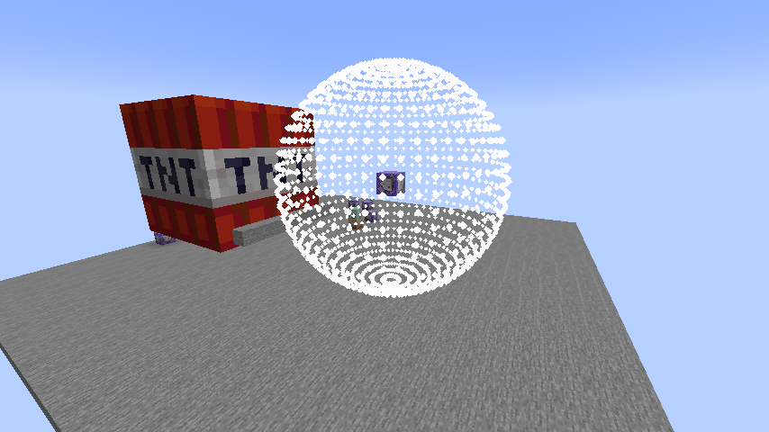

# 尾递归

## 递归

当一个函数复合上自己，神奇的事情发生了。想象两面镜子相对，一直向里嵌套。

递归是一种自相似的结构。当我们要使用递归解决问题时，关键点是抓住这个问题的某种自相似性，并设计求解路径。

递归不能无限嵌套下去，当求解出问题的解或是到达边界时，必须触发终止条件，这又称为递归的出口。

递归与之前我们讲到的function构造同理，是实时解析的。当递归在终点停止后，子函数结束，父函数要继续执行子函数后的内容。父函数结束后，父函数的父函数又继续执行......这称为递归的回溯。

我们将递归分为两类：尾递归与广义递归。二者的主要区别在于兼容性不同。

当函数在尾部复合自己，它等价于一个循环，这种递归我们称为尾递归。尾递归的内部是依次执行的，而被外部调用时相当于嵌套执行，因此维护它的兼容性只需要使用s命名法。

除了尾递归的递归称为广义递归。这种递归在内部相当于嵌套执行，但是我们无法预计嵌套的层数，因此s命名法失效，我们需要讨论新的兼容性维护方法。

## 尾递归(循环)

求解路径：尾递归是线性路径。

终止条件：由于记分板性能开销小，适合用于流程控制，所以我们尽量使用记分板控制尾递归的终止条件。

这里给出一个常用的尾递归模板：

```mcfunction
#loop_call
#进入循环
scoreboard players operation loop int = n int
execute if score loop int matches 1.. run function #loop

#loop
#循环操作
tellraw @a {"score":{"name":"loop","objective":"int"}}
#循环状态迭代
scoreboard players remove loop int 1
execute if score loop int matches 1.. run function #loop
```

递归的终止条件是循环变量loop减小到0。如果我们执行函数#loop_call，会发现循环变量从n到1全部输出。也就是说，对于分数`<n,int>`，我们输入多少，它便会执行多少次。(特别地，对于非法输入也就是0和负数，循环不会进入)

我们有时有循环变量从小到大的需求，只需稍改变进入循环和状态迭代的写法：

```mcfunction
#loop_call
#进入循环
scoreboad players set loop int 0
execute if score loop int < n int run function #loop

#loop
#循环操作
tellraw @a {"score":{"name":"loop","objective":"int"}}
#循环状态迭代
scoreboard players add loop int 1
execute if score loop int < n int run function #loop
```

输出为0到n-1。

break操作：我们只需要在循环操作中把循环变量`<loop,int>`置1即可跳出循环。
\#例：

```mcfunction
#loop_call
#进入循环
scoreboard players operation loop int = n int
execute if score loop int matches 1.. run function #loop

#loop
#循环操作
tellraw @a {"score":{"name":"loop","objective":"int"}}
execute if score loop int matches 5 store success score loop int run function #loop_end
#循环状态迭代
scoreboard players remove loop int 1
execute if score loop int matches 1.. run function #loop

#loop_end
say done！
```

递归到5的时候，提前跳出循环，进入到#loop_end函数。这里顺便利用了store success操作来将循环变量置1，较为方便。

执行方式是mc特有的输入，它具有继承性。利用继承性，当我们把空间执行方式与尾递归进行结合后，就会产生一定的空间遍历路径。

\#例1：以均匀角度遍历空间各个朝向

```mcfunction
#loop_call
#进入循环
scoreboard players set loop int 30
execute rotated 0.0 -89.0 run function #loop0

#loop0
#循环操作:进入第二重循环
scoreboard players set sloop int 60
function #loop1
#循环状态迭代
scoreboard players remove loop int 1
execute if score loop int matches 1.. rotated 0.0 ~6.0 run function #loop0

#loop1
#循环操作
particle end_rod ^ ^ ^5.0
#循环状态迭代
scoreboard players remove sloop int 1
execute if score sloop int matches 1.. rotated ~6.0 ~ run function #loop1
```
可以观察到一个以基准点为球心，半径为5的球面。



\#例2：线段路径

```mcfunction
#loop_call
#进入循环(positioned ^ ^ ^的作用是把执行点改为基准点，并把高度h置0)
scoreboard players set loop int 100
execute positioned ^ ^ ^ run function #loop

#loop
#循环操作
particle end_rod ~ ~ ~
#循环状态迭代
scoreboard players remove loop int 1
execute if score loop int matches 1.. positioned ^ ^ ^0.1 run function #loop
```
可以观察到一个以基准点为起点，沿着执行朝向长度为10格的线段。这种方法在与视线有关的检测问题中尤为常用，因此又被开发者们称为“视线追踪”。如何制作建模丰富，精度更高，开销理想的视线追踪是命令中一个被广泛讨论的问题。

总的来说，尾递归+空间访问便产生了几何与轨迹的问题。我们会在<数理计算>章节重点讨论这类问题。