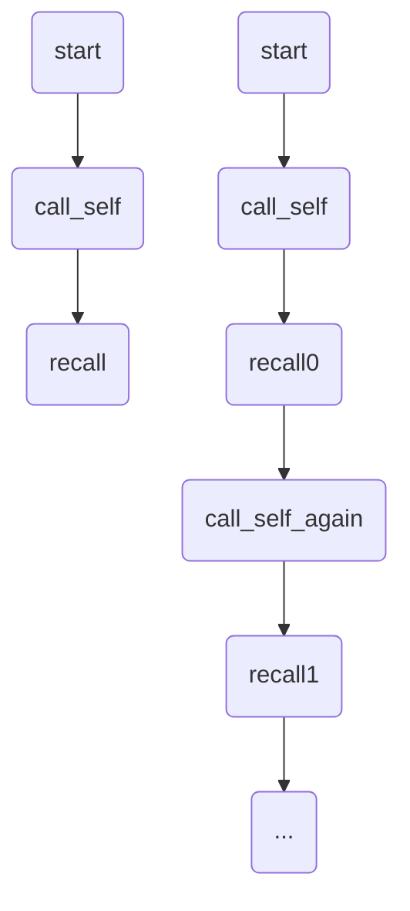
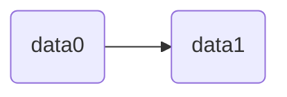
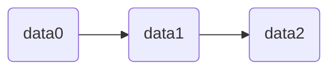
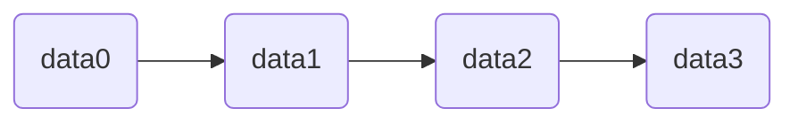
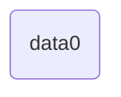
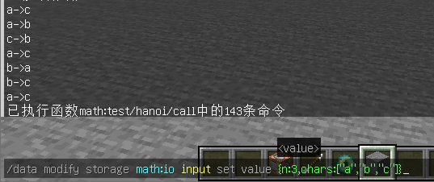
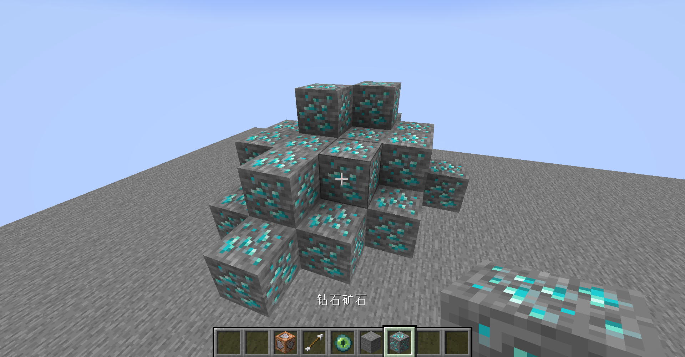
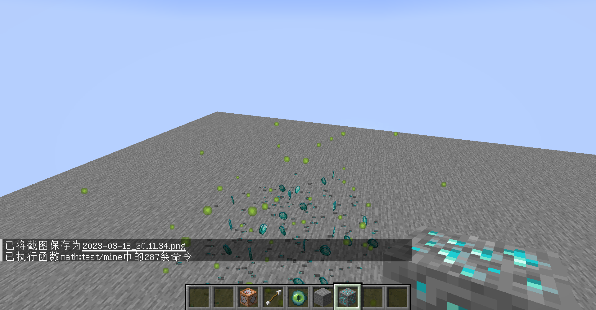

# 广义递归

如果一个递归具有回溯部分(即图中的recall)的命令，那么它就是一个广义递归。



在大多数情况下，recall部分是需要继承来自start部分的数据的。
或者说，start、recall0、recall1......recalln全都要共享同一个数据空间。

参考嵌套执行的兼容性维护方式，我们的s命名法其实就是在构建这样的数据空间，只不过数量有限，无法适用于嵌套层数未知的广义递归。

那么，我们该如何人工维护无限的数据空间呢？

栈：一种先进后出的数据结构。



data2入栈：



data3入栈：



data3出栈：


data4入栈：


data4出栈


data2出栈


data1出栈



data0出栈
栈空。

我们利用栈来储存函数的数据空间。
当一个函数被调用，让它的数据空间入栈。当一个函数执行结束，让它的数据空间出栈。

那么，在call_self阶段，子函数首先让自己的数据空间入栈。子函数可能调用子子函数，子子函数的数据空间也入栈。但不管怎样，子子函数先结束，子函数后结束。因此子子函数的数据空间先出栈，子函数的数据空间后出栈。那么call_self阶段结束后，所有的子函数数据空间均已出栈，栈顶元素依然是当前函数的数据空间。

如此这般，就可以实现start与所有recall部分的数据空间共享。

那么，在命令中应该如何构造栈呢？

一.利用执行方式的局部性。

我们已经介绍过，执行方式自然的具有局部性。每个函数的执行方式是独立的。执行方式自然可以看作是栈上的数据空间。如果我们函数中用到的数据可以方便地使用执行方式进行记录，那么便可以使用执行方式栈。

执行方式栈的实例：

\#例1：汉诺塔问题

```mcfunction
#hanoi/call
#需要传入世界实体为执行者
data modify storage math:io temp set value {char0:"",char1:""}
#用y坐标代表起始圆柱，z坐标代表目标圆柱，ry视角代表中间圆柱。
tp @s 0 0 2 1 0
#用x坐标代表n个圆盘。
execute store result entity @s Pos[0] double 1 run data get storage math:io input.n
#用当前数据空间(at @s)进入递归函数
execute at @s run function #hanoi/rec
#回到加载区块，防止世界实体刷没
tp @s 0 11 0

#hanoi/rec
#用世界实体访问执行方式来获取数据
tp @s ~ ~ ~ ~ ~
execute store result score n int run data get entity @s Pos[0]
execute if score n int matches ..1 run function #hanoi/print
execute if score n int matches 2.. run function #hanoi/next

#hanoi/next
#交换目标圆柱和中间圆柱
execute store result score temp int run data get entity @s Rotation[0]
execute store result entity @s Rotation[0] float 1 run data get entity @s Pos[2]
execute store result entity @s Pos[2] double 1 run scoreboard players get temp int
#盘子输入数量减1(positioned ~-1 ~ ~)
execute at @s positioned ~-1 ~ ~ run function #hanoi/rec
#回溯到当前函数执行方式
tp @s ~ ~ ~ ~ ~
function #hanoi/print
#交换起始圆柱和中间圆柱
execute store result score temp int run data get entity @s Rotation[0]
execute store result entity @s Rotation[0] float 1 run data get entity @s Pos[1]
execute store result entity @s Pos[1] double 1 run scoreboard players get temp int
#盘子输入数量减1(positioned ~-1 ~ ~)
execute at @s positioned ~-1 ~ ~ run function #hanoi/rec

#hanoi/print
execute store result score temp0 int run data get entity @s Pos[1]
execute store result score temp1 int run data get entity @s Pos[2]
#获取第一个输出字符
execute if score temp0 int matches 0 run data modify storage math:io temp.char0 set from storage math:io input.chars[0]
execute if score temp0 int matches 1 run data modify storage math:io temp.char0 set from storage math:io input.chars[1]
execute if score temp0 int matches 2 run data modify storage math:io temp.char0 set from storage math:io input.chars[2]
#获取第二个输出字符
execute if score temp1 int matches 0 run data modify storage math:io temp.char1 set from storage math:io input.chars[0]
execute if score temp1 int matches 1 run data modify storage math:io temp.char1 set from storage math:io input.chars[1]
execute if score temp1 int matches 2 run data modify storage math:io temp.char1 set from storage math:io input.chars[2]
#输出
tellraw @a [{"nbt":"temp.char0","storage":"math:io"},{"text":"->"},{"nbt":"temp.char1","storage":"math:io"}]
```



\#例2：连锁挖掘钻石矿

```mcfunction
#mine
setblock ~ ~ ~ air destroy
execute positioned ~1 ~ ~ if block ~ ~ ~ diamond_ore run function #mine
execute positioned ~-1 ~ ~ if block ~ ~ ~ diamond_ore run function #mine
execute positioned ~ ~1 ~ if block ~ ~ ~ diamond_ore run function #mine
execute positioned ~ ~-1 ~ if block ~ ~ ~ diamond_ore run function #mine
execute positioned ~ ~ ~1 if block ~ ~ ~ diamond_ore run function #mine
execute positioned ~ ~ ~-1 if block ~ ~ ~ diamond_ore run function #mine
```




所有联通的钻石矿都被挖掉了。

二.利用storage列表栈

列表的prepend和remove操作可以模拟入栈出栈。(见第五章数据处理基础)

```mcfunction
#math:_init
#设置函数的storage栈
data modify storage math:io rec set value [{}]
```

我们只需要在函数的开头和结尾控制数据空间的入栈和出栈。

```mcfunction
#rec_func
data modify storage math:io rec prepend value {}
#else commands
data remove storage math:io rec[0]
```

在函数内容中，我们需要使用两个数据空间：rec[0]与rec[1]。这里需要对两者进行区分。

rec[0]是当前函数的数据空间，当前的局部变量全部放入rec[0]。当前函数调用子函数时，也使用rec[0]进行参数调用。

rec[1]是调用当前函数的函数数据空间，如果要获取对当前函数输入的参数，应从rec[1]中获取。如果要进行返回操作，也应该把返回值放入rec[1]。

storage栈的实例：

\#例：汉诺塔问题

```mcfunction
#hanoi/call
data modify storage math:io rec[0] set from storage math:io input
function #hanoi/rec

#hanoi/rec
#注意这里是prepend from而不是prepend value，它不仅实现了栈空间，还实现了类似于execute执行方式的继承性。
data modify storage math:io rec prepend from storage math:io rec[0]
execute store result score n int run data get storage math:io rec[1].n
execute if score n int matches 1 run tellraw @a [{"nbt":"rec[1].chars[0]","storage":"math:io"},{"text":"->"},{"nbt":"rec[1].chars[2]","storage":"math:io"}]
execute if score n int matches 2.. run function #hanoi/next
data remove storage math:io rec[0]

#hanoi/next
data modify storage math:io temp set from storage math:io rec[0].chars[2]
data modify storage math:io rec[0].chars[2] set from storage math:io rec[0].chars[1]
data modify storage math:io rec[0].chars[1] set from storage math:io temp
execute store result storage math:io rec[0].n int 1 run scoreboard players remove n int 1
function #hanoi/rec
tellraw @a [{"nbt":"rec[1].chars[0]","storage":"math:io"},{"text":"->"},{"nbt":"rec[1].chars[2]","storage":"math:io"}]
data modify storage math:io rec[0].chars set from storage math:io rec[1].chars
data modify storage math:io temp set from storage math:io rec[0].chars[1]
data modify storage math:io rec[0].chars[1] set from storage math:io rec[0].chars[0]
data modify storage math:io rec[0].chars[0] set from storage math:io temp
function #hanoi/rec
```

当然，并不是所有的广义递归都需要维护函数栈。

我们在章节<数理计算>与<数据处理基础>中将会看到两个无栈的广义递归实例(无栈的原因是没有数据记录需要)。