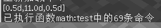

# 黑箱测试

## 常用调试方法

本章的目的是让您的命令系统能够按照预期效果跑起来。

当一个命令系统被编写完成，我们并不知道它能不能按照预期效果跑起来；如果出现了故障，我们并不能马上知道问题出在哪里。这个时候我们就需要对这个命令系统进行调试。

本书把调试分为两个步骤：测试和搜索，分别对应本章的两个部分：<测试方法>和<搜索异常>。

测试方法检查您的系统是否存在bug，搜索异常则是找到bug出现在哪里。

此外，语法错误不在本章的讨论范围之内。因为语法错误非常容易排除，查看游戏的日志信息，把对应行的命令改正即可(可以查看文件.minecraft/logs/latest.log，也可以在启动器设置中打开日志窗口)。因此，应用本章的调试技巧前，**请务必先排除系统中全部的语法错误**。

为了提供有参考价值的调试演示，本章的调试案例是真实的，均来自于实际开发的项目。

最后，众所周知，Minecraft这款游戏充满"特性"。不过，请您相信，tellraw、scoreboard、storage是不存在特性的。请把这些工具作为坚实的debug基础，无论出现什么问题，也不要怀疑这些工具告诉你的**真实信息**。

## 黑箱测试

我们在第一章已经论述过，无论是单条命令，还是一段命令，还是一个mcfunction，都是一个广义上的函数。这种函数符合黑箱的特征（输入输出，运算处理）。

那么测试一个命令函数，只需给黑箱指定输入，检查它的输出端。

本书中习惯将math:test函数作为测试函数，用于测试各个模块的运行情况。

另外，必须保证测试函数是可重复运行的，被测函数可能会遗留一些实体，要注意给这些实体加上特有的tag，便于在测试函数结尾清理这些实体。

黑箱测试的实战：

\#例1：检查整数精度开根号函数

```mcfunction
#math:test
#指定输入为64
scoreboard players set inp int 64
function math:_sqrt
#将输出打印以检查
tellraw @a {"score":{"name":"res","objective":"int"}}
```


可以观察到，黑箱给出了正确的输出。因此我们可以说，函数在给定输入64的情况下运行正常。

\#例2：在数学中，图是描述于一组对象的结构，其中某些对象对在某种意义上是“相关的”。这些对象对应于称为顶点的数学抽象（也称为节点或点），并且每个相关的顶点对都称为边（也称为链接或线）。我们可以利用mc的3D场景，将图这种抽象的数学结构可视化呈现。以下为可视化算法的测试函数：

```mcfunction
#math:test
#将图的数据模板实例化为临时对象
data modify storage math:io input set value {nodes:[{name:"test_node",to:[1,2],display:{hide_name:0b,item:{id:"minecraft:command_block",Count:1b},uvw:[0.0d,0.0d,0.0d]}}],pos:[0.0d,-57.0d,0.0d],rot:[0.0f,0.0f],uvw_theta:0.0f}
execute as @e[tag=math_marker,limit=1] run function math:graph/_ssnew
#运行可视化算法(输入了临时对象)
function math:graph/_display
#输出测试节点的位置
tellraw @a {"nbt":"Pos","entity":"@e[tag=graph_node,limit=1]"}
#清理节点实体
kill @e[tag=graph_entity]
```



在这里，由于图的可视化呈现用到了节点实体，为了保证测试函数的可重复性，我们在测试结束时执行了清理指令`kill @e[tag=graph_entity]`

另外，我们观察到输出的节点实体坐标为召唤位置0 11 0，并非预期的安置位置。因此测试结果是math:graph/_display算法存在问题。

\#例3：单条命令是一个函数，也可以进行黑箱测试。我们以测试tp命令为例：

```mcfunction
#math:test
#输入执行者(朝向是0.0,0.0)，输入执行朝向
tp @s 0.0 0.0 0.0 ~ ~
tellraw @a {"nbt":"Rotation","entity":"@s"}
```

对于这个函数实现的功能，我们的预期是将实体朝向改变为输入的执行朝向。因此我们在输出端检查实体的朝向。

当我们使用`execute rotated 0.0 91.0 run function math:test`，也即输入执行朝向为0.0 91.0时，我们发现了问题，输出是[0.0f,90.0f]。

还记得第一章<对rotated与facing以及tp细节的说明>吗？事实上笔者正是使用这种黑箱测试的方法发现了这个问题。

当你对一条命令的执行效果不是很了解时，黑箱测试便是一种有力的测试手段（另一种手段是直接翻阅源代码，然而这需要门槛）。

本节完。