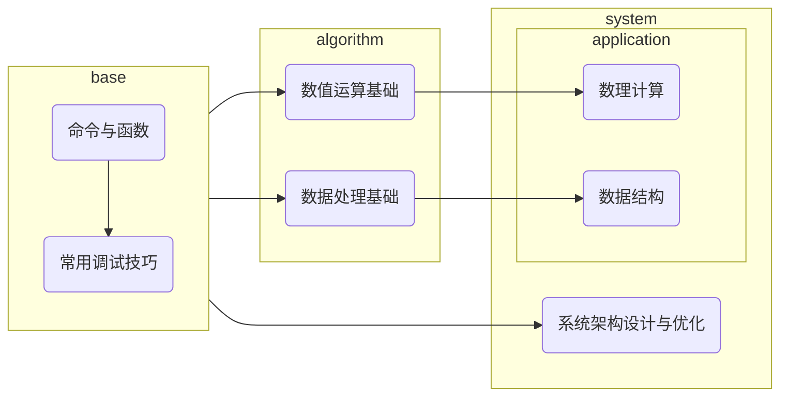

# 前言

一.我为什么要写这本书？

从2016年入坑命令以来，对于我来说，命令是一种玩法，也是我的兴趣。我尝试探索过命令中的一些命题，并且对于它们有一套自己的看法与理论。因为某些现实因素，我可能要离开命令这个领域了，如果这些理论无法记录下来，对我而言会是一种遗憾，因此产生了编写这本书的想法。

二.你为什么要读这本书？

可能会有很多种理由，但它不应该是“为了创作出更好的作品”，这本书无法指导你的创作，如果单纯关注原版作品的质量，你应该寻求一些更加实用以及关注玩家审美的教程，而非小豆理论。在我看来，一种合理的，读这本书的理由是：“我想了解一种看待命令的视角，解决一些命令里的命题，尽管它们看起来不是那么实用”。

三.读这本书需要哪些前置知识？

- 基础的命令知识以及实践经验。
- 高中及以上水平的数学、物理知识。
- 基本的算法与数据结构思想。

四.如何读这本书？

- 读懂每一条命令
- 多进游戏测试和实践
- 书中难免有纰漏，若发现，请及时反馈给我！(QQ:859345316)
- 理论中的思想适用于java版mc1.14-1.19.4，命令运行结果参考1.19.2/1.19.4(2023.3.4)

*从现在开始，让我们简洁优雅地去写好每一条命令吧！*

