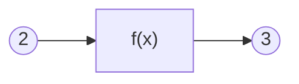
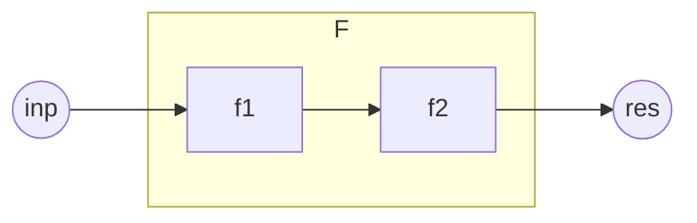

# 命令与函数

## 一切还要从函数说起

### 什么是函数

什么是函数？不同的领域有许多不同的定义。

在数学中，函数的传统定义是这样的：

> 在一个变化过程中，设有两个变量x、y，如果对于任意一个x都有唯一确定的一个y和它对应，那么就称x是自变量，y是x的函数。

而函数的近代定义是这样的：

> 设A，B是非空数集，如果按照某种确定的对应关系f，使得对于集合A中的任意一个数x，在集合B中都有唯一确定的数y和它对应，那么就称映射f：A->B为从集合A到集合B的一个函数，记作y=f(x)。

多元函数的定义是这样的：

> 设D为一个非空的n元有序数组的集合，f为某一确定的对应规则。若对于每一个有序数组(x1,x2,...,xn)∈D，通过对应规则f，都有唯一确定的实数y与之对应，则称对应f为定义在D上的n元函数

计算机科学中函数的定义是这样的：

> 计算机的函数，是一个固定的程序段，或称其为一个子程序，它在可以实现固定运算功能的同时，还带有一个入口和一个出口，所谓的入口就是函数所带的各个参数，我们可以通过这个入口，把函数的参数值代入子程序，供计算机处理；所谓出口，就是指函数的函数值，在计算机求得之后，由此口带回给调用它的程序。

我们不难发现，函数是一种极其抽象的概念。

传统与近代的函数定义分别从运动与映射的角度认识函数。多元函数将函数的定义域扩展到了向量。

此外，数学中还有泛函与算子的概念，可以实现函数与数的映射，函数与函数的映射……

计算机科学中的函数可以具备内部状态，还能完成特定功能。数学中无内部状态的抽象函数，在计算机科学中被称为“纯函数”。

为什么它们都是函数？函数的本质特征是什么？我们需要以更加简单的角度认识函数，抓住不同函数概念共有的特征。

也许你已经注意到了，函数的定义非常强调函数的“唯一确定性”。对于一个自变量的值，函数必须给出一个唯一确定的值，才能称之为函数。

例如在平面直角坐标系中，一个以原点为圆心的圆解析式是 $x^2+y^2=r^2$ 。这个解析式，只能称其为圆的方程，而不是圆的函数。因为对于每个 $x∈(-r,r)$ ，都有两个y与之对应，不满足唯一确定性。

唯一确定性是我们认识函数的关键。

例如 $y=x+2$ 是一个函数。如果代入x=1，便得到y=3。函数的唯一确定性意味着，不管何时何地何种环境，只要把1代入x，总能得到3，不会得到其它的值。

函数是可重复使用的黑箱。x是自变量，也即函数的输入。y是因变量，也即函数的输出。对相同的输入，函数总能给出相同的输出，与其它任何条件无关。

如图所示，函数是中间的黑箱部分，具有输入输出的接口。

可见，**函数具备三个最基本的要素：输入、输出、处理。**

### 命令也是一种函数

命令也是一种函数。

在命令执行前，世界中与之相关的因素看作是命令的输入(包括随机种子等所有因素在内)，那么命令就会有确定的处理，最后得到一个确定的命令执行后的mc世界的状态。

例如：`scoreboard players add n int 1`，这条命令接收执行前的记分板分数<n,int>作为输入，进行+1处理，输出到记分板分数<n,int>。再例如：`kill @e[type=sheep]`，这条命令接收执行前已加载区块中全部活着的羊作为输入，对这些羊的血量(Health)进行置0的处理，输出到活着的羊的血量。

对int的说明

<pre>int将会是本书最常用的记分板。我们对int的定义如下：
    1.对于命名是一个整数的虚拟玩家，它们的int值是对应整数
        值。例如<2,int>的值是2，<-1,int>的值是-1。
    2.对于其它命名的虚拟玩家，它们的int用于表示记分板形式
        的临时对象。其中，命名中含有子字符串"temp"的称为
        临时分数。临时对象与临时分数的概念将在本章<命令处
        理>部分进行详细介绍。
    3.由于玩家名就是虚拟玩家名，必然属于以上情况之一，故
        玩家在int上的值不作定义。
    4.对于处于实体组中的实体，如果它有自己的上级实体，首
        先它不是玩家。那么它的int定义为自己的上级实体编号
        (一般是id记分板)。实体组与上级实体的概念将在<数理计
        算>章节进行详细介绍。
    5.对于其它非玩家实体，它们的int可以定义为自己最重要的
        整数数据，也可以留空。例如粒子实体的int可以定义为自
        己的存在时间。</pre>

对kill命令与@e选择器的说明

<pre>
读者对kill命令与@e选择器，应该已经有了比较通俗的理解：
kill的作用是“清除”实体，而@e的作用是选择全部实体。那
么，为什么笔者在上文的清除绵羊一例中要进行繁琐的叙述呢？
主要是为了严谨考虑。现在，我们需要更加深入地了解这两个
概念。
1.@e不一定是全部实体。
    ①血量为0的红体状态生物无法被@e选中。
    ②非生物实体被kill命令作用后被标记，无法被@e选中。
    ③处于未加载区块中的实体无法被@e选中。
    使用@s、@a等选择器可以选中以上三种情况。
    而直接使用UUID表示法只能选中①情况实体。
2.kill不一定能清除实体。
    ①如果是生物实体，kill的作用相当于把血量置0，如果此时
        利用@s选中生物，把Health重新回升，可以实现生物复
        活。否则生物将在红体时间结束后被真正清除。
    ②如果是非生物实体，kill的作用相当于把实体作标记，使其
        无法被@e选中，并在下1tick之前被清除。这期间，没有
        手段使实体复活，但在kill命令执行后，仍然可以在同一
        个函数内使用@s选择器选中该实体，在清除之前对其进
        行操作。</pre>

.

因此可以说，**命令具备函数的基本要素(输入、输出、处理)**。我们将在本章<命令函数的基本要素>部分详细介绍命令的输入输出与处理。

另外，mcfunction是命令体系中重要的组成部分，也是更为特殊的函数。它允许将多条命令写到同一个文件中，并依次执行。调用mcfunction的命令是function。前文已经论述，命令是一种函数，又因为function是一种命令，所以function也是一种函数。这说明，借助mcfunction我们可以将多条命令合成为一个新的函数。下图中的模型可以阐释该原理：

图中f1和f2是基本的命令函数，f1的输出即为f2的输入。F同样可以看成一个具有输入与输出的黑箱结构，而f2(f1())即为F确定的处理规则。因此，F具备了函数的基本要素，它是一个复合函数。

因此可以说，命令函数不仅具备函数的基本要素，**命令函数之间还可以通过一定的组织方式复合为新的函数。** 我们将在本章<命令函数的组织方式>部分进行详细介绍。

本节完。

