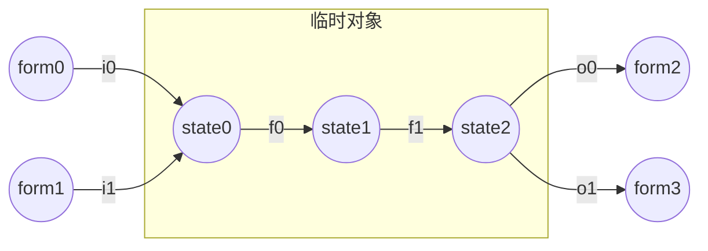
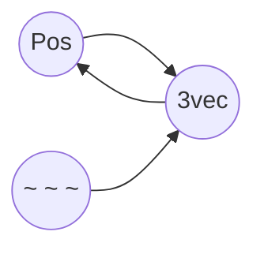

# 命令与函数

## 命令函数的基本要素

### 输入输出

#### 执行方式：天然的命令输入

执行方式，又称执行环境，是一系列命令运行过程中使用的参数的总称，包括维度、坐标、朝向、执行者、高度h五个。每条命令都具有自己的执行方式，因此执行方式具有局部性。如果未经过execute改变执行方式，那么子命令的执行方式与父命令的执行方式保持一致，因此执行方式具有继承性。

命令通过一系列基本表达与执行方式建立联系。由于引入执行维度会使得叙述变得复杂，我们一般忽略维度的不同，默认为主世界。以下为常用的执行方式表达。

目标选择器@s即为执行者实体的指代。注意：执行者可以不是实体，例如命令方块，此时@s会选择失败。

目标选择器参数中dx=,dy=,dz=或是distance=，它们的范围起点由x=,y=,z=确定。但如果x=,y=,z=中的任意个未被指定，其默认值则为执行坐标对应分量的值。

相对坐标系~delta_x ~delta_y ~delta_z的各轴方向与xyz轴一致，而相对坐标系的原点 ~ ~ ~ (又称为执行点)即为执行坐标。**需要特别指出的一点是：许多命令新人会将<执行坐标>与<执行者坐标>的概念混淆，误认为 ~ ~ ~ 就是@s的坐标，这是十分不正确的，必须根据实际情况分析二者的坐标。**

局部坐标系^u ^v ^w的各轴方向由执行朝向确定。u轴方向为执行朝向的左方向，v轴方向为执行朝向的上方向，w轴方向为执行朝向的前方向，可以简记为“左上前”。而局部坐标系的原点 ^ ^ ^ (又称为基准点)，由执行坐标与高度h共同确定：^ ^ ^即为~ ~h ~，或者说基准点位于执行点上方h格高度处。

我们发现，命令中遍布执行方式的身影。所以，确定一条命令的执行环境是非常重要的。以下讲解确定命令执行环境的方法。

1.根据命令执行的源头确定执行方式的初始值。

·若源头为玩家聊天框，那么执行者是玩家，执行维度是玩家所在维度，执行坐标是玩家坐标(碰撞箱地面中心，即feet的位置，feet与eyes又称为实体的锚点)，执行朝向是玩家朝向，高度h是0。

·若源头为命令方块，那么执行者是命令方块，执行维度是命令方块所在维度，执行坐标是命令方块的中心点坐标，执行朝向是水平正南(z+方向)，高度h是0。

·若源头为tick/load函数，那么执行者是服务端，执行维度是主世界，执行坐标是世界出生点，执行朝向是正南，高度h是0。

·此外还有一些不常用的执行源头(成书、tellraw、告示牌、schedule、进度等)，这里不再列举。

2.根据函数的调用过程中的execute子命令分析执行方式状态转移。

执行者可能被as修改为参数指定实体。

执行维度可能被in修改为参数指定维度，可能被at修改为参数指定实体所在维度。

执行坐标可能被at修改为参数指定实体坐标，可能被positioned as修改为参数指定实体坐标，可能被positioned修改为参数指定坐标，可能被align修改为原执行坐标向下取整后坐标，可能被in进行对应维度的坐标缩放。

执行朝向可能被rotated修改为参数指定朝向，可能被rotated as修改为参数指定实体朝向，可能被facing修改为从基准点看向参数指定坐标的朝向，可能被facing entity修改为从基准点看向参数指定锚点的朝向。

高度h可能被anchored eyes修改为执行者实体的身高(eyes到feet的距离)，可能被anchored feet修改为0，可能被positioned \<pos> (而at和positioned as无此效果)修改为0。

<details>
<summary>对rotated与facing以及tp细节的说明</summary>
<pre>
读者可能遇到过这样一个问题：让一个实体看向反方向。如果
使用命令execute as entity at @s run tp @s ~ ~ ~ ~
 ~180.0或者命令execute as entity at @s rotated ~ 
~180.0 run tp @s ~ ~ ~ ~ ~会发现实体并没有看向反方向
，而是看向了竖直向上或向下方向。经过我们的研究发现，问
题出现在tp而不是rotated。tp有这样一个机制：当它旋转实体
的rot1角的时候，如果我们给tp传入的目标角度超过了-90度到
90度的范围，那么实体朝向在旋转过程中会在竖直方向被卡住。
例如：实体当前朝向是89.0f，目标角度是91.0f，实体朝向最终
会变成90.0f，也就是朝向竖直向下。如果是-89.0f旋转到-91.0f
，朝向竖直向上同理。对于这个现象，我们的解决方法是利用
facing ^ ^ ^1对执行朝向进行“规整化”。facing的作用是为
执行朝向重新赋值，它是标准的-90.0f到90.0f的rot1角度。例如
rotated把执行朝向累加到(0.0f,91.0f)后，facing ^ ^ ^1会把执
行朝向规整化为(-180.0f,89.0f)，二者是同一个方向，但后者就
可以保证tp的正常运行了。类似的道理，我们可以直接使用子命
令facing ^ ^ ^-1对执行朝向进行反转。</pre>
</details>

这是一个利用执行方式实现命令输入的例子：`setblock ~ ~5 ~ stone` 该命令接收执行坐标作为输入，在执行坐标上方5格输出一个石头。（为了简化叙述，忽略了维度、区块加载、高度上限、原有方块）

总结：执行方式是一种天然的、方便、良好的输入。它具有局部性、继承性、可直接访问的优良特性。而执行方式同时具有很大的局限性：

* 单向传递，无法作为命令的输出
* 无法直接进行复杂的数值运算
* 无法表示具有复杂结构的数据

由于以上三点局限性，我们有必要维护更加高级的命令输入输出形式。

#### 人工维护的输入输出

本节介绍人工维护的输入输出。人工维护的输入输出，通常有以下几种形式：记分板、storage、实体。我们在本节对这三种形式的维护方法进行一一讲解。

·记分板表示的输入输出：

记分板经常被用来表示有限范围的数值(包括整数和小数)，它的表示范围是-2^31~2^31-1(即-2147483648到2147483647)。对于普通整数，直接取原数值即可。对于普通小数，我们需要事先规定好一个倍率(有时也称精度)。例如1k倍率的小数，那么2333表示的实际数值是2.333。对于较大的整数或精度较高的小数，我们就需要多个记分板分数来表示一个数值。本书中最常用的记分板输入输出是两个临时对象：inp(input的缩写)和res(result的缩写)，它们的记分板表示形式是<inp,int>和<res,int>。本书最常用的普通小数倍率是1k。

\#例：

```
scoreboard players set inp int 64
function math:sqrt/_3sqrt
scoreboard players get res int
```

这里把输入inp置为了64，调用了数学库中的3位精度开根号函数，获得输出res是8000(表示数值为8.000)。

·storage表示的输入输出：

storage是一种自定义nbt的储存介质。自定义nbt具有高度的自由性，经常被用于表示各种具有复杂结构的数据，甚至是被用于表示一个对象。本书中最常用的两个storage分别是math:class与math:io。math:class的特点是只用于储存静态的数据模板，它们在初始化阶段被设置，在运行阶段只读(与整数的int定义异曲同工)。math:io与math:class相反，它只用于储存运行过程中产生的各类临时数据和输入输出。对于输入输出，我们使用math:io中的input和result两个临时对象进行表示。下面三个例子可以很好地解释class与io的使用方式：

\#例1：

```
data modify storage math:io input set from math:class vehicles[{id:"plane"}]
function vehicles:_new
```

这段命令将载具类中飞机的数据模板放入input，然后调用了载具的构造函数，实例化了一个飞机对象。

\#例2：

```
data modify storage math:io input set from storage math:class vehicles[{id:"garbage_truck"}]
data modify storage math:io input merge from storage math:class vehicles[{id:"sports_car"}]
function vehicles:_new
```

这段命令构造了一个临时类：载具是跑车，但同时继承了垃圾车的部分属性，然后运行了载具的构造函数，将其实例化为对象。

\#例3：

```
data modify storage math:io input set from storage math:class vehicles[{id:"sports_car"}]
data modify storage math:io input.v_max set value 12.5d
function vehicles:_new
```

这段命令实例化了一辆最大速度是12.5的跑车。

·实体表示的输入输出：

实体是命令中最常用的对象，它具有功能性与逻辑性。在功能性的一面：原版生物AI可以为我们所用，盔甲架/物品展示框可以为我们提供模型显示服务，载具类实体可以提供座椅，抛射物可以制作发射效果......在逻辑性的一面：实体可以直接通过as、at等execute子命令与执行方式沟通，实现围绕实体的一系列逻辑。可以说传统命令的实质是面向实体编程。在命令中，我们最常使用的实体指代方法是使用tag。本书中对输入输出实体的指代tag分别是input和result。每次将实体置入输入输出池之前，我们首先应使用tag @e remove input/result进行输入输出池的释放。这里使用@e而不是@e[tag=]，是为了避免后者画蛇添足性的性能损坏：后者会把检查tag是否存在的操作在有tag实体上进行两次。以下几个例子展示实体输入输出的用法：

\#例1：

```
#entity:_new
tag @e remove result
summon marker 0 11 0 {Tags:["result","entity"]}
#else operations
```

该entity的构造函数会返回一个marker实体。当其他开发者调用entity:_new函数时，便可以使用@e[tag=result,limit=1]对返回实体进行唯一确定的指代。

\#例2：

```
#entity:test
function entity:_new
tag @e remove input
tag @e[tag=result,limit=1] add input
tag @e[distance=..10] add input
function entity:_kill_each_other
```

该entity的测试函数首先调用了entity的构造函数，生成了一个新的marker实体，然后利用result标签对其进行指代，置入输入池，同时将以执行位置为球心，半径10格的球体范围的全部实体置入了输入池，然后调用entity:_kill_each_other函数，使它们自相残杀。

<details>
<summary>对0 0附近区块以及坐标0 11 0的说明</summary>
<pre>
本书使用命令forceload add -1 -1 1 1将0 0附近四个区块
全部加载。0 11 0是本书中较为常用的坐标：临时方块在0 11 
0被放置，很多实体在0 11 0被生成。在0 11 0生成实体有一点
好处：我们假设玩家实际游戏区域距离0 11 0较远，那么实体
渲染的第一帧对玩家不可见。例如在玩家面前发射一支箭，如
果直接在玩家面前生成箭，会发现箭的朝向一开始并不正确，
并且有一个偏转动画。这是由于实体第一帧的渲染由summon
决定，后续命令只能使实体从初始状态经过动画过渡到后续状态
，而0 11 0使得第一帧不可见就可以避免这个问题。另外需要注
意的是，使用0 11 0生成箭这类抛射物实体，然后传送到玩家面
前时，不能使用tp，因为tp把Motion[1]归零，使用data命令传
送就可以避免这个问题了。另外，为什么y坐标设为11？是笔者
习惯所致，大概是两个0两个1敲起来比较爽吧。</pre>
</details>

.

总结：人工维护的输入输出是更加高级的输入输出形式，能够自由地表达任意数量任意结构的数值和数据，甚至是对象。但本节所讲的人工维护的输入输出有最大的一点局限性：它们都是全局的，不具备执行方式那样的局部性。那么，有没有什么方法克服这段局限性，实现具有局部性的人工数据形式呢？我们将在<命令函数的组织方式>中的<顺序>和<广义递归>部分进行讲解。

#### 输入输出部分的总结

在本章节的第二部分，我们重点介绍了两类自定义数据的输入输出形式，它们在数值运算与数据处理中最为常见，也是最灵活的形式，能够自由地表达不同的事物。但是我们应该认识到，在命令中，输入输出的概念实际上要更为广阔。广义来讲，所有的“检测”类问题都是命令的输入，它们把mc世界中繁杂的元素转化成易于我们处理的形式（也就是本部分讲到的形式）；所有的“功能”类问题都是命令的输出，它们把我们处理后的形式转化为mc世界中可以被玩家看到或者听到的各种元素。这里可以对常见的广义输入输出问题进行一下列举（这里只是可以大致看一下命令的管辖范围，而不是要每一项讲解）。而探索mc世界输入输出的边界，利用它们制作精彩的作品就是读者的任务了！

检测类问题：

* 玩家按键操作

  * WASD、空格、shift
  * FQ左右键，按住右键
  * 指定槽位/手持指定物品
  * 鼠标滚轮滚动
  * 视角转动
  * 看向指定对象
  * 走进指定区域
  * 与容器内物品交互
  * 输入文字
* 方块地形状况

  * 穷举进行if block探测
  * 插箭法在inBlockState中获得方块信息
  * 战利品表法获得方块id
  * data get获得方块实体的nbt信息
* 生物实体行为

  * 在指定空间区域
  * 当前属性状态

功能类问题：

* 实体控制

  * 移动传送
  * 血量控制
  * 修改状态属性
  * AI控制
* 放置方块

  * 穷举setblock
  * 使用fill/clone/结构
  * 掉落沙生成法
* 修改物品

  * 穷举修改
  * 临时物品法
  * 潜影盒法
* 显示文本

  * 书本、tellraw、title、actionbar、bossbar
  * sidebar
  * 告示牌、CustomName
  * 物品display的Lore和Name
* 粒子声音

### 命令处理

本节我们介绍命令中最基本的处理方式。“临时”是命令处理的核心思想。在命令中，同一类型的数据可能会存在许多不同的形式，其中一些形式是用于储存而非运算的，而另外一些形式是便于我们运算的。例如对于坐标这种类型的数据，它的形式可能是实体的Pos标签，可能是执行方式中的执行坐标，也可能是以记分板表示的小数。

在命令处理中，我们通常需要将储存形式通过转换操作变成临时的运算形式，再进行处理，最后将处理完成的运算形式转换成所需的储存形式。下面的模型图可以阐释这个理论：



这里需要注意将这个模型图与我们之前的函数模型图区分。在函数模式图中，节点是函数，数据沿着箭头流动。但在命令处理模型图中，圆节点是不同的数据形式，圆节点之间转换的方块节点才是函数。i0、i1函数将储存形式form0、form1转换成了易于运算处理的临时对象初始形式state0；f0和f1是针对临时对象编写的状态转移函数，它们将临时对象从初始的state0状态转移到了处理完成的state2状态；o0、o1函数将临时对象形式的state2转换到了输出所需的储存形式form2、form3。

由此，我们可以引出本节最为重要的两个概念：形式转换网与临时对象。i0、i1、o0、o1函数以及它们连接的数据形式形成的网络称为形式转换网。数据state0、state1、state2与状态转移函数f0、f1的有机组合称为临时对象。也就是说，**临时对象是易于处理的运算形式**，而**形式转换网是将其它形式与临时对象形式进行相互转化的转换函数网络**。

#### 临时对象

分类：

* 临时分数
* 临时nbt
* 临时实体
* 临时物品
* 临时方块
* 世界实体
* 广义临时实体
* 广义临时对象

临时分数：用记分板分数表示的数值类型临时对象。本书中，我们使用含有子字符串"temp"的虚拟玩家在记分板int上的分数来表示一个临时分数。例如：<tempx,int>,<templ,int>,<temp_id,int>,<temp,int>。就像输入输出形式那样，小数数值的临时分数需要事先规定好一个倍率例如1k。由此可以看出，**临时对象类型的定义不仅包含mc中存在的表示形式，还包含人为的规定，相同表示形式但人为规定不同的形式不能认为是同一类型。**

\#例1：将输入的整数类型nbt转化为临时对象后进行+1处理返还

```
execute store result score temp int run data get storage math:io input
scoreboard players add temp int 1
execute store result storage math:io input int 1 run scoreboard players get temp int 1
```

由于**记分板运算命令的返回值是运算结果**，我们通常做以下简化处理

```
execute store result score temp int run data get storage math:io input
execute store result storage math:io input int 1 run scoreboard players add temp int 1
```

在这个例子中，临时分数充分展现了它易于运算的特性。但是，我们是不是非借助临时分数进行运算不可呢？其实不然，看下面的例子：

```
execute store result storage math:io input int -1 run data get storage math:io input -1.0001
```

这条命令巧妙地利用倍率与向下取整的性质，直接在原nbt上实现了一定范围内的加1运算，并没有借助临时分数。不过，目前没有证据显示这样做对性能有优化作用，所以在命令的可读性方面考虑，我们不推荐这种写法。在实际开发中，利用倍率实现乘法运算是更为正常的做法：

\#例2：绕开临时分数，直接对浮点数进行乘10运算

```
execute store result storage math:io input double 0.001 run data get storage math:io input 10000
```

另外，请读者思考：把浮点数乘10，用以下命令是否可行？命令的返回值是一种什么类型的数据？

```
execute store result storage math:io input 10 run data get storage math:io input
```

利用临时分数进行数值运算的理论，我们将在<数值运算基础>这一章进行深入讲解。

临时nbt：用storage表示的临时对象，其数据通常具有复杂的层次或顺序结构。本书中，我们使用在storage math:io中带有子字符串"temp"的标签表示一个临时nbt，例如：storage math:io temp_cmp，storage math:io temp_list等。

\#例：交换输入的两项nbt

```
data modify storage math:io temp set from storage math:io input[0]
data modify storage math:io input[0] set from storage math:io input[1]
data modify storage math:io input[1] set from storage math:io temp
```

利用临时nbt进行数据处理的理论，我们将在<数据处理基础>这一章进行深入讲解。

临时实体：使用tag对实体进行指代，表示一个实体类型的临时对象。本书中，我们使用带有子字符串"tmp"的标签指代一个临时实体，例如@e[tag=tmp,limit=1]。注意本书中对“临时”的缩写习惯，使用了两种不同的表示：temp、tmp，而它们的用法有所不同。当被指代的是一个确切的值(例如记分板分数、nbt值)，强调值的可重复属性时(例如不同的变量可能具有相同的值是2)，我们使用temp进行指代；当被指代的是一个对象(通常是一个实体)，强调其独一无二的属性时(例如实体的位置和朝向几乎不可能相同)，我们使用tmp进行指代。这样使用两种不相同的指代方法可以增加不同类型元素的区分度，方便辨别，增加命令的可读性(至少不会一眼望去全是temp了)。

\#例：召唤一只分数level为5的村民

```
summon villager ~ ~ ~
scoreboard players set @e[type=villager,limit=1,sort=nearest] level 5
```

在不了解tag指代的情况下，我们可能就会像上面这样做：召唤一只村民，利用选择器参数选择最近的那只村民进行分数赋值。抛开偌长的选择器有失优雅性不谈，这种方法的漏洞也是非常明显的：不同村民位置重合时有误选的风险。不过，利用tag指代进行命令处理，我们可以这样做：

```
summon villager ~ ~ ~ {Tags:["tmp"]}
scoreboard players set @e[tag=tmp,limit=1] level 5
tag @e remove tmp
```

就像人工维护输入输出的input和result标签，规定使用前必须移除，我们对临时tmp标签也进行了一种维护：规定使用后tmp必须移除。这样便可以保证，下次使用tmp标签时，世界上不存在其它的tmp标签实体(这是命令处理顺序的单线程导致的)，@e[tag=tmp,limit=1]也就准确地指代了上文的实体，不会出现误选风险。或许读者已经注意到了，前三项基本的临时对象与<人工维护的输入输出>中讲到的三种常用输入输出形式十分相似，有的甚至只有命名上的区别。是的，输入输出形式本质上就是临时对象的一种，它们就是来自"高层"的临时对象。关于输入输出与临时对象的关系，函数层级的概念，以及前文提到的“单线程”一事，我们将在本章<命令函数的组织方式>中的顺序部分进行详细讲解。

临时物品：物品形式的临时对象。在对物品进行处理时，我们便需要引入临时物品。这里，我们使用0 0 0坐标的箱子的0号栏位存放临时物品，使用block 0 0 0 container.0或block 0 0 0 Items[0]即可指代临时物品。

\#例：把玩家手持物品数量修改为64个

```
item replace block 0 0 0 container.0 from entity @s weapon.mainhand
data modify block 0 0 0 Items[0].Count set value 64b
item replace entity @s weapon.mainhand from block 0 0 0 container.0
```

此外，利用物品修饰器也是一种处理物品的方法，可以绕开临时物品。不过由于临时物品的操作更加灵活，这里不再介绍物品修饰器法。

临时方块：方块形式的临时对象。在对方块进行处理时，我们需要引入临时方块，另外在对文本进行处理时，我们还需要引入一种特殊的临时方块：告示牌。本书使用0 11 0坐标放置所有的临时方块。为了避免此前的临时方块与当前临时方块id相同导致setblock失败，我们规定使用0 11 0放置临时方块之前首先应在0 11 0放置空气。

\#例1：告示牌解析分数文本，输出到执行者实体的CustomName

```
setblock 0 11 0 air
setblock 0 11 0 oak_sign{Text1:'[{"text":"Entity_"},{"score":{"name":"inp","objective":"int"}}]'}
data modify entity @s CustomName set from block 0 11 0
```

当我们输入一个僵尸，输入分数inp int为303，可以发现僵尸的名字变为Entity_303。

<details>
<summary>对告示牌作用的说明</summary>
<pre>
告示牌是解析JSON文本的常用手段。JSON文本除了text
之外的其它组件，有很多是需要解析的，例如score、nbt
selector。许多JSON文本显示位置无法解析这类组件，例
如：CustomName、display.Name、display.Lore，这时
我们便需要利用告示牌的解析作用，把解析完成的JSON文
本输出到所需位置。除了告示牌，也可以用战利品表的手段
进行JSON文本解析，这里不再介绍。</pre>
</details>

.
\#例2：输入两个坐标，把坐标0位置的方块输出到坐标1位置。

```
summon marker 0 11 0 {Tags:["tmp"]}
data modify entity @e[tag=tmp,limit=1] Pos set from storage math:io input.pos0
```

我们首先生成一个临时实体用于坐标访问逻辑，把它的坐标设置为坐标0。

```
setblock 0 11 0 air
execute at @e[tag=tmp,limit=1] run clone ~ ~ ~ ~ ~ ~ 0 11 0
```

然后利用clone指令把坐标0位置的方块变为0 11 0临时方块。

```
data modify entity @e[tag=tmp,limit=1] Pos set from storage math:io input.pos1
execute at @e[tag=tmp,limit=1] run clone 0 11 0 0 11 0 ~ ~ ~
kill @e[tag=tmp]
```

然后我们把临时实体的坐标设置为pos1，用于访问坐标1，把0 11 0临时方块复制到坐标1。最后为了维护以后的临时实体形式的唯一指代性，把当前临时实体清除掉。

世界实体：用于提供坐标访问服务的永驻临时实体。在上一个例子中，我们使用了临时实体进行坐标访问，生成后清除。但是在坐标访问次数非常大的情况下，每次坐标访问都需要summon然后kill一个临时实体，会对性能造成很大的拖累，这是十分不划算的。因此，我们需要引入一个永驻的世界实体，直接使用它进行坐标访问，而无需summon/kill。本书中，我们使用@e[tag=math_marker,limit=1]来指代世界实体。以下为世界实体的维护命令：

```
#math_marker
kill @e[tag=math_marker]
summon math_marker 0 11 0 {Tags:["math_marker"],UUID:[I;0,0,0,0]}
#_init
function #math_marker
#tick
execute store result score temp int if entity @e[tag=math_marker]
execute unless score temp int matches 1 run function #math_marker
```

这里之所以在tick中进行math_marker数量的检查，是因为在运行过程中math_marker有进入未加载区块的风险，这时可以在tick中进行自动补充。另外，math_marker的UUID设置为固定值，对性能追求极致的开发者也可以使用UUID直接指代世界实体，节省选择器检索带来的性能浪费。不过，为了可读性考虑，本书还是使用math_marker标签进行指代，在需要节省选择器开销时尽量使math_marker变为执行者实体，使用@s对世界实体进行指代。

有了世界实体后，前面例子中的方块复制函数便可以优化了：

```
#block_trans
#传入math_marker为执行者
data modify entity @s Pos set from storage math:io input.pos0
execute at @s run clone ~ ~ ~ ~ ~ ~ 0 11 0
data modify entity @s Pos set from storage math:io input.pos1
execute at @s run clone 0 11 0 0 11 0 ~ ~ ~
```

广义临时实体：多个临时实体，以及全世界全部已有实体组成的整体形式。当命令处理多项数据时，即使是世界上已经存在的与当前处理任务无关的实体，也可以被临时用于记录数据，节省过多的临时实体生成开销。假设当前任务所需临时实体数量为<n,int>，我们使用以下命令生成数量为n的广义临时实体(限定为marker类型)：

```
#process
execute store result score loop int run tag @e[type=marker] add tmp
execute if score loop int < n int run function #loop0
execute if score loop int > n int run function #loop1
#operations with @e[tag=tmp]...
kill @e[tag=tmp_kill]
tag @e remove tmp

#loop0
summon marker 0 11 0 {Tags:["tmp","tmp_kill"]}
scoreboard players add loop int 1
execute if score loop int < n int run function #loop0

#loop1
tag @e[tag=tmp,limit=1] remove tmp
scoreboard players remove loop int 1
execute if score loop int > n int run function #loop1
```

这里的#loop0和#loop1函数调用了自己，这种技巧我们称之为递归。这种递归我们将在本章<命令函数的组织方式>中<递归>一节中<尾递归>的部分进行讲解。

广义临时对象：任意多个临时对象组合而成的临时对象。一组临时对象可以通过人为规定的约束，组合成新的临时对象。例如：三个临时分数<tempx,int>,<tempy,int>,<tempz,int>可以组合为临时坐标这种新的临时对象。再例如：如果我们规定<particle,int>是表示粒子类型的临时对象，临时坐标与<particle,int>的组合又可表示临时粒子这种广义临时对象。

临时对象的关键属性与属性扩展：

如果一组属性刚好能够完全确定一个临时对象，少了不行，多了不必，那么这一组属性我们称之为临时对象的关键属性。那么理论上，我们把关键属性作为临时对象的表示，就已经获得了临时对象的全部信息，足够进行任何运算处理。例如空间中使用三个坐标<3vec_x,int>,<3vec_y,int>,<3vec_z,int>足够确定一个三维向量。

当我们使用关键属性表示临时对象，进行各种各样的运算时，偶尔会发现很多重复出现的非关键属性。例如对三维向量的计算中，我们可能经常在计算过程中使用到它的方向角属性<3vec_rot0,int>,<3vec_rot1,int>和长度属性<3vec_l,int>。由关键属性计算非关键属性的运算被重复执行，造成了额外的开销。因此，我们需要引入临时对象中属性扩展的概念。

扩展函数：接收以关键属性表示的临时对象作为输入，计算临时对象的非关键属性作为扩展属性，输出完整的临时对象。限制函数：只能接收完整的临时对象作为输入，进行相应处理，得到预期的输出；对于不完整的临时对象输入，输出不定。属性扩展：在进行所需运算前，首先调用扩展函数处理临时对象，再调用限制函数进行相应运算，以省去重复运算，达到节省开销的目的。

此外，关键属性的选取并不是唯一的。还是以三维向量为例，如果我们以直角坐标系的方式来表示一个三维向量，那么我们可以把属性<3vec_x,int>,<3vec_y,int>,<3vec_z,int>作为三维向量的关键属性，编写三维向量的方向角与长度扩展函数。如果我们以球坐标系的方式来表示一个三维向量，那么我们可以把属性<3vec_rot0,int>,<3vec_rot1,int>,<3vec_l,int>作为三维向量的关键属性，编写三维向量的直角坐标扩展函数。

这里以三维向量作为例子，展示它的两种扩展函数：

```
#math:3vec/_ex-xyz
#扩展函数：对3vec进行直角坐标属性扩展
#输入：3vec{<3vec_rot0,int>,<3vec_rot1,int>,<3vec_l,int>}
#输出：3vec{<3vec_x,int>,<3vec_y,int>,<3vec_z,int>,<3vec_rot0,int>,<3vec_rot1,int>,<3vec_l,int>}
#获得单位方向向量
execute store result entity @s Rotation[0] float 0.001 run scoreboard players get 3vec_rot0 int
execute store result entity @s Rotation[1] float 0.001 run scoreboard players get 3vec_rot1 int
execute rotated as @s positioned 0.0 0.0 0.0 run tp @s ^ ^ ^1.0

#对单位向量的x分量乘模长得到x坐标
execute store result score 3vec_x int run data get entity @s Pos[0] 10000
scoreboard players operation stemp0 int = 3vec_l int
scoreboard players operation stemp1 int = 3vec_l int
scoreboard players operation stemp0 int /= 10000 int
scoreboard players operation stemp1 int %= 10000 int
scoreboard players operation stemp1 int *= 3vec_x int
scoreboard players operation stemp1 int /= 10000 int
scoreboard players operation 3vec_x int *= stemp0 int
scoreboard players operation 3vec_x int += stemp1 int

#对单位向量的y分量乘模长得到y坐标
execute store result score 3vec_y int run data get entity @s Pos[1] 10000
scoreboard players operation stemp0 int = 3vec_l int
scoreboard players operation stemp1 int = 3vec_l int
scoreboard players operation stemp0 int /= 10000 int
scoreboard players operation stemp1 int %= 10000 int
scoreboard players operation stemp1 int *= 3vec_y int
scoreboard players operation stemp1 int /= 10000 int
scoreboard players operation 3vec_y int *= stemp0 int
scoreboard players operation 3vec_y int += stemp1 int

#对单位向量的z分量乘模长得到z坐标
execute store result score 3vec_z int run data get entity @s Pos[2] 10000
scoreboard players operation stemp0 int = 3vec_l int
scoreboard players operation stemp1 int = 3vec_l int
scoreboard players operation stemp0 int /= 10000 int
scoreboard players operation stemp1 int %= 10000 int
scoreboard players operation stemp1 int *= 3vec_z int
scoreboard players operation stemp1 int /= 10000 int
scoreboard players operation 3vec_z int *= stemp0 int
scoreboard players operation 3vec_z int += stemp1 int
```

```
#math:3vec/_ex-rot
#扩展函数：对3vec进行球坐标属性扩展
#输入：3vec{<3vec_x,int>,<3vec_y,int>,<3vec_z,int>}
#输出：3vec{<3vec_x,int>,<3vec_y,int>,<3vec_z,int>,<3vec_rot0,int>,<3vec_rot1,int>,<3vec_l,int>}
#获得单位方向向量以及朝向
execute store result entity @s Pos[0] double 0.001 run scoreboard players get 3vec_x int
execute store result entity @s Pos[1] double 0.001 run scoreboard players get 3vec_y int
execute store result entity @s Pos[2] double 0.001 run scoreboard players get 3vec_z int
execute positioned 0.0 0.0 0.0 facing entity @s feet run tp @s ^ ^ ^1.0 ~ ~

#把朝向输出到方向角
execute store result score 3vec_rot0 int run data get entity @s Rotation[0] 1000
execute store result score 3vec_rot1 int run data get entity @s Rotation[1] 1000

#单位方向向量转换为临时分数
execute store result score stempi0 int run data get entity @s Pos[0] 10000
execute store result score stempi1 int run data get entity @s Pos[1] 10000
execute store result score stempi2 int run data get entity @s Pos[2] 10000

#求坐标的绝对值和
scoreboard players operation 3vec_l int = 3vec_x int
execute if score 3vec_x int matches ..-1 run scoreboard players operation 3vec_l int *= -1 int
execute if score 3vec_y int matches 1.. run scoreboard players operation 3vec_l int += 3vec_y int
execute if score 3vec_y int matches ..-1 run scoreboard players operation 3vec_l int -= 3vec_y int
execute if score 3vec_z int matches 1.. run scoreboard players operation 3vec_l int += 3vec_z int
execute if score 3vec_z int matches ..-1 run scoreboard players operation 3vec_l int -= 3vec_z int

#求单位向量坐标的绝对值和
execute if score stempi0 int matches ..-1 run scoreboard players operation stempi0 int *= -1 int
execute if score stempi1 int matches ..-1 run scoreboard players operation stempi1 int *= -1 int
execute if score stempi2 int matches ..-1 run scoreboard players operation stempi2 int *= -1 int
scoreboard players operation stempi0 int += stempi1 int
scoreboard players operation stempi0 int += stempi2 int

#绝对值相除获得模长
scoreboard players operation stemp0 int = 3vec_l int
scoreboard players operation 3vec_l int /= stempi0 int
scoreboard players operation 3vec_l int *= 10000 int
scoreboard players operation stemp0 int %= stempi0 int
scoreboard players operation stemp0 int *= 10000 int
scoreboard players operation stemp0 int /= stempi0 int
scoreboard players operation 3vec_l int += stemp0 int
```

如果是初学命令的读者，不必被上面复杂的运算吓到。这里，我们仅仅是提供一个例子来展现属性扩展的思想，不必关注其中复杂的处理细节。这些复杂的运算处理，我们将在章节<数值运算基础>与章节<数理计算>中深入讲解。

#### 形式转换网

转换函数是形式转换网的骨架。在同一个类型的形式转换网络中，假设有n种形式，那么理论上完整的形式转换网应该包括n*(n-1)个转换函数，即每种形式都有到其它形式的直达路径。

但在实际情况中，我们往往不会写出全部的转换函数。理由有两点：一是，不是全部的转换函数都有用，我们可以根据需要只写出部分转换函数；二是，有一些转换函数甚至是不可实现的。我们以三维向量的形式转换网为例子来进行说明：



在这个形式转换网中，n=3，理论上应该有3*2=6个转换函数，然而实际只有3个转换函数。首先，在输入输出章节中，我们提到过，执行方式具有单向传递性，无法作为输出，因此3vec到`~ ~ ~`和Pos到`~ ~ ~`的转换函数不可实现。其次，`~ ~ ~`到Pos的转换函数是单条命令：`tp @s ~ ~ ~`，不需要写成函数文件记录下来。那么，我们就以剩下的三个转换函数作为形式转换网的例子进行展示：

```
#math:3vec/_topos
#转换函数：将3vec转换为执行者坐标
#输入：3vec{<3vec_x,int>,<3vec_y,int>,<3vec_z,int>}
#输出：执行者坐标
execute store result entity @s Pos[0] double 0.001 run scoreboard players get 3vec_x int
execute store result entity @s Pos[1] double 0.001 run scoreboard players get 3vec_y int
execute store result entity @s Pos[2] double 0.001 run scoreboard players get 3vec_z int
```

```
#math:3vec/_posto
#转换函数：将执行者坐标转换为3vec
#输入：执行者坐标
#输出：3vec{<3vec_x,int>,<3vec_y,int>,<3vec_z,int>}
execute store result score 3vec_x int run data get entity @s Pos[0] 1000
execute store result score 3vec_y int run data get entity @s Pos[1] 1000
execute store result score 3vec_z int run data get entity @s Pos[2] 1000
```

```
#math:3vec/_coordto
#转换函数：将执行坐标转换为3vec
#需要传入世界实体为执行者
#输入：执行坐标
#输出：3vec{<3vec_x,int>,<3vec_y,int>,<3vec_z,int>}
tp @s ~ ~ ~
execute store result score 3vec_x int run data get entity @s Pos[0] 1000
execute store result score 3vec_y int run data get entity @s Pos[1] 1000
execute store result score 3vec_z int run data get entity @s Pos[2] 1000
```

#### 命令处理部分的总结

在本章的第三部分，我们讲解了命令处理的两个基本概念：临时对象与形式转换网。由此，我们可以得到命令处理的基本方法：首先将处理的类型进行形式表示与划分；然后找到容易运算的形式作为临时对象，根据临时对象的分类去编写相应的处理函数；最后构造形式转换网，完成临时对象与其它表示形式的转换。

另外，这里还有几点需要注意：

1. 临时对象的选取不定。例如：对点进行数值运算时，临时分数无疑是最佳的运算形式，那么此时我们应该选择临时分数形式作为临时对象；但在对点进行空间几何运算时，`~ ~ ~`与Pos通过facing和tp的运算可能会发挥巨大的威力，那么此时我们应选择这两种形式作为临时对象。对这三种形式的灵活运用将贯彻整个<数理计算>章节。
2. 形式转换函数未必以函数文件的形式存在，也可能是以一段命令的形式存在于某个函数之中(复合函数的理论)。例如，在本部分<临时对象>一节中，对临时分数处理浮点数的讲解中的例1，<temp,int>这个临时分数是临时对象，而对nbt输入输出的data get和execute store本质上也是一种形式转换网。

除了基本的命令处理方法以外，本书还会深入讲解在命令中最灵活常用的两种处理：数值运算与数据处理，分别在章节<数值运算基础>与<数据处理基础>。

本节完。
