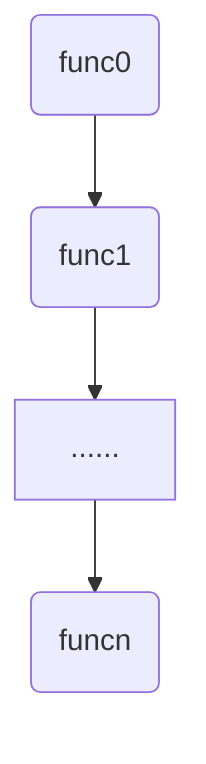
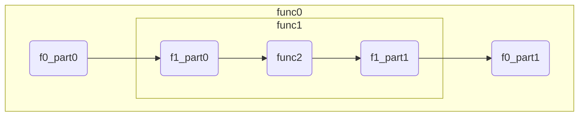
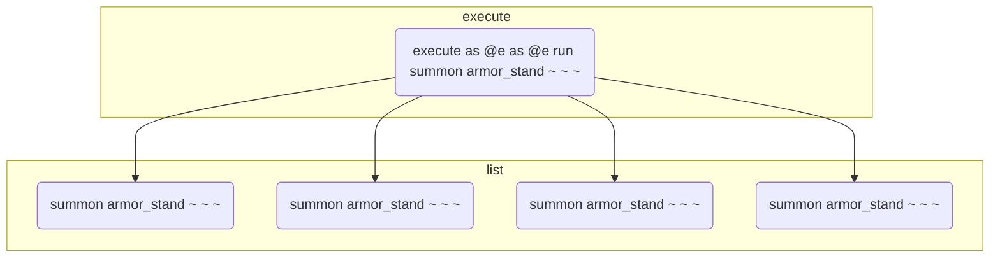
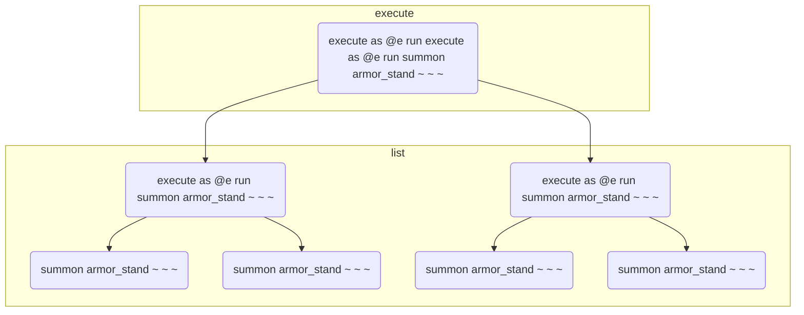
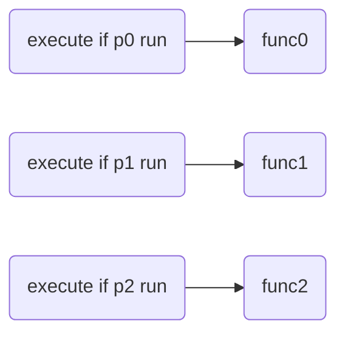

# 命令与函数

## 命令函数的组织方式

在学习了命令函数的基本要素之后，我们可以自己构造一个一个独立的函数。但是想要让这些独立的函数按照我们预期的方式组织起来，组成新的复合函数，我们还需要学习命令函数的组织方式。

根据开发中的经验，我们把组织方式分为四类：顺序、分支、递归、回调。不同的函数依次复合，此所谓顺序；两个或者多个函数形成了分岔路口，在不同的输入下有不同的函数进行复合，此所谓分支；当同一个函数复合了自己，形成了具有自相似性的组织结构，此所谓递归；当函数被作为参数进行传递，在需要的时候调用，此所谓回调。

在mc命令中选择合适的元素，构造以上四种组织方式的框架，是本章第三部分的任务。同时，对于第二部分中命令的基本要素，把它们组织在一起后，可能会出现冲突的现象。探究这些冲突何时会发生，以及如何维护来避免冲突的发生，也是第三部分的重要任务。

### 顺序

顺序是命令函数最常见的组织方式，例如：所有的单条命令都是依次执行的。单条命令总是在一条执行完之后再执行另一条，不存在“同时”的概念(单线程)。因此，命令函数总是依照某种顺序来执行。我们通常使用function与execute遍历两种方法来构造命令函数顺序。

#### function构造

在mcfunction文件中，按行依次写下函数f0,f1,f2......fn，运行这个function，将会依次执行f0,f1,f2......fn。设一个自然数i，i<n。函数fi+1总是在fi运行完后再运行，且两个函数之间不可能会有其它函数运行。我们称这种顺序为依次执行，模型图如下：



如果funci是一段命令，我们可以把它重新划分成不同的部分，或是放进多个连续mcfunction文件进行重组，或是把许多连续的不同部分合并成一段，都不改变处理规则，整体函数与原函数等价。另外，给两段函数funca和funcb，如果funca的输出与funcb的输入无关，funcb的输出也与funca的输入无关，那么它们还可以交换顺序，改变顺序后整体函数也与原函数等价。

\#例：

```
#计算1/l*(pos+uvec)模长平方
scoreboard players operation tempx int += tempi int
scoreboard players operation tempy int += tempj int
scoreboard players operation tempz int += tempk int
scoreboard players operation tempx int /= templ int
scoreboard players operation tempy int /= templ int
scoreboard players operation tempz int /= templ int
scoreboard players operation tempx int *= tempx int
scoreboard players operation tempy int *= tempy int
scoreboard players operation tempz int *= tempz int
scoreboard players operation tempd int = tempx int
scoreboard players operation tempd int += tempy int
scoreboard players operation tempd int += tempz int
```

经过我们交换顺序并重组后：

```
#x坐标
scoreboard players operation tempx int += tempi int
scoreboard players operation tempx int /= templ int
scoreboard players operation tempx int *= tempx int

#y坐标
scoreboard players operation tempy int += tempj int
scoreboard players operation tempy int /= templ int
scoreboard players operation tempy int *= tempy int

#z坐标
scoreboard players operation tempz int += tempk int
scoreboard players operation tempz int /= templ int
scoreboard players operation tempz int *= tempz int

#获得模长平方
scoreboard players operation tempd int = tempx int
scoreboard players operation tempd int += tempy int
scoreboard players operation tempd int += tempz int
```

可以看出，我们需要根据命令段的前后逻辑，合理地重组依次执行顺序，在合适的地方加上空行，使命令段具有更好的可读性。

现在我们来探讨输入输出和临时对象在依次执行中的兼容性问题。

对于执行方式表示的输入，由于执行方式具有局部性，每条命令都有属于自己的执行方式，冲突不会发生，完全兼容。

\#例：

```
#test
setblock ~ ~1 ~ stone
setblock ~ ~2 ~ glass
```

两条命令都使用了执行方式，输入了不同的坐标，石头的玻璃均被放置在正确的位置。

对于人工维护的输入输出，任意两个函数funci和funcj，如果funci与funcj使用了相同的表示，例如funci在funcj之前，当funci执行结束后再执行funcj，由于输入输出每次使用都被重新赋值(例如tag @e remove input)，与之前的输入输出使用情况无关，因此冲突不会发生，完全兼容。

\#例：

```
#test
scoreboard players set inp int 16
function math:_sqrt
scoreboard players get res int

scoreboard players set inp int 64
function math:sqrt/_3sqrt
scoreboard players get res int
```

这里使用了相同的输入形式<inp,int>，分别用16和64去调用了两个不同的开根号函数，分别都得到了正确答案4和8000。

对于临时对象形式，任意两个函数funci和funcj，如果funci与funcj的处理使用了相同的表示，例如funci在funcj之前，当funci执行结束后再执行funcj，由于临时对象每次使用要么被重新赋值(例如临时方块的setblock 0 11 0 air)，要么被规定在使用完成后清除(例如临时实体的kill @e[tag=tmp])，与之前的临时对象使用情况无关，因此冲突不会发生，完全兼容。

\#例：

```
#test
scoreboard players operation temp int = inp0 int
scoreboard players operation temp int += inp1 int
tellraw @a {"score":{"name":"temp","objective":"int"}}

scoreboard players operation temp int = inp2 int
scoreboard players operation temp int += inp3 int
tellraw @a {"score":{"name":"temp","objective":"int"}}
```

这里处理了两组不同的输入{<inp0,int>,<inp1,int>}和{<inp2,int>,<inp3,int>}，却使用了同一个临时分数temp，分别使用tellraw输出了两组输入的和。

因此，我们得到结论：如果不同的命令函数使用了相同的基本要素表示，在依次执行中完全兼容。

除了依次执行，利用mcfunction，我们还可以在一段命令函数的中间插入另一个函数。例如整段函数是f0，插入的函数是f1，那么f1将f0划分为了三部分：f0_part0,f1,f0_part1。执行f0也即依次执行f0_part0,f1,f0_part1。我们把f0与f1的顺序称为嵌套执行。嵌套执行的模型图如下：



在嵌套模型中，我们探究这两个概念：函数层级，输入输出的本质。

函数层级：我们假设func0函数是直接面向用户的命令环境（例如聊天框、命令方块、tick/load中调用的函数），规定func0函数为0级函数。当i级函数嵌套执行了函数funci+1，那么函数funci+1的层级是i+1。例如在这个模型中func1是1级函数，func2是2级函数。

输入输出的本质：在嵌套模型中我们可以发现，func0将自己中间处理过程中的数据作为输入，调用了func1。而func1用自己中间处理过程中的数据作为输入，调用了func2。总结起来，对于i>0，i级函数的输入是调用自己的i-1级函数的临时对象，而i级函数的输出将会被用作i-1级函数的的临时对象。因此我们说，输入输出的本质是来自高层的临时对象。特别地，对于0级函数，它的输入输出来自于用户(玩家交互与mc世界)。

现在我们来探究输入输出与临时对象在嵌套执行中的兼容性问题。

对于执行方式表示的输入，由于它具有局部性，完全兼容（与依次执行同理，不再论述）。

对于人工维护的输入输出，因为本质是来自高层的临时对象，它们与人工构造的临时对象具有相同的兼容性。由于临时对象具有全局性，那么我们在嵌套了func1的func0函数中，如果使用了与func1或func2中相同表示的临时对象，那么冲突就发生了：f0_part0中使用的临时对象，在func1中被修改，那么在f0_part1中无法继续f0_part0中对临时对象的计算。为了解决这种冲突，我们需要引入一种命名机制来避免临时对象的冲突。在本书中使用的命名机制是s命名法。

s命名法：在n级函数的临时对象命名前加上n-1个字符's'。例如1级函数中使用临时分数<tempx,int>，在2级函数中对应<stempx,int>，在3级函数中对应<sstempx,int>。s意为"support"，底层函数是对高层函数的支持。指的注意的是，由于2级函数的输入输出是来自1级函数的临时对象，因此2级函数的输入输出是一个1级表示：<inp,int>,<res,int>。同理，3级函数的输入输出是一个2级表示：<sinp,int>,<sres,int>。

s命名法中的"越级上报"现象：高层函数可以直接调用更底层函数，不会引起冲突(例如0级函数调用2级函数)。底层函数可以直接拿取高层函数的数据作为输入，不会因此冲突(例如2级函数可以直接获取玩家数据，而玩家数据属于用户层的0级环境)。

#### execute构造

使用execute遍历是另外一种构造命令函数顺序的方法。例如世界上有5个实体，ABCDE(这里默认为选择器未指定sort参数时的实体加载顺序，例如先summon A，那么A会第一个被选择)，使用命令`execute as @e run say hi`可以遍历这5个实体，让它们分别输出hi。那么execute的顺序只是依次执行A say hi , B say hi，C say hi，D say hi，E say hi吗？为了更加深入地理解一条execute的处理顺序，让我们来实现<输入输出部分>例子中引用到的entity:_kill_each_other函数。

```
#entity:_kill_each_other
tag @e remove result
execute as @e[tag=input,sort=random] run function entity:kill_another
tag @e[tag=input,limit=1] add result

#entity:kill_another
tag @s add tmp
tag @e[tag=input,tag=!tmp,limit=1,sort=random]
tag @s remove tmp
```

我们让输入池中的实体按随机顺序去执行kill_another函数，而kill_another函数的功能是杀死除自己以外的随机一个输入实体。那么，我们预期会有随机一名实体活下来，把它打上result标签输出。

然而，当我们实际运行后发现，并没有实体活下来。为了解释这种现象，我们需要引入实时解析与预解析的概念。

实时解析：如果A有BC，A结束后立即BC。同理，如果B有DE，B结束后立即DE，那么实际的顺序是ABDEC。我们称ABCDE之间是实时解析的。

预解析：如果A有BC，D有EF，A结束后先是把BC加入一个队列，D结束后又把EF加入队列，AD结束后再依次处理队列中的BCEF，那么实际顺序是ADBCEF。我们称AD相对于BCEF是预解析的。

我们把execute子命令中，右边的子命令看作是左边的子命令的从属，把if/unless、run子命令定义为"可返回子命令"。

在一条execute命令中，最右边的子命令必然是一个可返回子命令。而execute中可能存在的store子命令，它统计的是最右边的可返回子命令的返回值。把store的运行分为两个过程：1.解释store本身的含义，把返回值的去处像标签一样“贴”到最右边的可返回子命令上；2.运行把返回值赋值到去处。

那么一条execute命令的运行过程可以被我们划分为两部分：1.对左边的子命令进行解析，进行执行方式的状态转移，进行条件的判断来中断或继续，进行store含义的解析；2.执行最右边的可返回子命令，将可返回子命令的返回值赋值到store的去处。

我们的结论是：1、2过程中的子命令之间分别是实时解析的，而1过程相对于2过程是预解析的。

那么不难看出，在之前的_kill_each_other函数的execute命令中，所有的实体在预解析过程中都被分配了执行kill_another函数的任务，而此时kill_another函数还未运行，它们全部存活。

预解析的过程结束后，开始执行所有的kill_another函数，即使是已经被kill标记死亡的实体仍然会执行已被分配的kill_another函数任务，随机杀死一个未被标记死亡的实体。如果有n只实体，"随机杀死一个未被标记死亡的实体"，这个过程进行了n次，最终结果也即全部实体被杀死。

我们再举例几个execute的用法，希望读者能够加深对execute运行的理解，并能成功解释它们的运行结果。

\#例1：有n个实体，获取它们的x坐标。

```
execute store result score last_x int as @e[sort=furthest] store result score @s x run data get entity @s Pos[0]
```

运行结果：所有实体把自己的x坐标获取到了自己的x记分板，last_x int记分板记录了最远的实体的x坐标。

\#例2：假设两个输入实体位置不同，交换它们的位置。

```
execute as @e[tag=input] at @s at @e[tag=input,limit=1,sort=furthest] run tp @s ~ ~ ~
```

运行结果：两实体成功交换位置。读者试分析两个at分别的作用。

\#例3：假设有n个实体位置不同，让它们像环一样转圈。

```
#给所有实体编号
scoreboard players set temp int 0
execute as @e store result score @s int run scoreboard players add temp int 1
#目的地是自己的编号+1
execute as @e run scoreboard players operation @s tp = @s int
scoreboard players add @e tp 1
#n号实体的目的地是1
scoreboard players operation @e tp %= temp int
#运行传送
execute as @e at @e if score @s tp = @e[sort=nearest,limit=1] int run tp @s ~ ~ ~
```

运行结果：所有实体到达了目的地。1号实体到了原来2号实体的位置，2号实体到了原来3号实体的位置，......，n-1号实体到了原来n号实体的位置，n号实体到了原来1号实体的位置。

\#例4：n个实体，奇偶交替

```
scoreboard players set test int 0
execute as @e if score test int matches 0 store result score test int if score test int matches 0
```

运行结果：如果n是奇数，<test,int>变为1，如果n是偶数，<test,int>变为0。运行过程中<test,int>的值在01之间交替，第一个if score test int matches 0形同虚设，没有中断命令的运行。

其实，实时解析与预解析的概念在命令中普遍存在。例如在<function构造>中，我们利用mcfunction实现命令函数的复合，这些命令函数之间便是实时解析的。在<回调>一节中，我们会发现使用mcfunction调用命令方块时，mcfunction相对于命令方块是预解析的。如果读者有一定的算法基础，也可以把实时解析和预解析的概念与深度优先搜索(DFS)和广度优先搜索(BFS)的概念进行类比。

由于使用execute构造多条命令函数的顺序时，这些命令函数之间遵循我们在function构造中讲到的"依次执行"模型，输入输出和临时对象的兼容性与那个模型相同，这里不再论述。

最后，我们来介绍execute与function的互相嵌套问题。让我们假设世界上只有x个实体，它们全是盔甲架，如果做三次实验，每次分别运行以下函数，分别会得到几个盔甲架？

\#例1

```
execute as @e as @e run summon armor_stand ~ ~ ~
```

根据实时解析与预解析的理论，在预解析阶段，两层as @e构造了一个 x^2 次数的顺序，把 x^2 条summon命令加入了执行列表，然后处理执行列表，执行了 x^2 次生成盔甲架，因此最后会有x^2+x个盔甲架。



\#例2

```
execute as @e run execute as @e run summon armor_stand ~ ~ ~
```

首先根据实时解析与预解析的理论，第一层execute as @e run把x条"execute as @e run summon armor_stand ~ ~ ~"加入了执行列表。处理执行列表时，一边处理前面的x条"execute as @e run summon armor_stand ~ ~ ~"，一边在执行列表后面追加新的summon命令，每条"execute as @e run summon armor_stand ~ ~ ~"都会追加x条summon命令，总共有x条，因此依然会有 x^2 条summon命令，最后会有x^2+x个盔甲架。



\#例3

```
#test1
execute as @e run function #test2

#test2
execute as @e run summon armor_stand ~ ~ ~
```

首先根据实时解析与预解析理论，#test1函数分发了x条function #test2命令。而function具有一个特性是：内部全部命令结束后整个function命令才会结束。因此，第二条execute as @e run summon armor_stand ~ ~ ~开始执行时，第一条execute as @e run summon armor_stand ~ ~ ~已经全部执行结束，第二条接收了第一条已经生成的盔甲架作为输入，会生成更多的盔甲架，这是与#例2不同的地方。function的结束特性，使得我们可以把function看作一个个独立的功能，例如test2抽象为“把盔甲架数量翻倍”。在这里，x个盔甲架，运行了x次“把盔甲架数量翻倍”，因此最后会得到x*2^x个盔甲架。

function的"独立功能"特性，可以使以上逻辑在n个test函数中依然成立。我们把 $f^{(n)}(x)$ 作为 $f(f(f(...f(x)...)))$ 这里有n个f的表示，那么在n层function+execute嵌套后实体的数量可以表示为:

$$
f_{n}(x) =
\begin{cases} 
2x&,\ \ n=1\\
f^{(x)}_{n-1}(x)&,\ \ n> 1\\
\end{cases}
$$

### 分支

我们通过execute if/unless控制命令的执行与中断来选择不同的命令函数与之前的命令函数进行复合，从而实现分支结构。

如果分支较少，我们称这种分支为简单分支。简单分支的实现离不开条件的运算，因此我们在简单分支中还要讲解条件逻辑运算的实现与开销优化问题。

如果分支较多，我们的实现方法是记分板树。对一棵纯的记分板树，我们关注它的开销问题，因此引入分支因子x并探究x的最佳取值。对一棵其它类型参数的记分板树，我们要找到这种类型转化为分数的转换函数。

#### 简单分支

前后无关性：

前后无关性是分支结构的重要特性。由于在mcfunction中，我们用依次执行execute if/unless的方式来构造简单分支，如下图：



如果条件p0返回成功，首先执行func0，再去判断条件p1，p2。这意味着，条件判定与命令执行之间的关系是实时解析的。但在我们预期的分支模型中，条件判定相对于命令执行是预解析的，即先判断所有的条件，再选择一个路口继续执行。

二者的不同发生在命令的运行效果会改变条件的判定结果时，也即前后发生了关联。

\#例：金币多的队伍获胜并结束游戏。

```
#coin_judge
execute if score red_coin int > blue_coin int run function #red_win
execute if score red_coin int = blue_coin int run function #score_draw
execute if score red_coin int < blue_coin int run function #blue_win

#end_game
scoreboard players set red_coin int 0
scoreboard players set blue_coin int 0
#else operations
```

在coin_judge函数中，逻辑看似十分正确，金币多的队伍获胜，如果金币一样就判定为平局。但是red_win、score_draw、blue_draw都会调用结束游戏的函数end_game，其中包括重置金币数的操作。也就是说命令执行的结果反过来影响了条件判定，发生了前后关联。那么如果红队的金币比较多，将会看到红队获胜与平局都会发生，十分诡异。

因此，为了保证简单分支的正常运行，维护它的前后无关性是十分重要的。我们通常有三种维护方法：

1.直接维护：删除反作用于条件的操作。上述获胜判定一例中，金币数量的重置操作完全可以放到游戏开始而不是游戏结束。

2.重组顺序：如果条件i执行的操作会影响到条件j，我们就先判定条件j后判定条件i。上述获胜判定一例中，我们只需要调整coin_judge函数的判定顺序就可以避开前后关联：

```
#coin_judge
execute if score red_coin int = blue_coin int run function #score_draw
execute if score red_coin int > blue_coin int run function #red_win
execute if score red_coin int < blue_coin int run function #blue_win
```

3.转移数据：把判定条件的数据先转移到一个临时对象，条件改为判定临时对象，那么反作用不会涉及临时对象。上述获胜判定一例，我们可以把coin_judge修改为：

```
#coin_judge
scoreboard players operation temp int = red_coin int
scoreboard players operation temp int -= blue_coin int
execute if score temp int matches 1.. run function #red_win
execute if score temp int matches 0 run function #score_draw
execute if score temp int matches ..-1 run function #blue_win
```

当然，为了维护临时对象temp的兼容性，这里与顺序中<嵌套执行>同理，需要遵循s命名法。

顺序化分支：

分支会带来函数的嵌套。函数嵌套不仅会让函数文件变多，导致前后文逻辑不连贯，还会带来上面所说的前后关联陷阱。嵌套的兼容性需要使用s命名法来维护，十分不方便。总的来说，嵌套较多的命令是丑陋的，可维护性差的。

简单分支的函数嵌套有时是可以被化解的。这种化解方法我们称之为顺序化。顺序化的基本思想是“以不变应万变”。对于不同的分支，我们找到它们相同的部分，汇聚在一起处理。根据不变部分的处理的前后，顺序化处理可以分为两种：不变在前、不变在后。以下几个例子可以演示顺序化处理的两种方法：

\#例1：出门买一个西瓜，看见卖包子的就买两个。

```
#test_buy
scoreboard players set buy_count int 1
execute if entity @e[tag=ssbun_trader] run scoreboard players set buy_count int 2
execute as @e[tag=wmelon_trader,limit=1] run function trader:_buy
```

\#例2：过大门，警察要有警察证，医生要有医生证，农民要有农民证，工人要有工人证，有证可以过，没证不让过。

```
#gate_access
execute if score inp int matches 1 if entity @s[tag=license_1] run scoreboard players set res int 1
execute if score inp int matches 1 if entity @s[tag=!license_1] run scoreboard players set res int 0
execute if score inp int matches 2 if entity @s[tag=license_2] run scoreboard players set res int 1
execute if score inp int matches 2 if entity @s[tag=!license_2] run scoreboard players set res int 0
execute if score inp int matches 3 if entity @s[tag=license_3] run scoreboard players set res int 1
execute if score inp int matches 3 if entity @s[tag=!license_3] run scoreboard players set res int 0
execute if score inp int matches 4 if entity @s[tag=license_4] run scoreboard players set res int 1
execute if score inp int matches 4 if entity @s[tag=!license_4] run scoreboard players set res int 0
```

可以看到，写了一坨if，非常丑陋。经过“不变在前”的顺序化优化后：

```
#gate_access
scoreboard players set res int 0
execute if score inp int matches 1 if entity @s[tag=license_1] run scoreboard players set res int 1
execute if score inp int matches 2 if entity @s[tag=license_2] run scoreboard players set res int 1
execute if score inp int matches 3 if entity @s[tag=license_3] run scoreboard players set res int 1
execute if score inp int matches 4 if entity @s[tag=license_4] run scoreboard players set res int 1
```

不变在前的顺序化其实是提供了一种“默认值”的功能。凡是结果为默认值的条件都不需要再判断了。

\#例3：如果奖池里有奖品，就从奖池里抽一个奖品。如果奖池里没奖品，就刷新奖池，再从奖池里抽一个奖品。

```
#test_loot
execute if data storage math:io loot_list[0] run function #test_loop0
execute unless data storage math:io loot_list[0] run function #test_loot1

#test_loot0
summon item ~ ~ ~ {Item:{id:"minecraft:glass",Count:1b},Tags:["tmp"]}
data modify entity @e[tag=tmp,limit=1] Item set from storage math:io loot_list[0]
tag @e remove tmp
data remove storage math:io loot_list[0]

#test_loot1
#math:class loot_list为奖池的数据模板。
data modify storage math:io list set from storage math:class loot_list
#_shuffle是列表的洗牌算法。我们将在章节<数据处理基础>中实现它。
function math:list/_shuffle
data modify storage math:io loot_list set from storage math:io list
summon item ~ ~ ~ {Item:{id:"minecraft:glass",Count:1b},Tags:["tmp"]}
data modify entity @e[tag=tmp,limit=1] Item set from storage math:io loot_list[0]
tag @e remove tmp
data remove storage math:io loot_list[0]
```

采用一般的简单分支，额外开了两个函数，指令十分臃肿。

更加令人恼火的是，这里踩中了简单分支的前后关联陷阱：如果奖池里只剩一项奖品，抽出这个奖品后将会立即刷新奖池并抽出另一个奖品，这不符合我们一次只抽一个奖品的需要。

不过，我们使用“不变在后”的顺序化处理后，就可以让这个分支得到很简洁的优化了：

```
#test_loot
#如果奖池没奖品就刷新，保证奖池有奖品。
execute unless data storage math:io loot_list[0] run function #loot_refresh
#生成奖品
summon item ~ ~ ~ {Item:{id:"minecraft:glass",Count:1b},Tags:["tmp"]}
data modify entity @e[tag=tmp,limit=1] Item set from storage math:io loot_list[0]
tag @e remove tmp
data remove storage math:io loot_list[0]

#loot_refresh
data modify storage math:io list set from storage math:class loot_list
function math:list/_shuffle
data modify storage math:io loot_list set from storage math:io list
```

顺序化分支更典型的应用是二分法施加某种“可叠加的影响”。这种影响的数值可以拆分为若干二进制位，我们从高位开始依次施加这种影响，每次把高位拆除掉，原来的“次高位”就变成了新的高位。

\#例：二分法给予执行者玩家指定数量，并且最多63个金锭。

```
#give_coin
#防止改变函数输入
scoreboard players operation temp int = inp int

#拆分各二进制位
execute if score temp int matches 32.. run give @s gold_ingot 32
execute if score temp int matches 32.. run scoreboard players remove temp int 32
execute if score temp int matches 16.. run give @s gold_ingot 16
execute if score temp int matches 16.. run scoreboard players remove temp int 16
execute if score temp int matches 8.. run give @s gold_ingot 8
execute if score temp int matches 8.. run scoreboard players remove temp int 8
execute if score temp int matches 4.. run give @s gold_ingot 4
execute if score temp int matches 4.. run scoreboard players remove temp int 4
execute if score temp int matches 2.. run give @s gold_ingot 2
execute if score temp int matches 2.. run scoreboard players remove temp int 2
execute if score temp int matches 1.. run give @s gold_ingot 1
```

与或非逻辑：

简单分支的构造离不开条件，有时我们需要实现条件的逻辑运算。我们来实现三种常见的逻辑运算：与或非，并讨论它们的兼容性。

非：

1.if/unless互相改写。一般情况下，条件在execute的if/unless互为非，不过这也是有例外的。例如if score与unless score，如果记分板不存在，二者都返回0；if block与unless block，如果判断坐标在虚空，二者都返回0。

if/unless与执行方式一样，具有完美的兼容性。

2.记分板取反。我们使用记分板的0/1值表示真假，只需要对它进行加1模2的操作就能取反。

```
#not_implement
execute store success score res int if <condition>
scoreboard players add res int 1
scoreboard players operation res int %= 2 int
```

```
#not_implement
execute store success score res int if <condition>
execute store success score res int if score res int matches 0
```

记分板方法的兼容性与<嵌套执行>相同，需要s命名。

或：

我们使用一个顺序化分支来实现或逻辑。或的默认值是0，每个条件都只能把或的结果置1。

```
scoreboard players set res int 0
execute if <condition0> run scoreboard players set res int 1
execute if <condition1> run scoreboard players set res int 1
#......
execute if <conditioni> run scoreboard players set res int 1
```

我们还可以利用短路原理对或逻辑进行开销优化。短路原理利用之前判断的结果，如果结果已经被置1，则后面无需判断。

```
scoreboard players set res int 0
execute if <condition0> run scoreboard players set res int 1
execute if score res int 0 if <condition1> run scoreboard players set res int 1
execute if score res int 0 if <condition2> run scoreboard players set res int 1
#......
execute if score res int 0 if <conditioni> run scoreboard players set res int 1
```

短路原理能够优化的前提是：\<conditioni\>的开销较大，比if score的开销大的多，那么使用if score进行提前截断才有优化价值。否则会适得其反，徒增if score开销。

该方法的兼容性与<嵌套执行>相同，需要s命名。

与：

```
scoreboard players set res int 0
execute if <condition0> if <condition1> if <condition2> ... if <conditioni> run scoreboard players set res int 1
```

注意：这里没有使用store法获取结果，这是因为store统计最右边的<可返回子命令>，如果condition0不通过，最右边的conditioni其实不会被判断，store也就不会对结果进行赋值。

我们重点关注与逻辑的开销问题。在execute中，熔断机制是存在的。前面的条件不通过，后面的条件就不会进行运算。

这意味着，我们将不同的条件安排在不同的位置，虽然效果同样是实现了与逻辑，但开销是不同的。

现在，我们的任务就是找到让开销最少的条件排列。对于命令 `execute if c0 if c1 if c2 ...... if ci` ，我们假设条件ci通过的概率是pi，开销是wi，且不同条件通过与否相互独立。那么，命令只判断条件c0的概率是1-p0，命令只判断条件c0,c1的概率是p0*(1-p1)，命令只判断条件c0,c1,c2的概率是p0\*p1\*(1-p1)......每种情况乘上对应的概率进行求和，即可求得开销的总期望值。或者，我们换一种方式进行理解：条件c0的开销必然被运行，无论失败或成功；条件c1的开销只能在c0成功后运行；条件c2的开销只能在c0成功并且c1成功后运行......因此总期望为w0+p0\*w1+p0\*p1\*w2+......+p0\*p1\*p2*......*wi

对于相邻两项：p0\*p1\*p2\*......\*pi-1\*wi与p0\*p1\*p2\*......\*pi-1\*pi\*wi+1相加，我们可以提取公共部分：(p0\*p1\*p2\*......\*pi-1)(wi+pi\*wi+1)，如果我们将条件jk分别代入这个局部，可以得到wj+pj\*wk与wk+pk\*wj。如果说j条件在前是更小的开销，那么两者作差应该小于0，可以得到：

$$
(1-p_k)w_j<(1-p_j)w_k
$$

也就是说，对于两个相邻的条件，我们可以分别计算它们的开销乘上对方的反概率，较小者优先放到前面。

事实上，任意多个条件，我们发现，可以使用数值 $w_i/(1-p_i)$ 来度量条件ci的开销权重，权重小的条件优先放到前面，即可得到统计上最优的开销。如果对这个结论感兴趣，读者自证不难。

当然，在实际开发中我们不可能严格测出wi和pi的准确数值，假设“条件相互独立”也不一定成立。不过这个推导仍然具有指导意义：我们在编写指令时可以估计条件的概率与开销，开销小或是概率低的条件可以放到前面。

#### 记分板树

记分板树是分支情况较多的高级分支。由于记分板判断的性能较好，能表示的不同值也足够多，我们使用记分板分数来控制一棵记分板树的路径。

\#例：输入光照强度，输出对应等级光源方块

```
#setlight
execute if score inp int matches 0 run setblock ~ ~ ~ light[level=0]
execute if score inp int matches 1 run setblock ~ ~ ~ light[level=1]
execute if score inp int matches 2 run setblock ~ ~ ~ light[level=2]
execute if score inp int matches 3 run setblock ~ ~ ~ light[level=3]
execute if score inp int matches 4 run setblock ~ ~ ~ light[level=4]
execute if score inp int matches 5 run setblock ~ ~ ~ light[level=5]
execute if score inp int matches 6 run setblock ~ ~ ~ light[level=6]
execute if score inp int matches 7 run setblock ~ ~ ~ light[level=7]
execute if score inp int matches 8 run setblock ~ ~ ~ light[level=8]
execute if score inp int matches 9 run setblock ~ ~ ~ light[level=9]
execute if score inp int matches 10 run setblock ~ ~ ~ light[level=10]
execute if score inp int matches 11 run setblock ~ ~ ~ light[level=11]
execute if score inp int matches 12 run setblock ~ ~ ~ light[level=12]
execute if score inp int matches 13 run setblock ~ ~ ~ light[level=13]
execute if score inp int matches 14 run setblock ~ ~ ~ light[level=14]
execute if score inp int matches 15 run setblock ~ ~ ~ light[level=15]
```

这是一棵长度为16，分支因子为16的记分板树，也即通常所说的“穷举”。我们可以发现，穷举法的性能浪费是十分严重的。如果是n种情况的穷举，它要进行n次分数判断，而其中仅仅只有1次是成功的。

实际上我们可以实现开销更低的记分板树，这就是为什么需要引入分支因子的概念。

分支因子x：

每个记分板树搜索函数内，仅写x条if score，分成许多不同的函数，以达到减少性能浪费的目的。例如我们把上述setlight函数改写成分支因子为4的记分板树：

```
#setlight/0_15
execute if score inp int matches 0..3 run function #setlight/0_3
execute if score inp int matches 4..7 run function #setlight/4_7
execute if score inp int matches 8..11 run function #setlight/8_11
execute if score inp int matches 12..15 run function #setlight/12_15

#setlight/0_3
execute if score inp int matches 0 run setblock ~ ~ ~ light[level=0]
execute if score inp int matches 1 run setblock ~ ~ ~ light[level=1]
execute if score inp int matches 2 run setblock ~ ~ ~ light[level=2]
execute if score inp int matches 3 run setblock ~ ~ ~ light[level=3]

#setlight/4_7
execute if score inp int matches 4 run setblock ~ ~ ~ light[level=4]
execute if score inp int matches 5 run setblock ~ ~ ~ light[level=5]
execute if score inp int matches 6 run setblock ~ ~ ~ light[level=6]
execute if score inp int matches 7 run setblock ~ ~ ~ light[level=7]

#setlight/8_11
execute if score inp int matches 8 run setblock ~ ~ ~ light[level=8]
execute if score inp int matches 9 run setblock ~ ~ ~ light[level=9]
execute if score inp int matches 10 run setblock ~ ~ ~ light[level=10]
execute if score inp int matches 11 run setblock ~ ~ ~ light[level=11]

#setlight/12_15
execute if score inp int matches 12 run setblock ~ ~ ~ light[level=12]
execute if score inp int matches 13 run setblock ~ ~ ~ light[level=13]
execute if score inp int matches 14 run setblock ~ ~ ~ light[level=14]
execute if score inp int matches 15 run setblock ~ ~ ~ light[level=15]
```

经过4分支因子的优化，现在每次查询只需要进行8次if score而不是16次。事实上，对于x^y种情况的记分板树，使用x分支因子只需要进行x*y次if score判断。(每层执行一个函数进行x次，总共y层)

现在我们来探究x的最佳取值。

如果总情况数固定不变为n，即n=x^y，那么y=log(x,n)。每个搜索函数，我们要进行x次execute if score操作和1次function调用操作。经过实验测定，二者的开销数值分别为1.3cc和1.4cc（见附录-命令开销表）。因此总开销关于x的函数：

$$
cost(x)=(1.3x+1.4)log_x(n)
$$

如果限定x只取正整数，可以发现cost(4)最小。因此从开销的角度分析，分支因子的最佳取值是4。

当然，分支因子较小会导致文件数和空间占用过多。如果不希望文件过多，也可以适当增大分支因子的取值。

非整数输入转化为分数：

记分板树对于非整数的输入有变形。最为常见的是针对字符串输入的记分板树。

\#例：用字符串参数指定生物类型

```
#mob:_new
tag @e remove result
execute if data storage math:io input{type:"spider"} run summon spider ~ ~ ~ {Tags:["result"]}
execute if data storage math:io input{type:"zombie"} run summon zombie ~ ~ ~ {Tags:["result"]}
execute if data storage math:io input{type:"creeper"} run summon creeper ~ ~ ~ {Tags:["result"]}
execute if data storage math:io input{type:"villager"} run summon villager ~ ~ ~ {Tags:["result"]}
execute if data storage math:io input{type:"skeleton"} run summon skeleton ~ ~ ~ {Tags:["result"]}
execute if data storage math:io input{type:"iron_golem"} run summon iron_golem ~ ~ ~ {Tags:["result"]}
execute as @e[tag=result,limit=1] run function mob:set
```

对于字符串形式的输入，我们可以通过data get命令的返回值获得字符串长度，建立与长度相关的记分板树，从而实现筛选，减少if data次数（访问nbt的操作开销较大），实现优化开销：

```
#mob:_new
tag @e remove result
execute store result score temp_l int run data get storage math:io input.type
execute if score temp_l int matches 6 run function mob:new/length_6
execute if score temp_l int matches 7 run function mob:new/length_7
execute if score temp_l int matches 8 run function mob:new/length_8
execute if score temp_l int matches 10 run function mob:new/length_10
execute as @e[tag=result,limit=1] run function mob:set

#mob:new/length_6
execute if data storage math:io input{type:"spider"} run summon spider ~ ~ ~ {Tags:["result"]}
execute if data storage math:io input{type:"zombie"} run summon zombie ~ ~ ~ {Tags:["result"]}

#mob:new/length_7
execute if data storage math:io input{type:"creeper"} run summon creeper ~ ~ ~ {Tags:["result"]}

#mob:new/length_8
execute if data storage math:io input{type:"villager"} run summon villager ~ ~ ~ {Tags:["result"]}
execute if data storage math:io input{type:"skeleton"} run summon skeleton ~ ~ ~ {Tags:["result"]}

#mob:new/length_10
execute if data storage math:io input{type:"iron_golem"} run summon iron_golem ~ ~ ~ {Tags:["result"]}
```

记分板树的兼容性与适用性：

兼容性与嵌套执行同理，需要s命名，不再赘述。

我们来重点讨论记分板树的适用性。读者可能发现，记分板树本质上和“n分法”的思想是相似的。我们在顺序化分支中提到过另外一种二分法，也就是把数值按位拆解后施加影响。此外，在数学和编程中，二分法是一种求解函数零点或查找问题答案的算法。

那么，如何区分这些方法各自适用于什么地方？主要是通过问题的解的形式来确定的。

1. 解是连续函数的零点，应该使用二分求零点。
2. 解是离散有序序列中的元素，应该使用二分查找。
3. 解是离散有序问题的答案，应该使用二分答案。
4. 解是施加可叠加的影响，应该使用二进制位拆解。

记分板树与以上4种“二分法”有着很大的不同。以上4者，它们对解的秩序有很高的要求。但是记分板树对解的秩序无要求，甚至搜索结果不一定是同类型的操作。它实际上是牺牲了大量空间来换取搜索的时间，通过记分板分数来控制一定范围内的动态性。

如果读者有一定的数据结构基础，可以把线段树与记分板树进行类比。

此外，mc1.19.4后动态命令成为可行的现实。在一些对即时性要求不高的场景中，动态命令可以方便地取代记分板树。我们将在章节<系统架构设计与优化>中讲解动态命令系统的设计。

### 递归

#### 尾递归(循环)

#### 广义递归

### 回调

