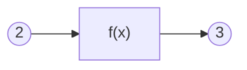
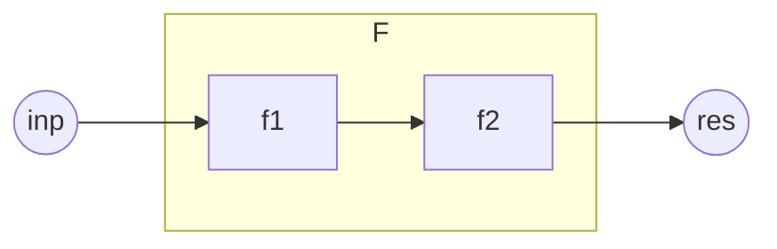
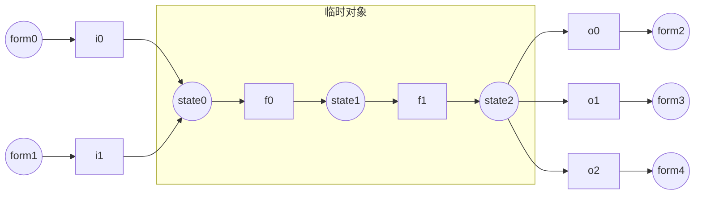

[toc]

# 前言

一.我为什么要写这本书？

&nbsp;&nbsp;&nbsp;&nbsp;&nbsp;&nbsp;&nbsp;&nbsp;从2016年入坑命令以来，对于我来说，命令是一种玩法，也是我的兴趣。我尝试探索过命令中的一些命题，并且对于它们有一套自己的看法与理论。因为某些现实因素，我可能要离开命令这个领域了，如果这些理论无法记录下来，对我而言会是一种遗憾，因此产生了编写这本书的想法。

二.你为什么要读这本书？

&nbsp;&nbsp;&nbsp;&nbsp;&nbsp;&nbsp;&nbsp;&nbsp;可能会有很多种理由，但它不应该是“为了创作出更好的作品”，这本书无法指导你的创作，如果单纯关注原版作品的质量，你应该寻求一些更加实用以及关注玩家审美的教程，而非小豆理论。在我看来，一种合理的，读这本书的理由是：“我想了解一种看待命令的视角，解决一些命令里的命题，尽管它们看起来不是那么实用”。

三.读这本书需要哪些前置知识？

- 基础的命令知识以及实践经验。
- 高中及以上水平的数学、物理知识。
- 基本的算法与数据结构思想。

四.如何读这本书？

- 读懂每一条命令
- 多进游戏测试和实践
- 书中难免有纰漏，若发现，请及时反馈给我！(QQ:859345316)
- 理论中的命令思想适用于java版mc1.14-1.19.2（2022.11.7），具体运行结果参考1.19.2

*从现在开始，让我们简洁优雅地去写好每一条命令吧！*

# 命令与函数

## 一切还要从函数说起

### 什么是函数

&nbsp;&nbsp;&nbsp;&nbsp;&nbsp;&nbsp;&nbsp;&nbsp;什么是函数呢？我们在不同的领域可能听过许多不同的定义。在数学中，函数的传统定义是这样的：

> 在一个变化过程中，设有两个变量x、y，如果对于任意一个x都有唯一确定的一个y和它对应，那么就称x是自变量，y是x的函数。

&nbsp;&nbsp;&nbsp;&nbsp;&nbsp;&nbsp;&nbsp;&nbsp;而函数的近代定义是这样的：

> 设A，B是非空数集，如果按照某种确定的对应关系f，使得对于集合A中的任意一个数x，在集合B中都有唯一确定的数y和它对应，那么就称映射f：A->B为从集合A到集合B的一个函数，记作y=f(x)。

&nbsp;&nbsp;&nbsp;&nbsp;&nbsp;&nbsp;&nbsp;&nbsp;多元函数的定义是这样的：

> 设D为一个非空的n元有序数组的集合，f为某一确定的对应规则。若对于每一个有序数组(x1,x2,...,xn)∈D，通过对应规则f，都有唯一确定的实数y与之对应，则称对应f为定义在D上的n元函数

&nbsp;&nbsp;&nbsp;&nbsp;&nbsp;&nbsp;&nbsp;&nbsp;在计算机科学中函数的定义是这样的：

> 计算机的函数，是一个固定的程序段，或称其为一个子程序，它在可以实现固定运算功能的同时，还带有一个入口和一个出口，所谓的入口就是函数所带的各个参数，我们可以通过这个入口，把函数的参数值代入子程序，供计算机处理；所谓出口，就是指函数的函数值，在计算机求得之后，由此口带回给调用它的程序。

&nbsp;&nbsp;&nbsp;&nbsp;&nbsp;&nbsp;&nbsp;&nbsp;我们不难发现，函数是一种极其抽象的概念。传统的函数定义从运动的角度认识函数，近代的函数定义从集合与映射的角度认识函数，到此为止的函数依然完成的是数与数之间的对应。而多元函数将函数的定义域扩展到了向量，完成了向量与数的对应。此外，数学中还有泛函与算子的概念，可以完成函数与数的对应，函数与函数的对应……计算机科学中的函数则具备了内部状态，能够完成特定功能，而原来数学中无内部状态的抽象的函数，在计算机科学中被称为“纯函数”。

&nbsp;&nbsp;&nbsp;&nbsp;&nbsp;&nbsp;&nbsp;&nbsp;不知道你有没有思考过，为什么会有这么多不同的概念都使用着一个相同的名字叫函数？函数的本质特征是什么？现在，我们需要从一个更加简单的角度去认识函数，抓住不同函数概念中共有的特征。

&nbsp;&nbsp;&nbsp;&nbsp;&nbsp;&nbsp;&nbsp;&nbsp;也许你已经注意到了，函数的定义非常强调函数的“唯一确定性”。对于一个自变量的值，函数必须给出一个唯一确定的值，才能称之为函数。例如在平面直角坐标系中，一个圆心在原点的圆的解析式是$x^2+y^2=r^2$。这个解析式，我们只能称其为圆的方程，而不是圆的函数。因为对于每个$x∈(-r,r)$，都有两个y与之对应，不满足唯一确定性。这个特性是我们认识函数的关键。

&nbsp;&nbsp;&nbsp;&nbsp;&nbsp;&nbsp;&nbsp;&nbsp;对于y=x+2这个函数，如果我们代入x=1，便可以得到y=3。由于函数的唯一确定性，这意味着，不管我们在何时何地何种环境下，只要把x代入1，总能得到3，不会得到其它的值。也就是说，函数可以理解为可重复使用的一台机器。我们把x也就是自变量叫做函数的输入，y也就是因变量叫做函数的输出，那么对于相同的输入，函数它总能给出相同的输出，与其它任何条件均无关。



&nbsp;&nbsp;&nbsp;&nbsp;&nbsp;&nbsp;&nbsp;&nbsp;如上图所示，f(x)这台机器也就是中间的黑盒子了。由此可见，**函数具备三个最基本的要素：输入、输出、处理。**

### 命令也是一种函数

&nbsp;&nbsp;&nbsp;&nbsp;&nbsp;&nbsp;&nbsp;&nbsp;命令也是一种函数。为什么这么说呢？我们把命令执行前的整个mc世界看作是命令的输入(包括随机种子等所有因素在内)，那么命令就会有确定的运行规则，最后得到一个确定的命令执行后的mc世界的状态。

&nbsp;&nbsp;&nbsp;&nbsp;&nbsp;&nbsp;&nbsp;&nbsp;例如：`scoreboard players add n int 1`，这条命令接收执行前的记分板分数<n,int>作为输入，进行+1处理后输出到记分板分数<n,int>。再例如：`kill @e[type=sheep]`，这条命令接收执行前已加载区块中全部活着的羊作为输入，对这些羊的血量(Health)进行置0的处理，输出到活着的羊的血量。

<details>
<summary>对int的说明</summary>
<pre>int将会是本书最常用的记分板。我们对int的定义如下：
    1.对于命名是一个整数的虚拟玩家，它们的int值是对应整数
        值。例如<2,int>的值是2，<-1,int>的值是-1。
    2.对于其它命名的虚拟玩家，它们的int用于表示记分板形式
        的临时对象。其中，命名中含有子字符串"temp"的称为
        临时分数。临时对象与临时分数的概念将在本章<命令处
        理>部分进行详细介绍。
    3.由于玩家名就是虚拟玩家名，必然属于以上情况之一，故
        玩家在int上的值不作定义。
    4.对于处于实体组中的实体，如果它有自己的上级实体，首
        先它不是玩家。那么它的int定义为自己的上级实体编号
        (一般是id记分板)。实体组与上级实体的概念将在<数理计
        算>章节进行详细介绍。
    5.对于其它非玩家实体，它们的int可以定义为自己最重要的
        整数数据，也可以留空。例如粒子实体的int可以定义为自
        己的存在时间。</pre>
</details>
<details>
<summary>对kill命令与@e选择器的说明</summary>
<pre>
读者对kill命令与@e选择器，应该已经有了比较通俗的理解：
kill的作用是“清除”实体，而@e的作用是选择全部实体。那
么，为什么笔者在上文的清除绵羊一例中要进行繁琐的叙述呢？
主要是为了严谨考虑。现在，我们需要更加深入地了解这两个
概念。
1.@e不一定是全部实体。
    ①血量为0的红体状态生物无法被@e选中。
    ②非生物实体被kill命令作用后被标记，无法被@e选中。
    ③处于未加载区块中的实体无法被@e选中。
    使用@s、@a等选择器可以选中以上三种情况。
    而直接使用UUID表示法只能选中①情况实体。
2.kill不一定能清除实体。
    ①如果是生物实体，kill的作用相当于把血量置0，如果此时
        利用@s选中生物，把Health重新回升，可以实现生物复
        活。否则生物将在红体时间结束后被真正清除。
    ②如果是非生物实体，kill的作用相当于把实体作标记，使其
        无法被@e选中，并在下1tick之前被清除。这期间，没有
        手段使实体复活，但在kill命令执行后，仍然可以在同一
        个函数内使用@s选择器选中该实体，在清除之前对其进
        行操作。</pre>
</details>

&nbsp;&nbsp;&nbsp;&nbsp;&nbsp;&nbsp;&nbsp;&nbsp;因此可以说，**命令具备函数的基本要素(输入、输出、处理)**。我们将在本章<命令函数的基本要素>部分详细介绍命令的输入输出与处理。

&nbsp;&nbsp;&nbsp;&nbsp;&nbsp;&nbsp;&nbsp;&nbsp;另外，mcfunction是命令体系中重要的组成部分，也是更为特殊的函数。它允许将多条命令写到同一个文件中，并依次执行。调用mcfunction的命令是function。前文已经论述，命令是一种函数，又因为function是一种命令，所以function也是一种函数。这说明，借助mcfunction我们可以将多条命令合成为一个新的函数。下图中的模型可以阐释该原理：



&nbsp;&nbsp;&nbsp;&nbsp;&nbsp;&nbsp;&nbsp;&nbsp;图中f1和f2是基本的命令函数，f1的输出即为f2的输入。F同样可以看成一个具有输入与输出的黑箱结构，而f2(f1())即为F确定的处理规则。因此，F具备了函数的基本要素，它是一个复合函数。

&nbsp;&nbsp;&nbsp;&nbsp;&nbsp;&nbsp;&nbsp;&nbsp;因此可以说，命令函数不仅具备函数的基本要素，**命令函数之间还可以通过一定的组织方式复合为新的函数。** 我们将在本章<命令函数的组织方式>部分进行详细介绍。

## 命令函数的基本要素

### 输入输出

#### 执行方式：天然的命令输入

&nbsp;&nbsp;&nbsp;&nbsp;&nbsp;&nbsp;&nbsp;&nbsp;执行方式，又称执行环境，是一系列命令运行过程中使用的参数的总称，包括维度、坐标、朝向、执行者、高度h五个。每条命令都具有自己的执行方式，因此执行方式具有局部性。如果未经过execute改变执行方式，那么子命令的执行方式与父命令的执行方式保持一致，因此执行方式具有继承性。

&nbsp;&nbsp;&nbsp;&nbsp;&nbsp;&nbsp;&nbsp;&nbsp;命令通过一系列基本表达与执行方式建立联系。由于引入执行维度会使得叙述变得复杂，我们一般忽略维度的不同，默认为主世界。以下为常用的执行方式表达。

&nbsp;&nbsp;&nbsp;&nbsp;&nbsp;&nbsp;&nbsp;&nbsp;目标选择器@s即为执行者实体的指代。注意：执行者可以不是实体，例如命令方块，此时@s会选择失败。

&nbsp;&nbsp;&nbsp;&nbsp;&nbsp;&nbsp;&nbsp;&nbsp;目标选择器参数中dx=,dy=,dz=或是distance=，它们的范围起点由x=,y=,z=确定。但如果x=,y=,z=中的任意个未被指定，其默认值则为执行坐标对应分量的值。

&nbsp;&nbsp;&nbsp;&nbsp;&nbsp;&nbsp;&nbsp;&nbsp;相对坐标系~delta_x ~delta_y ~delta_z的各轴方向与xyz轴一致，而相对坐标系的原点 ~ ~ ~ (又称为执行点)即为执行坐标。**需要特别指出的一点是：许多命令新人会将<执行坐标>与<执行者坐标>的概念混淆，误认为 ~ ~ ~ 就是@s的坐标，这是十分不正确的，必须根据实际情况分析二者的坐标。**

&nbsp;&nbsp;&nbsp;&nbsp;&nbsp;&nbsp;&nbsp;&nbsp;局部坐标系^u ^v ^w的各轴方向由执行朝向确定。u轴方向为执行朝向的左方向，v轴方向为执行朝向的上方向，w轴方向为执行朝向的前方向，可以简记为“左上前”。而局部坐标系的原点 ^ ^ ^ (又称为基准点)，由执行坐标与高度h共同确定：^ ^ ^即为~ ~h ~，或者说基准点位于执行点上方h格高度处。

&nbsp;&nbsp;&nbsp;&nbsp;&nbsp;&nbsp;&nbsp;&nbsp;我们发现，命令中遍布执行方式的身影。所以，确定一条命令的执行环境是非常重要的。以下讲解确定命令执行环境的方法。

&nbsp;&nbsp;&nbsp;&nbsp;&nbsp;&nbsp;&nbsp;&nbsp;1.根据命令执行的源头确定执行方式的初始值。

&nbsp;&nbsp;&nbsp;&nbsp;&nbsp;&nbsp;&nbsp;&nbsp;·若源头为玩家聊天框，那么执行者是玩家，执行维度是玩家所在维度，执行坐标是玩家坐标(碰撞箱地面中心，即feet的位置，feet与eyes又称为实体的锚点)，执行朝向是玩家朝向，高度h是0。

&nbsp;&nbsp;&nbsp;&nbsp;&nbsp;&nbsp;&nbsp;&nbsp;·若源头为命令方块，那么执行者是命令方块，执行维度是命令方块所在维度，执行坐标是命令方块的中心点坐标，执行朝向是水平正南(z+方向)，高度h是0。

&nbsp;&nbsp;&nbsp;&nbsp;&nbsp;&nbsp;&nbsp;&nbsp;·若源头为tick/load函数，那么执行者是服务端，执行维度是主世界，执行坐标是世界出生点，执行朝向是正南，高度h是0。

&nbsp;&nbsp;&nbsp;&nbsp;&nbsp;&nbsp;&nbsp;&nbsp;·此外还有一些不常用的执行源头(成书、tellraw、告示牌、schedule、进度等)，这里不再列举。

&nbsp;&nbsp;&nbsp;&nbsp;&nbsp;&nbsp;&nbsp;&nbsp;2.根据函数的调用过程中的execute子命令分析执行方式状态转移。

&nbsp;&nbsp;&nbsp;&nbsp;&nbsp;&nbsp;&nbsp;&nbsp;执行者可能被as修改为参数指定实体。

&nbsp;&nbsp;&nbsp;&nbsp;&nbsp;&nbsp;&nbsp;&nbsp;执行维度可能被in修改为参数指定维度，可能被at修改为参数指定实体所在维度。

&nbsp;&nbsp;&nbsp;&nbsp;&nbsp;&nbsp;&nbsp;&nbsp;执行坐标可能被at修改为参数指定实体坐标，可能被positioned as修改为参数指定实体坐标，可能被positioned修改为参数指定坐标，可能被align修改为原执行坐标向下取整后坐标，可能被in进行对应维度的坐标缩放。

&nbsp;&nbsp;&nbsp;&nbsp;&nbsp;&nbsp;&nbsp;&nbsp;执行朝向可能被rotated修改为参数指定朝向，可能被rotated as修改为参数指定实体朝向，可能被facing修改为从基准点看向参数指定坐标的朝向，可能被facing entity修改为从基准点看向参数指定锚点的朝向。

&nbsp;&nbsp;&nbsp;&nbsp;&nbsp;&nbsp;&nbsp;&nbsp;高度h可能被anchored eyes修改为执行者实体的身高(eyes到feet的距离)，可能被anchored feet修改为0，可能被positioned \<pos> (而at和positioned as无此效果)修改为0。

<details>
<summary>对rotated与facing以及tp细节的说明</summary>
<pre>
读者可能遇到过这样一个问题：让一个实体看向反方向。如果
使用命令execute as entity at @s run tp @s ~ ~ ~ ~
 ~180.0或者命令execute as entity at @s rotated ~ 
~180.0 run tp @s ~ ~ ~ ~ ~会发现实体并没有看向反方向
，而是看向了竖直向上或向下方向。经过我们的研究发现，问
题出现在tp而不是rotated。tp有这样一个机制：当它旋转实体
的rot1角的时候，如果我们给tp传入的目标角度超过了-90度到
90度的范围，那么实体朝向在旋转过程中会在竖直方向被卡住。
例如：实体当前朝向是89.0f，目标角度是91.0f，实体朝向最终
会变成90.0f，也就是朝向竖直向下。如果是-89.0f旋转到-91.0f
，朝向竖直向上同理。对于这个现象，我们的解决方法是利用
facing ^ ^ ^1对执行朝向进行“规整化”。facing的作用是为
执行朝向重新赋值，它是标准的-90.0f到90.0f的rot1角度。例如
rotated把执行朝向累加到(0.0f,91.0f)后，facing ^ ^ ^1会把执
行朝向规整化为(-180.0f,89.0f)，二者是同一个方向，但后者就
可以保证tp的正常运行了。类似的道理，我们可以直接使用子命
令facing ^ ^ ^-1对执行朝向进行反转。</pre>
</details>

&nbsp;&nbsp;&nbsp;&nbsp;&nbsp;&nbsp;&nbsp;&nbsp;
&nbsp;&nbsp;&nbsp;&nbsp;&nbsp;&nbsp;&nbsp;&nbsp;这是一个利用执行方式实现命令输入的例子：`setblock ~ ~5 ~ stone` 该命令接收执行坐标作为输入，在执行坐标上方5格输出一个石头。（为了简化叙述，忽略了维度、区块加载、高度上限、原有方块）

&nbsp;&nbsp;&nbsp;&nbsp;&nbsp;&nbsp;&nbsp;&nbsp;总结：执行方式是一种天然的、方便、良好的输入。它具有局部性、继承性、可直接访问的优良特性。而执行方式同时具有很大的局限性：

&nbsp;&nbsp;&nbsp;&nbsp;&nbsp;&nbsp;&nbsp;&nbsp;·单向传递，无法作为命令的输出；

&nbsp;&nbsp;&nbsp;&nbsp;&nbsp;&nbsp;&nbsp;&nbsp;·无法直接对执行方式进行复杂的数值运算；

&nbsp;&nbsp;&nbsp;&nbsp;&nbsp;&nbsp;&nbsp;&nbsp;·无法满足具有复杂结构数据的表示需求；

由于以上三点局限性，我们有必要维护更加高级的命令输入输出形式。

#### 人工维护的输入输出

&nbsp;&nbsp;&nbsp;&nbsp;&nbsp;&nbsp;&nbsp;&nbsp;本节介绍人工维护的输入输出。人工维护的输入输出，通常有以下几种形式：记分板、storage、实体。我们在本节对这三种形式的维护方法进行一一讲解。

&nbsp;&nbsp;&nbsp;&nbsp;&nbsp;&nbsp;&nbsp;&nbsp;·记分板表示的输入输出：

&nbsp;&nbsp;&nbsp;&nbsp;&nbsp;&nbsp;&nbsp;&nbsp;&nbsp;&nbsp;&nbsp;&nbsp;&nbsp;&nbsp;&nbsp;&nbsp;记分板经常被用来表示有限范围的数值(包括整数和小数)，它的表示范围是-2^31~2^31-1(即-2147483648到2147483647)。对于普通整数，直接取原数值即可。对于普通小数，我们需要事先规定好一个倍率(有时也称精度)。例如1k倍率的小数，那么2333表示的实际数值是2.333。对于较大的整数或精度较高的小数，我们就需要多个记分板分数来表示一个数值。本书中最常用的记分板输入输出是两个临时对象：inp(input的缩写)和res(result)的缩写，它们的记分板表示形式是<inp,int>和<res,int>。本书最常用的普通小数倍率是1k。

例：

```
scoreboard players set inp int 64
function math:sqrt/_3sqrt
scoreboard players get res int
```

这里把输入inp置为了64，调用了数学库中的3位精度开根号函数，获得输出res是8000(表示数值为8.000)。

&nbsp;&nbsp;&nbsp;&nbsp;&nbsp;&nbsp;&nbsp;&nbsp;·storage表示的输入输出：

&nbsp;&nbsp;&nbsp;&nbsp;&nbsp;&nbsp;&nbsp;&nbsp;&nbsp;&nbsp;&nbsp;&nbsp;&nbsp;&nbsp;&nbsp;&nbsp;storage是一种自定义nbt的储存介质。自定义nbt具有高度的自由性，经常被用于表示各种具有复杂结构的数据，甚至是被用于表示一个对象。本书中最常用的两个storage分别是math:class与math:io。math:class的特点是只用于储存静态的数据模板，它们在初始化阶段被设置，在运行阶段只读(与整数的int定义异曲同工)。math:io与math:class相反，它只用于储存运行过程中产生的各类临时数据和输入输出。对于输入输出，我们使用math:io中的input和result两个临时对象进行表示。下面三个例子可以很好地解释class与io的使用方式：

例1：

```
data modify storage math:io input set from math:class vehicles[{id:"plane"}]
function vehicles:_new
```

这段命令将载具类中飞机的数据模板放入input，然后调用了载具的构造函数，实例化了一个飞机对象。

例2：

```
data modify storage math:io input set from storage math:class vehicles[{id:"garbage_truck"}]
data modify storage math:io input merge from storage math:class vehicles[{id:"sports_car"}]
function vehicles:_new
```

这段命令构造了一个临时类：载具是跑车，但同时继承了垃圾车的部分属性，然后运行了载具的构造函数，将其实例化为对象。

例3：

```
data modify storage math:io input set from storage math:class vehicles[{id:"sports_car"}]
data modify storage math:io input.v_max set value 12.5d
function vehicles:_new
```

这段命令实例化了一辆最大速度是12.5的跑车。

&nbsp;&nbsp;&nbsp;&nbsp;&nbsp;&nbsp;&nbsp;&nbsp;·实体表示的输入输出：

&nbsp;&nbsp;&nbsp;&nbsp;&nbsp;&nbsp;&nbsp;&nbsp;&nbsp;&nbsp;&nbsp;&nbsp;&nbsp;&nbsp;&nbsp;&nbsp;实体是命令中最常用的对象，它具有功能性与逻辑性。在功能性的一面：原版生物AI可以为我们所用，盔甲架/物品展示框可以为我们提供模型显示服务，载具类实体可以提供座椅，抛射物可以制作发射效果......在逻辑性的一面：实体可以直接通过as、at等execute子命令与执行方式沟通，实现围绕实体的一系列逻辑。可以说传统命令的实质是面向实体编程。在命令中，我们最常使用的实体指代方法是使用tag。本书中对输入输出实体的指代tag分别是input和result。每次将实体置入输入输出池之前，我们首先应使用tag @e remove input/result进行输入输出池的释放。这里使用@e而不是@e[tag=]，是为了避免后者画蛇添足性的性能损坏：后者会把检查tag是否存在的操作在有tag实体上进行两次。以下几个例子展示实体输入输出的用法：

例1：

```
#entity:_new
tag @e remove result
summon marker 0 11 0 {Tags:["result","entity"]}
#else operations
```

该entity的构造函数会返回一个marker实体。当其他开发者调用entity:_new函数时，便可以使用@e[tag=result,limit=1]对返回实体进行唯一确定的指代。

例2：

```
#entity:test
function entity:_new
tag @e remove input
tag @e[tag=result,limit=1] add input
tag @e[distance=..10] add input
function entity:_kill_each_other
```

该entity的测试函数首先调用了entity的构造函数，生成了一个新的marker实体，然后利用result标签对其进行指代，置入输入池，同时将以执行位置为球心，半径10格的球体范围的全部实体置入了输入池，然后调用entity:_kill_each_other函数，使它们自相残杀。

<details>
<summary>对0 0附近区块以及坐标0 11 0的说明</summary>
<pre>
本书使用命令forceload add -1 -1 1 1将0 0附近四个区块
全部加载。0 11 0是本书中较为常用的坐标：临时方块在0 11 
0被放置，很多实体在0 11 0被生成。在0 11 0生成实体有一点
好处：我们假设玩家实际游戏区域距离0 11 0较远，那么实体
渲染的第一帧对玩家不可见。例如在玩家面前发射一支箭，如
果直接在玩家面前生成箭，会发现箭的朝向一开始并不正确，
并且有一个偏转动画。这是由于实体第一帧的渲染由summon
决定，后续命令只能使实体从初始状态经过动画过渡到后续状态
，而0 11 0使得第一帧不可见就可以避免这个问题。另外需要注
意的是，使用0 11 0生成箭这类抛射物实体，然后传送到玩家面
前时，不能使用tp，因为tp把Motion[1]归零，使用data命令传
送就可以避免这个问题了。</pre>
</details>

&nbsp;&nbsp;&nbsp;&nbsp;&nbsp;&nbsp;&nbsp;&nbsp;总结：人工维护的输入输出是更加高级的输入输出形式，能够自由地表达任意数量任意结构的数值和数据，甚至是对象。但本节所讲的人工维护的输入输出有最大的一点局限性：它们都是全局的，不具备执行方式那样的局部性。那么，有没有什么方法克服这段局限性，实现具有局部性的人工数据形式呢？我们将在<命令函数的组织方式>中的<顺序>和<广义递归>部分进行讲解。

#### 输入输出部分的总结

&nbsp;&nbsp;&nbsp;&nbsp;&nbsp;&nbsp;&nbsp;&nbsp;在本章节的第二部分，我们重点介绍了两类自定义数据的输入输出形式，它们在数值运算与数据处理中最为常见，也是最灵活的形式，能够自由地表达不同的事物。但是我们应该认识到，在命令中，输入输出的概念实际上要更为广阔。广义来讲，所有的“检测”类问题都是命令的输入，它们把mc世界中繁杂的元素转化成易于我们处理的形式（也就是本部分讲到的形式）；所有的“功能”类问题都是命令的输出，它们把我们处理后的形式转化为mc世界中可以被玩家看到或者听到的各种元素。这里可以对常见的广义输入输出问题进行一下列举（这里只是可以大致看一下命令的管辖范围，而不是要每一项讲解）。而探索mc世界输入输出的边界，利用它们制作精彩的作品就是读者的任务了！

·检测类问题

&nbsp;&nbsp;&nbsp;&nbsp;&nbsp;&nbsp;&nbsp;&nbsp;·玩家按键操作

&nbsp;&nbsp;&nbsp;&nbsp;&nbsp;&nbsp;&nbsp;&nbsp;&nbsp;&nbsp;&nbsp;&nbsp;&nbsp;&nbsp;&nbsp;&nbsp;·WASD、空格、shift

&nbsp;&nbsp;&nbsp;&nbsp;&nbsp;&nbsp;&nbsp;&nbsp;&nbsp;&nbsp;&nbsp;&nbsp;&nbsp;&nbsp;&nbsp;&nbsp;·FQ左右键，按住右键

&nbsp;&nbsp;&nbsp;&nbsp;&nbsp;&nbsp;&nbsp;&nbsp;&nbsp;&nbsp;&nbsp;&nbsp;&nbsp;&nbsp;&nbsp;&nbsp;·指定格子中有指定物品/手持指定物品

&nbsp;&nbsp;&nbsp;&nbsp;&nbsp;&nbsp;&nbsp;&nbsp;&nbsp;&nbsp;&nbsp;&nbsp;&nbsp;&nbsp;&nbsp;&nbsp;·鼠标滚轮滚动

&nbsp;&nbsp;&nbsp;&nbsp;&nbsp;&nbsp;&nbsp;&nbsp;&nbsp;&nbsp;&nbsp;&nbsp;&nbsp;&nbsp;&nbsp;&nbsp;·视角转动

&nbsp;&nbsp;&nbsp;&nbsp;&nbsp;&nbsp;&nbsp;&nbsp;&nbsp;&nbsp;&nbsp;&nbsp;&nbsp;&nbsp;&nbsp;&nbsp;·看向指定对象

&nbsp;&nbsp;&nbsp;&nbsp;&nbsp;&nbsp;&nbsp;&nbsp;&nbsp;&nbsp;&nbsp;&nbsp;&nbsp;&nbsp;&nbsp;&nbsp;·走进指定区域

&nbsp;&nbsp;&nbsp;&nbsp;&nbsp;&nbsp;&nbsp;&nbsp;&nbsp;&nbsp;&nbsp;&nbsp;&nbsp;&nbsp;&nbsp;&nbsp;·与容器ui内物品进行交互

&nbsp;&nbsp;&nbsp;&nbsp;&nbsp;&nbsp;&nbsp;&nbsp;&nbsp;&nbsp;&nbsp;&nbsp;&nbsp;&nbsp;&nbsp;&nbsp;·输入文字

&nbsp;&nbsp;&nbsp;&nbsp;&nbsp;&nbsp;&nbsp;&nbsp;&nbsp;&nbsp;&nbsp;&nbsp;&nbsp;&nbsp;&nbsp;&nbsp;·etc

&nbsp;&nbsp;&nbsp;&nbsp;&nbsp;&nbsp;&nbsp;&nbsp;·方块地形状况

&nbsp;&nbsp;&nbsp;&nbsp;&nbsp;&nbsp;&nbsp;&nbsp;&nbsp;&nbsp;&nbsp;&nbsp;&nbsp;&nbsp;&nbsp;&nbsp;·穷举进行if block探测

&nbsp;&nbsp;&nbsp;&nbsp;&nbsp;&nbsp;&nbsp;&nbsp;&nbsp;&nbsp;&nbsp;&nbsp;&nbsp;&nbsp;&nbsp;&nbsp;·插箭法在inBlockState中获得方块信息

&nbsp;&nbsp;&nbsp;&nbsp;&nbsp;&nbsp;&nbsp;&nbsp;&nbsp;&nbsp;&nbsp;&nbsp;&nbsp;&nbsp;&nbsp;&nbsp;·战利品表法获得方块id

&nbsp;&nbsp;&nbsp;&nbsp;&nbsp;&nbsp;&nbsp;&nbsp;&nbsp;&nbsp;&nbsp;&nbsp;&nbsp;&nbsp;&nbsp;&nbsp;·直接利用data get获得方块实体的nbt信息

&nbsp;&nbsp;&nbsp;&nbsp;&nbsp;&nbsp;&nbsp;&nbsp;&nbsp;&nbsp;&nbsp;&nbsp;&nbsp;&nbsp;&nbsp;&nbsp;·etc

&nbsp;&nbsp;&nbsp;&nbsp;&nbsp;&nbsp;&nbsp;&nbsp;·生物实体行为

&nbsp;&nbsp;&nbsp;&nbsp;&nbsp;&nbsp;&nbsp;&nbsp;&nbsp;&nbsp;&nbsp;&nbsp;&nbsp;&nbsp;&nbsp;&nbsp;·在指定区域

&nbsp;&nbsp;&nbsp;&nbsp;&nbsp;&nbsp;&nbsp;&nbsp;&nbsp;&nbsp;&nbsp;&nbsp;&nbsp;&nbsp;&nbsp;&nbsp;·当前状态

&nbsp;&nbsp;&nbsp;&nbsp;&nbsp;&nbsp;&nbsp;&nbsp;&nbsp;&nbsp;&nbsp;&nbsp;&nbsp;&nbsp;&nbsp;&nbsp;·etc

&nbsp;&nbsp;&nbsp;&nbsp;&nbsp;&nbsp;&nbsp;&nbsp;·etc

·功能类问题

&nbsp;&nbsp;&nbsp;&nbsp;&nbsp;&nbsp;&nbsp;&nbsp;·实体控制

&nbsp;&nbsp;&nbsp;&nbsp;&nbsp;&nbsp;&nbsp;&nbsp;&nbsp;&nbsp;&nbsp;&nbsp;&nbsp;&nbsp;&nbsp;&nbsp;·移动与传送

&nbsp;&nbsp;&nbsp;&nbsp;&nbsp;&nbsp;&nbsp;&nbsp;&nbsp;&nbsp;&nbsp;&nbsp;&nbsp;&nbsp;&nbsp;&nbsp;·血量控制

&nbsp;&nbsp;&nbsp;&nbsp;&nbsp;&nbsp;&nbsp;&nbsp;&nbsp;&nbsp;&nbsp;&nbsp;&nbsp;&nbsp;&nbsp;&nbsp;·改变状态属性

&nbsp;&nbsp;&nbsp;&nbsp;&nbsp;&nbsp;&nbsp;&nbsp;&nbsp;&nbsp;&nbsp;&nbsp;&nbsp;&nbsp;&nbsp;&nbsp;·生物AI控制

&nbsp;&nbsp;&nbsp;&nbsp;&nbsp;&nbsp;&nbsp;&nbsp;&nbsp;&nbsp;&nbsp;&nbsp;&nbsp;&nbsp;&nbsp;&nbsp;·etc

&nbsp;&nbsp;&nbsp;&nbsp;&nbsp;&nbsp;&nbsp;&nbsp;·方块放置

&nbsp;&nbsp;&nbsp;&nbsp;&nbsp;&nbsp;&nbsp;&nbsp;&nbsp;&nbsp;&nbsp;&nbsp;&nbsp;&nbsp;&nbsp;&nbsp;·穷举setblock

&nbsp;&nbsp;&nbsp;&nbsp;&nbsp;&nbsp;&nbsp;&nbsp;&nbsp;&nbsp;&nbsp;&nbsp;&nbsp;&nbsp;&nbsp;&nbsp;·使用fill/clone/结构

&nbsp;&nbsp;&nbsp;&nbsp;&nbsp;&nbsp;&nbsp;&nbsp;&nbsp;&nbsp;&nbsp;&nbsp;&nbsp;&nbsp;&nbsp;&nbsp;·掉落沙生成法

&nbsp;&nbsp;&nbsp;&nbsp;&nbsp;&nbsp;&nbsp;&nbsp;&nbsp;&nbsp;&nbsp;&nbsp;&nbsp;&nbsp;&nbsp;&nbsp;·etc

&nbsp;&nbsp;&nbsp;&nbsp;&nbsp;&nbsp;&nbsp;&nbsp;·物品修改

&nbsp;&nbsp;&nbsp;&nbsp;&nbsp;&nbsp;&nbsp;&nbsp;&nbsp;&nbsp;&nbsp;&nbsp;&nbsp;&nbsp;&nbsp;&nbsp;·穷举修改

&nbsp;&nbsp;&nbsp;&nbsp;&nbsp;&nbsp;&nbsp;&nbsp;&nbsp;&nbsp;&nbsp;&nbsp;&nbsp;&nbsp;&nbsp;&nbsp;·临时栏位修改单件物品nbt

&nbsp;&nbsp;&nbsp;&nbsp;&nbsp;&nbsp;&nbsp;&nbsp;&nbsp;&nbsp;&nbsp;&nbsp;&nbsp;&nbsp;&nbsp;&nbsp;·潜影盒法批量修改物品

&nbsp;&nbsp;&nbsp;&nbsp;&nbsp;&nbsp;&nbsp;&nbsp;·显示文本

&nbsp;&nbsp;&nbsp;&nbsp;&nbsp;&nbsp;&nbsp;&nbsp;&nbsp;&nbsp;&nbsp;&nbsp;&nbsp;&nbsp;&nbsp;&nbsp;·书本、tellraw、title、actionbar、bossbar

&nbsp;&nbsp;&nbsp;&nbsp;&nbsp;&nbsp;&nbsp;&nbsp;&nbsp;&nbsp;&nbsp;&nbsp;&nbsp;&nbsp;&nbsp;&nbsp;·sidebar

&nbsp;&nbsp;&nbsp;&nbsp;&nbsp;&nbsp;&nbsp;&nbsp;&nbsp;&nbsp;&nbsp;&nbsp;&nbsp;&nbsp;&nbsp;&nbsp;·告示牌、CustomName

&nbsp;&nbsp;&nbsp;&nbsp;&nbsp;&nbsp;&nbsp;&nbsp;&nbsp;&nbsp;&nbsp;&nbsp;&nbsp;&nbsp;&nbsp;&nbsp;·etc

&nbsp;&nbsp;&nbsp;&nbsp;&nbsp;&nbsp;&nbsp;&nbsp;·粒子声音

&nbsp;&nbsp;&nbsp;&nbsp;&nbsp;&nbsp;&nbsp;&nbsp;·etc

### 命令处理

&nbsp;&nbsp;&nbsp;&nbsp;&nbsp;&nbsp;&nbsp;&nbsp;本节我们介绍命令中最基本的处理方式。“临时”是命令处理的核心思想。在命令中，同一类型的数据可能会存在许多不同的形式，其中一些形式是用于储存而非运算的，而另外一些形式是便于我们运算的。例如对于坐标这种类型的数据，它的形式可能是实体的Pos标签，可能是执行方式中的执行坐标，也可能是以记分板表示的小数。

&nbsp;&nbsp;&nbsp;&nbsp;&nbsp;&nbsp;&nbsp;&nbsp;在命令处理中，我们通常需要将储存形式通过转换操作变成临时的运算形式，再进行处理，最后将处理完成的运算形式转换成所需的储存形式。下面的模型图可以阐释这个理论：



&nbsp;&nbsp;&nbsp;&nbsp;&nbsp;&nbsp;&nbsp;&nbsp;这里需要注意将这个模型图与我们之前的函数模型图区分。在函数模式图中，节点是函数，数据沿着箭头流动。但在命令处理模型图中，圆节点是不同的数据形式，圆节点之间转换的方块节点才是函数。i0、i1函数将储存形式form0、form1转换成了易于运算处理的临时对象初始形式state0；f0和f1是针对临时对象编写的状态转移函数，它们将临时对象从初始的state0状态转移到了处理完成的state2状态；o0、o1、o2函数将临时对象形式的state2转换到了输出所需的储存形式form2、form3、form4。

&nbsp;&nbsp;&nbsp;&nbsp;&nbsp;&nbsp;&nbsp;&nbsp;由此，我们可以引出本节最为重要的两个概念：形式转换网与临时对象。i0、i1、o0、o1、o2函数以及它们连接的数据形式形成的网络称为形式转换网。数据state0、state1、state2与状态转移函数f0、f1的有机组合称为临时对象。也就是说，**临时对象是易于处理的运算形式**，而**形式转换网是将其它形式转换为临时对象形式的转换函数网**。

#### 临时对象

分类：

&nbsp;&nbsp;&nbsp;&nbsp;&nbsp;&nbsp;&nbsp;&nbsp;·临时分数
&nbsp;&nbsp;&nbsp;&nbsp;&nbsp;&nbsp;&nbsp;&nbsp;·临时标签
&nbsp;&nbsp;&nbsp;&nbsp;&nbsp;&nbsp;&nbsp;&nbsp;·临时实体(已落后，不建议使用)
&nbsp;&nbsp;&nbsp;&nbsp;&nbsp;&nbsp;&nbsp;&nbsp;·临时nbt

#### 形式转换网

## 命令函数的组织方式

### 顺序

### 分支

### 递归

#### 尾递归(循环)

#### 广义递归

### 回调

# 常用调试技巧

# 数值运算基础

# 数理计算

# 数据处理基础

# 数据结构

# 系统架构设计与优化

