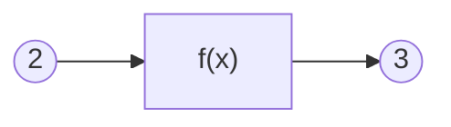
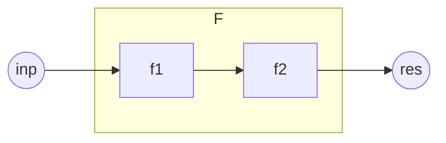

[toc]

# 前言

一.我为什么要写这本书？
&nbsp;&nbsp;&nbsp;&nbsp;&nbsp;&nbsp;&nbsp;&nbsp;从2016年入坑命令以来，对于我来说，命令是一种玩法，也是我的兴趣。我尝试探索过命令中的一些命题，并且对于它们有一套自己的看法与理论。因为某些现实因素，我可能要离开命令这个领域了，如果这些理论无法记录下来，对我而言会是一种遗憾，因此产生了编写这本书的想法。

二.你为什么要读这本书？
&nbsp;&nbsp;&nbsp;&nbsp;&nbsp;&nbsp;&nbsp;&nbsp;可能会有很多种理由，但它不应该是“为了创作出更好的作品”，这本书无法指导你的创作，如果单纯关注原版作品的质量，你应该寻求一些更加实用以及关注玩家审美的教程，而非小豆理论。在我看来，一种合理的，读这本书的理由是：“我想了解一种看待命令的视角，解决一些命令里的命题，尽管它们看起来不是那么实用”。

三.读这本书需要哪些前置知识？

- 基础的命令知识以及实践经验。
- 高中及以上水平的数学、物理知识。
- 基本的算法与数据结构思想。

四.如何读这本书？

- 读懂每一条命令
- 多进游戏测试和实践
- 书中难免有纰漏，若发现，请及时反馈给我！(QQ:859345316)
- 理论中的命令思想适用于java版mc1.14-1.19.2（2022.11.7），具体运行结果参考1.19.2

*从现在开始，让我们简洁优雅地去写好每一条命令吧！*

# 命令与函数

## 一切还要从函数说起

### 什么是函数

&nbsp;&nbsp;&nbsp;&nbsp;&nbsp;&nbsp;&nbsp;&nbsp;什么是函数呢？我们在不同的领域可能听过许多不同的定义。在数学中，函数的传统定义是这样的：

> 在一个变化过程中，设有两个变量x、y，如果对于任意一个x都有唯一确定的一个y和它对应，那么就称x是自变量，y是x的函数。

&nbsp;&nbsp;&nbsp;&nbsp;&nbsp;&nbsp;&nbsp;&nbsp;而函数的近代定义是这样的：

> 设A，B是非空数集，如果按照某种确定的对应关系f，使得对于集合A中的任意一个数x，在集合B中都有唯一确定的数y和它对应，那么就称映射f：A->B为从集合A到集合B的一个函数，记作y=f(x)。

&nbsp;&nbsp;&nbsp;&nbsp;&nbsp;&nbsp;&nbsp;&nbsp;多元函数的定义是这样的：

> 设D为一个非空的n元有序数组的集合，f为某一确定的对应规则。若对于每一个有序数组(x1,x2,...,xn)∈D，通过对应规则f，都有唯一确定的实数y与之对应，则称对应f为定义在D上的n元函数

&nbsp;&nbsp;&nbsp;&nbsp;&nbsp;&nbsp;&nbsp;&nbsp;在计算机科学中函数的定义是这样的：

> 计算机的函数，是一个固定的程序段，或称其为一个子程序，它在可以实现固定运算功能的同时，还带有一个入口和一个出口，所谓的入口就是函数所带的各个参数，我们可以通过这个入口，把函数的参数值代入子程序，供计算机处理；所谓出口，就是指函数的函数值，在计算机求得之后，由此口带回给调用它的程序。

&nbsp;&nbsp;&nbsp;&nbsp;&nbsp;&nbsp;&nbsp;&nbsp;我们不难发现，函数是一种极其抽象的概念。传统的函数定义从运动的角度认识函数，近代的函数定义从集合与映射的角度认识函数，到此为止的函数依然完成的是数与数之间的对应。而多元函数将函数的定义域扩展到了向量，完成了向量与数的对应。此外，数学中还有泛函与算子的概念，可以完成函数与数的对应，函数与函数的对应……计算机科学中的函数则具备了内部状态，能够完成特定功能，而原来数学中无内部状态的抽象的函数，在计算机科学中被称为“纯函数”。

&nbsp;&nbsp;&nbsp;&nbsp;&nbsp;&nbsp;&nbsp;&nbsp;不知道你有没有思考过，为什么会有这么多不同的概念都使用着一个相同的名字叫函数？函数的本质特征是什么？现在，我们需要从一个更加简单的角度去认识函数，抓住不同函数概念中共有的特征。

&nbsp;&nbsp;&nbsp;&nbsp;&nbsp;&nbsp;&nbsp;&nbsp;也许你已经注意到了，函数的定义非常强调函数的“唯一确定性”。对于一个自变量的值，函数必须给出一个唯一确定的值，才能称之为函数。例如在平面直角坐标系中，一个圆心在原点的圆的解析式是$x^2+y^2=r^2$。这个解析式，我们只能称其为圆的方程，而不是圆的函数。因为对于每个$x∈(-r,r)$，都有两个y与之对应，不满足唯一确定性。这个特性是我们认识函数的关键。

&nbsp;&nbsp;&nbsp;&nbsp;&nbsp;&nbsp;&nbsp;&nbsp;对于y=x+2这个函数，如果我们代入x=1，便可以得到y=3。由于函数的唯一确定性，这意味着，不管我们在何时何地何种环境下，只要把x代入1，总能得到3，不会得到其它的值。也就是说，函数可以理解为可重复使用的一台机器。我们把x也就是自变量叫做函数的输入，y也就是因变量叫做函数的输出，那么对于相同的输入，函数它总能给出相同的输出，与其它任何条件均无关。

&nbsp;&nbsp;&nbsp;&nbsp;&nbsp;&nbsp;&nbsp;&nbsp;如上图所示，f(x)这台机器也就是中间的黑盒子了。由此可见，**函数具备三个最基本的要素：输入、输出、处理。**

### 命令也是一种函数

&nbsp;&nbsp;&nbsp;&nbsp;&nbsp;&nbsp;&nbsp;&nbsp;命令也是一种函数。为什么这么说呢？我们把命令执行前的整个mc世界看作是命令的输入(包括随机种子等所有因素在内)，那么命令就会有确定的运行规则，最后得到一个确定的命令执行后的mc世界的状态。

&nbsp;&nbsp;&nbsp;&nbsp;&nbsp;&nbsp;&nbsp;&nbsp;例如：`scoreboard players add n int 1`，这条命令接收执行前的记分板分数<n,int>作为输入，进行+1处理后输出到记分板分数<n,int>。再例如：`kill @e[type=sheep]`，这条命令接收执行前已加载区块中全部活着的羊作为输入，对这些羊的血量(Health)进行置0的处理，输出到活着的羊的血量。

对int的说明

<pre>int将会是本书最常用的记分板。我们对int的定义如下：
    1.对于命名是一个整数的虚拟玩家，它们的int值是对应整数
        值。例如<2,int>的值是2，<-1,int>的值是-1。
    2.对于其它命名的虚拟玩家，它们的int用于表示记分板形式
        的临时对象。其中，命名中含有子字符串"temp"的称为
        临时分数。临时对象与临时分数的概念将在本章<命令处
        理>部分进行详细介绍。
    3.由于玩家名就是虚拟玩家名，必然属于以上情况之一，故
        玩家在int上的值不作定义。
    4.对于处于实体组中的实体，如果它有自己的上级实体，首
        先它不是玩家。那么它的int定义为自己的上级实体编号
        (一般是id记分板)。实体组与上级实体的概念将在<数理计
        算>章节进行详细介绍。
    5.对于其它非玩家实体，它们的int可以定义为自己最重要的
        整数数据，也可以留空。例如粒子实体的int可以定义为自
        己的存在时间。</pre>

对kill命令与@e选择器的说明

<pre>
读者对kill命令与@e选择器，应该已经有了比较通俗的理解：
kill的作用是“清除”实体，而@e的作用是选择全部实体。那
么，为什么笔者在上文的清除绵羊一例中要进行繁琐的叙述呢？
主要是为了严谨考虑。现在，我们需要更加深入地了解这两个
概念。
1.@e不一定是全部实体。
    ①血量为0的红体状态生物无法被@e选中。
    ②非生物实体被kill命令作用后被标记，无法被@e选中。
    ③处于未加载区块中的实体无法被@e选中。
    使用@s、@a等选择器可以选中以上三种情况。
    而直接使用UUID表示法只能选中①情况实体。
2.kill不一定能清除实体。
    ①如果是生物实体，kill的作用相当于把血量置0，如果此时
        利用@s选中生物，把Health重新回升，可以实现生物复
        活。否则生物将在红体时间结束后被真正清除。
    ②如果是非生物实体，kill的作用相当于把实体作标记，使其
        无法被@e选中，并在下1tick之前被清除。这期间，没有
        手段使实体复活，但在kill命令执行后，仍然可以在同一
        个函数内使用@s选择器选中该实体，在清除之前对其进
        行操作。</pre>

&nbsp;&nbsp;&nbsp;&nbsp;&nbsp;&nbsp;&nbsp;&nbsp;因此可以说，**命令具备函数的基本要素(输入、输出、处理)**。我们将在本章<命令函数的基本要素>部分详细介绍命令的输入输出与处理。

&nbsp;&nbsp;&nbsp;&nbsp;&nbsp;&nbsp;&nbsp;&nbsp;另外，mcfunction是命令体系中重要的组成部分，也是更为特殊的函数。它允许将多条命令写到同一个文件中，并依次执行。调用mcfunction的命令是function。前文已经论述，命令是一种函数，又因为function是一种命令，所以function也是一种函数。这说明，借助mcfunction我们可以将多条命令合成为一个新的函数。下图中的模型可以阐释该原理：

&nbsp;&nbsp;&nbsp;&nbsp;&nbsp;&nbsp;&nbsp;&nbsp;图中f1和f2是基本的命令函数，f1的输出即为f2的输入。F同样可以看成一个具有输入与输出的黑箱结构，而f2(f1())即为F确定的处理规则。因此，F具备了函数的基本要素，它是一个复合函数。

&nbsp;&nbsp;&nbsp;&nbsp;&nbsp;&nbsp;&nbsp;&nbsp;因此可以说，命令函数不仅具备函数的基本要素，**命令函数之间还可以通过一定的组织方式复合为新的函数。** 我们将在本章<命令函数的组织方式>部分进行详细介绍。

## 命令函数的基本要素

### 输入输出

#### 执行方式：天然的命令输入

&nbsp;&nbsp;&nbsp;&nbsp;&nbsp;&nbsp;&nbsp;&nbsp;执行方式，又称执行环境，是一系列命令运行过程中使用的参数的总称，包括维度、坐标、朝向、执行者、高度h五个。每条命令都具有自己的执行方式，因此执行方式具有局部性。如果未经过execute改变执行方式，那么子命令的执行方式与父命令的执行方式保持一致，因此执行方式具有继承性。

&nbsp;&nbsp;&nbsp;&nbsp;&nbsp;&nbsp;&nbsp;&nbsp;命令通过一系列基本表达与执行方式建立联系。由于引入执行维度会使得叙述变得复杂，我们一般忽略维度的不同，默认为主世界。以下为常用的执行方式表达。

&nbsp;&nbsp;&nbsp;&nbsp;&nbsp;&nbsp;&nbsp;&nbsp;目标选择器@s即为执行者实体的指代。注意：执行者可以不是实体，例如命令方块，此时@s会选择失败。

&nbsp;&nbsp;&nbsp;&nbsp;&nbsp;&nbsp;&nbsp;&nbsp;目标选择器参数中dx=,dy=,dz=或是distance=，它们的范围起点由x=,y=,z=确定。但如果x=,y=,z=中的任意个未被指定，其默认值则为执行坐标对应分量的值。

&nbsp;&nbsp;&nbsp;&nbsp;&nbsp;&nbsp;&nbsp;&nbsp;相对坐标系~delta_x ~delta_y ~delta_z的各轴方向与xyz轴一致，而相对坐标系的原点 ~ ~ ~ (又称为执行点)即为执行坐标。**需要特别指出的一点是：许多命令新人会将<执行坐标>与<执行者坐标>的概念混淆，误认为 ~ ~ ~ 就是@s的坐标，这是十分不正确的，必须根据实际情况分析二者的坐标。**

&nbsp;&nbsp;&nbsp;&nbsp;&nbsp;&nbsp;&nbsp;&nbsp;局部坐标系^u ^v ^w的各轴方向由执行朝向确定。u轴方向为执行朝向的左方向，v轴方向为执行朝向的上方向，w轴方向为执行朝向的前方向，可以简记为“左上前”。而局部坐标系的原点 ^ ^ ^ (又称为基准点)，由执行坐标与高度h共同确定：^ ^ ^即为~ ~h ~，或者说基准点位于执行点上方h格高度处。

&nbsp;&nbsp;&nbsp;&nbsp;&nbsp;&nbsp;&nbsp;&nbsp;我们发现，命令中遍布执行方式的身影。所以，确定一条命令的执行环境是非常重要的。以下讲解确定命令执行环境的方法。

&nbsp;&nbsp;&nbsp;&nbsp;&nbsp;&nbsp;&nbsp;&nbsp;1.根据命令执行的源头确定执行方式的初始值。

&nbsp;&nbsp;&nbsp;&nbsp;&nbsp;&nbsp;&nbsp;&nbsp;·若源头为玩家聊天框，那么执行者是玩家，执行维度是玩家所在维度，执行坐标是玩家坐标(碰撞箱地面中心，即feet的位置，feet与eyes又称为实体的锚点)，执行朝向是玩家朝向，高度h是0。

&nbsp;&nbsp;&nbsp;&nbsp;&nbsp;&nbsp;&nbsp;&nbsp;·若源头为命令方块，那么执行者是命令方块，执行维度是命令方块所在维度，执行坐标是命令方块的中心点坐标，执行朝向是水平正南(z+方向)，高度h是0。

&nbsp;&nbsp;&nbsp;&nbsp;&nbsp;&nbsp;&nbsp;&nbsp;·

#### 人工维护的输入输出

#### 输入输出部分的总结

### 命令处理

## 命令函数的组织方式

### 顺序

### 分支

### 递归

#### 尾递归(循环)

#### 广义递归

### 回调

# 常用调试技巧

# 数值运算基础

# 数理计算

# 数据处理基础

# 数据结构

# 系统架构设计与优化

