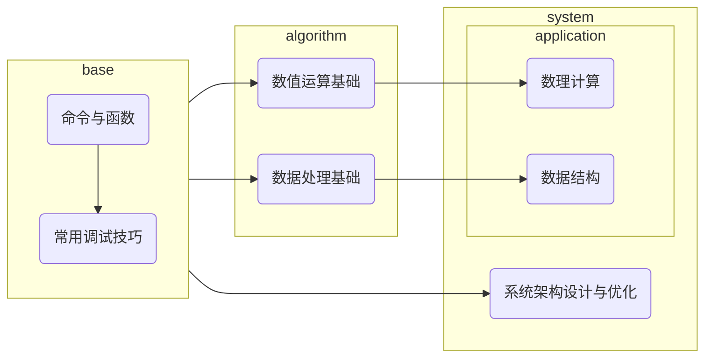
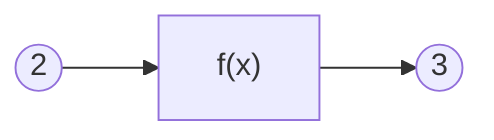
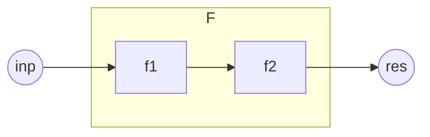
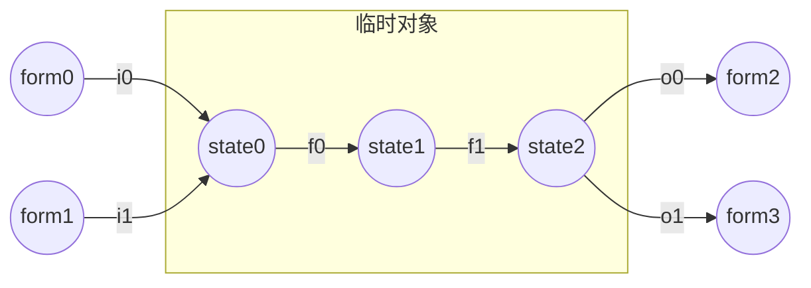
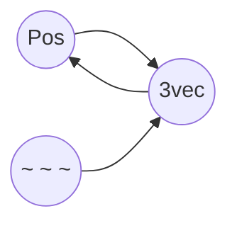
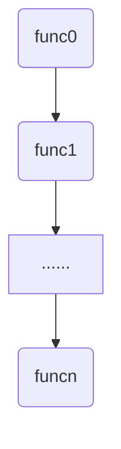
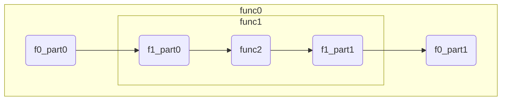
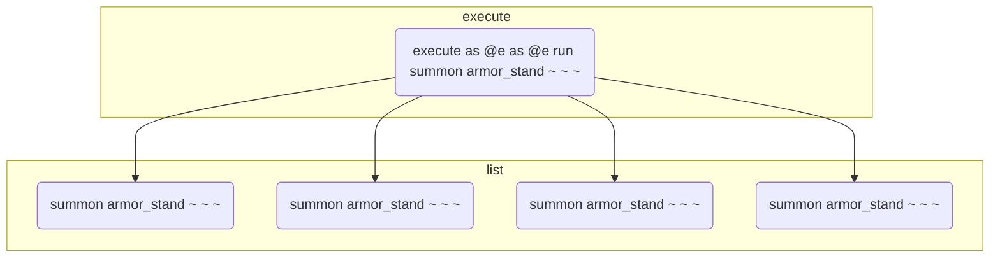
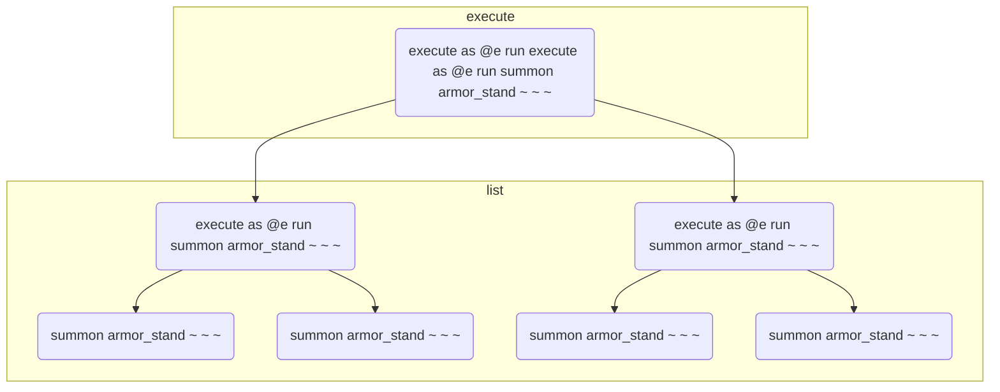
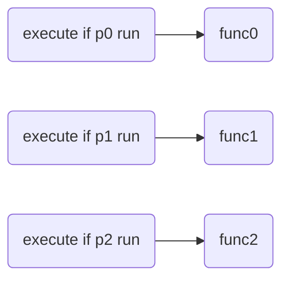

<!-- TOC -->

- [前言](#%E5%89%8D%E8%A8%80)
- [命令与函数](#%E5%91%BD%E4%BB%A4%E4%B8%8E%E5%87%BD%E6%95%B0)
  - [一切还要从函数说起](#%E4%B8%80%E5%88%87%E8%BF%98%E8%A6%81%E4%BB%8E%E5%87%BD%E6%95%B0%E8%AF%B4%E8%B5%B7)
    - [什么是函数](#%E4%BB%80%E4%B9%88%E6%98%AF%E5%87%BD%E6%95%B0)
    - [命令也是一种函数](#%E5%91%BD%E4%BB%A4%E4%B9%9F%E6%98%AF%E4%B8%80%E7%A7%8D%E5%87%BD%E6%95%B0)
  - [命令函数的基本要素](#%E5%91%BD%E4%BB%A4%E5%87%BD%E6%95%B0%E7%9A%84%E5%9F%BA%E6%9C%AC%E8%A6%81%E7%B4%A0)
    - [输入输出](#%E8%BE%93%E5%85%A5%E8%BE%93%E5%87%BA)
      - [执行方式：天然的命令输入](#%E6%89%A7%E8%A1%8C%E6%96%B9%E5%BC%8F%E5%A4%A9%E7%84%B6%E7%9A%84%E5%91%BD%E4%BB%A4%E8%BE%93%E5%85%A5)
      - [人工维护的输入输出](#%E4%BA%BA%E5%B7%A5%E7%BB%B4%E6%8A%A4%E7%9A%84%E8%BE%93%E5%85%A5%E8%BE%93%E5%87%BA)
    - [命令处理](#%E5%91%BD%E4%BB%A4%E5%A4%84%E7%90%86)
      - [临时对象](#%E4%B8%B4%E6%97%B6%E5%AF%B9%E8%B1%A1)
      - [形式转换网](#%E5%BD%A2%E5%BC%8F%E8%BD%AC%E6%8D%A2%E7%BD%91)
  - [命令函数的组织方式](#%E5%91%BD%E4%BB%A4%E5%87%BD%E6%95%B0%E7%9A%84%E7%BB%84%E7%BB%87%E6%96%B9%E5%BC%8F)
    - [顺序](#%E9%A1%BA%E5%BA%8F)
      - [function构造](#function%E6%9E%84%E9%80%A0)
      - [execute构造](#execute%E6%9E%84%E9%80%A0)
    - [分支](#%E5%88%86%E6%94%AF)
      - [简单分支](#%E7%AE%80%E5%8D%95%E5%88%86%E6%94%AF)
      - [记分板树](#%E8%AE%B0%E5%88%86%E6%9D%BF%E6%A0%91)
    - [递归](#%E9%80%92%E5%BD%92)
      - [尾递归(循环)](#%E5%B0%BE%E9%80%92%E5%BD%92%E5%BE%AA%E7%8E%AF)
      - [广义递归](#%E5%B9%BF%E4%B9%89%E9%80%92%E5%BD%92)
    - [回调](#%E5%9B%9E%E8%B0%83)
- [常用调试技巧](#%E5%B8%B8%E7%94%A8%E8%B0%83%E8%AF%95%E6%8A%80%E5%B7%A7)
- [数值运算基础](#%E6%95%B0%E5%80%BC%E8%BF%90%E7%AE%97%E5%9F%BA%E7%A1%80)
- [数理计算](#%E6%95%B0%E7%90%86%E8%AE%A1%E7%AE%97)
- [数据处理基础](#%E6%95%B0%E6%8D%AE%E5%A4%84%E7%90%86%E5%9F%BA%E7%A1%80)
- [数据结构](#%E6%95%B0%E6%8D%AE%E7%BB%93%E6%9E%84)
- [系统架构设计与优化](#%E7%B3%BB%E7%BB%9F%E6%9E%B6%E6%9E%84%E8%AE%BE%E8%AE%A1%E4%B8%8E%E4%BC%98%E5%8C%96)

<!-- /TOC -->

# 前言

一.我为什么要写这本书？

&nbsp;&nbsp;&nbsp;&nbsp;&nbsp;&nbsp;&nbsp;&nbsp;从2016年入坑命令以来，对于我来说，命令是一种玩法，也是我的兴趣。我尝试探索过命令中的一些命题，并且对于它们有一套自己的看法与理论。因为某些现实因素，我可能要离开命令这个领域了，如果这些理论无法记录下来，对我而言会是一种遗憾，因此产生了编写这本书的想法。

二.你为什么要读这本书？

&nbsp;&nbsp;&nbsp;&nbsp;&nbsp;&nbsp;&nbsp;&nbsp;可能会有很多种理由，但它不应该是“为了创作出更好的作品”，这本书无法指导你的创作，如果单纯关注原版作品的质量，你应该寻求一些更加实用以及关注玩家审美的教程，而非小豆理论。在我看来，一种合理的，读这本书的理由是：“我想了解一种看待命令的视角，解决一些命令里的命题，尽管它们看起来不是那么实用”。

三.读这本书需要哪些前置知识？

- 基础的命令知识以及实践经验。
- 高中及以上水平的数学、物理知识。
- 基本的算法与数据结构思想。

四.如何读这本书？

- 读懂每一条命令
- 多进游戏测试和实践(最好一边学一边写，最后可以完成一个属于你的前置数据包)
- 书中难免有纰漏，若发现，请及时反馈给我！(QQ:859345316)
- 理论中的命令思想适用于java版mc1.14-1.19.2（2022.11.7），具体运行结果参考1.19.2

*从现在开始，让我们简洁优雅地去写好每一条命令吧！*



# 命令与函数

## 一切还要从函数说起

### 什么是函数

&nbsp;&nbsp;&nbsp;&nbsp;&nbsp;&nbsp;&nbsp;&nbsp;什么是函数呢？我们在不同的领域可能听过许多不同的定义。在数学中，函数的传统定义是这样的：

> 在一个变化过程中，设有两个变量x、y，如果对于任意一个x都有唯一确定的一个y和它对应，那么就称x是自变量，y是x的函数。

&nbsp;&nbsp;&nbsp;&nbsp;&nbsp;&nbsp;&nbsp;&nbsp;而函数的近代定义是这样的：

> 设A，B是非空数集，如果按照某种确定的对应关系f，使得对于集合A中的任意一个数x，在集合B中都有唯一确定的数y和它对应，那么就称映射f：A->B为从集合A到集合B的一个函数，记作y=f(x)。

&nbsp;&nbsp;&nbsp;&nbsp;&nbsp;&nbsp;&nbsp;&nbsp;多元函数的定义是这样的：

> 设D为一个非空的n元有序数组的集合，f为某一确定的对应规则。若对于每一个有序数组(x1,x2,...,xn)∈D，通过对应规则f，都有唯一确定的实数y与之对应，则称对应f为定义在D上的n元函数

&nbsp;&nbsp;&nbsp;&nbsp;&nbsp;&nbsp;&nbsp;&nbsp;在计算机科学中函数的定义是这样的：

> 计算机的函数，是一个固定的程序段，或称其为一个子程序，它在可以实现固定运算功能的同时，还带有一个入口和一个出口，所谓的入口就是函数所带的各个参数，我们可以通过这个入口，把函数的参数值代入子程序，供计算机处理；所谓出口，就是指函数的函数值，在计算机求得之后，由此口带回给调用它的程序。

&nbsp;&nbsp;&nbsp;&nbsp;&nbsp;&nbsp;&nbsp;&nbsp;我们不难发现，函数是一种极其抽象的概念。传统的函数定义从运动的角度认识函数，近代的函数定义从集合与映射的角度认识函数，到此为止的函数依然完成的是数与数之间的对应。而多元函数将函数的定义域扩展到了向量，完成了向量与数的对应。此外，数学中还有泛函与算子的概念，可以完成函数与数的对应，函数与函数的对应……计算机科学中的函数则具备了内部状态，能够完成特定功能，而原来数学中无内部状态的抽象的函数，在计算机科学中被称为“纯函数”。

&nbsp;&nbsp;&nbsp;&nbsp;&nbsp;&nbsp;&nbsp;&nbsp;不知道你有没有思考过，为什么会有这么多不同的概念都使用着一个相同的名字叫函数？函数的本质特征是什么？现在，我们需要从一个更加简单的角度去认识函数，抓住不同函数概念中共有的特征。

&nbsp;&nbsp;&nbsp;&nbsp;&nbsp;&nbsp;&nbsp;&nbsp;也许你已经注意到了，函数的定义非常强调函数的“唯一确定性”。对于一个自变量的值，函数必须给出一个唯一确定的值，才能称之为函数。例如在平面直角坐标系中，一个圆心在原点的圆的解析式是 $x^2+y^2=r^2$ 。这个解析式，我们只能称其为圆的方程，而不是圆的函数。因为对于每个 $x∈(-r,r)$ ，都有两个y与之对应，不满足唯一确定性。这个特性是我们认识函数的关键。

&nbsp;&nbsp;&nbsp;&nbsp;&nbsp;&nbsp;&nbsp;&nbsp;对于 $y=x+2$ 这个函数，如果我们代入x=1，便可以得到y=3。由于函数的唯一确定性，这意味着，不管我们在何时何地何种环境下，只要把x代入1，总能得到3，不会得到其它的值。也就是说，函数可以理解为可重复使用的一台机器。我们把x也就是自变量叫做函数的输入，y也就是因变量叫做函数的输出，那么对于相同的输入，函数它总能给出相同的输出，与其它任何条件均无关。



&nbsp;&nbsp;&nbsp;&nbsp;&nbsp;&nbsp;&nbsp;&nbsp;如上图所示，f(x)这台机器也就是中间的黑盒子了。由此可见，**函数具备三个最基本的要素：输入、输出、处理。**

### 命令也是一种函数

&nbsp;&nbsp;&nbsp;&nbsp;&nbsp;&nbsp;&nbsp;&nbsp;命令也是一种函数。为什么这么说呢？我们把命令执行前的整个mc世界看作是命令的输入(包括随机种子等所有因素在内)，那么命令就会有确定的运行规则，最后得到一个确定的命令执行后的mc世界的状态。

&nbsp;&nbsp;&nbsp;&nbsp;&nbsp;&nbsp;&nbsp;&nbsp;例如：`scoreboard players add n int 1`，这条命令接收执行前的记分板分数<n,int>作为输入，进行+1处理后输出到记分板分数<n,int>。再例如：`kill @e[type=sheep]`，这条命令接收执行前已加载区块中全部活着的羊作为输入，对这些羊的血量(Health)进行置0的处理，输出到活着的羊的血量。

<details>
<summary>对int的说明</summary>
<pre>int将会是本书最常用的记分板。我们对int的定义如下：
    1.对于命名是一个整数的虚拟玩家，它们的int值是对应整数
        值。例如<2,int>的值是2，<-1,int>的值是-1。
    2.对于其它命名的虚拟玩家，它们的int用于表示记分板形式
        的临时对象。其中，命名中含有子字符串"temp"的称为
        临时分数。临时对象与临时分数的概念将在本章<命令处
        理>部分进行详细介绍。
    3.由于玩家名就是虚拟玩家名，必然属于以上情况之一，故
        玩家在int上的值不作定义。
    4.对于处于实体组中的实体，如果它有自己的上级实体，首
        先它不是玩家。那么它的int定义为自己的上级实体编号
        (一般是id记分板)。实体组与上级实体的概念将在<数理计
        算>章节进行详细介绍。
    5.对于其它非玩家实体，它们的int可以定义为自己最重要的
        整数数据，也可以留空。例如粒子实体的int可以定义为自
        己的存在时间。</pre>
</details>
<details>
<summary>对kill命令与@e选择器的说明</summary>
<pre>
读者对kill命令与@e选择器，应该已经有了比较通俗的理解：
kill的作用是“清除”实体，而@e的作用是选择全部实体。那
么，为什么笔者在上文的清除绵羊一例中要进行繁琐的叙述呢？
主要是为了严谨考虑。现在，我们需要更加深入地了解这两个
概念。
1.@e不一定是全部实体。
    ①血量为0的红体状态生物无法被@e选中。
    ②非生物实体被kill命令作用后被标记，无法被@e选中。
    ③处于未加载区块中的实体无法被@e选中。
    使用@s、@a等选择器可以选中以上三种情况。
    而直接使用UUID表示法只能选中①情况实体。
2.kill不一定能清除实体。
    ①如果是生物实体，kill的作用相当于把血量置0，如果此时
        利用@s选中生物，把Health重新回升，可以实现生物复
        活。否则生物将在红体时间结束后被真正清除。
    ②如果是非生物实体，kill的作用相当于把实体作标记，使其
        无法被@e选中，并在下1tick之前被清除。这期间，没有
        手段使实体复活，但在kill命令执行后，仍然可以在同一
        个函数内使用@s选择器选中该实体，在清除之前对其进
        行操作。</pre>
</details>

&nbsp;&nbsp;&nbsp;&nbsp;&nbsp;&nbsp;&nbsp;&nbsp;因此可以说，**命令具备函数的基本要素(输入、输出、处理)**。我们将在本章<命令函数的基本要素>部分详细介绍命令的输入输出与处理。

&nbsp;&nbsp;&nbsp;&nbsp;&nbsp;&nbsp;&nbsp;&nbsp;另外，mcfunction是命令体系中重要的组成部分，也是更为特殊的函数。它允许将多条命令写到同一个文件中，并依次执行。调用mcfunction的命令是function。前文已经论述，命令是一种函数，又因为function是一种命令，所以function也是一种函数。这说明，借助mcfunction我们可以将多条命令合成为一个新的函数。下图中的模型可以阐释该原理：



&nbsp;&nbsp;&nbsp;&nbsp;&nbsp;&nbsp;&nbsp;&nbsp;图中f1和f2是基本的命令函数，f1的输出即为f2的输入。F同样可以看成一个具有输入与输出的黑箱结构，而f2(f1())即为F确定的处理规则。因此，F具备了函数的基本要素，它是一个复合函数。

&nbsp;&nbsp;&nbsp;&nbsp;&nbsp;&nbsp;&nbsp;&nbsp;因此可以说，命令函数不仅具备函数的基本要素，**命令函数之间还可以通过一定的组织方式复合为新的函数。** 我们将在本章<命令函数的组织方式>部分进行详细介绍。

## 命令函数的基本要素

### 输入输出

#### 执行方式：天然的命令输入

&nbsp;&nbsp;&nbsp;&nbsp;&nbsp;&nbsp;&nbsp;&nbsp;执行方式，又称执行环境，是一系列命令运行过程中使用的参数的总称，包括维度、坐标、朝向、执行者、高度h五个。每条命令都具有自己的执行方式，因此执行方式具有局部性。如果未经过execute改变执行方式，那么子命令的执行方式与父命令的执行方式保持一致，因此执行方式具有继承性。

&nbsp;&nbsp;&nbsp;&nbsp;&nbsp;&nbsp;&nbsp;&nbsp;命令通过一系列基本表达与执行方式建立联系。由于引入执行维度会使得叙述变得复杂，我们一般忽略维度的不同，默认为主世界。以下为常用的执行方式表达。

&nbsp;&nbsp;&nbsp;&nbsp;&nbsp;&nbsp;&nbsp;&nbsp;目标选择器@s即为执行者实体的指代。注意：执行者可以不是实体，例如命令方块，此时@s会选择失败。

&nbsp;&nbsp;&nbsp;&nbsp;&nbsp;&nbsp;&nbsp;&nbsp;目标选择器参数中dx=,dy=,dz=或是distance=，它们的范围起点由x=,y=,z=确定。但如果x=,y=,z=中的任意个未被指定，其默认值则为执行坐标对应分量的值。

&nbsp;&nbsp;&nbsp;&nbsp;&nbsp;&nbsp;&nbsp;&nbsp;相对坐标系~delta_x ~delta_y ~delta_z的各轴方向与xyz轴一致，而相对坐标系的原点 ~ ~ ~ (又称为执行点)即为执行坐标。**需要特别指出的一点是：许多命令新人会将<执行坐标>与<执行者坐标>的概念混淆，误认为 ~ ~ ~ 就是@s的坐标，这是十分不正确的，必须根据实际情况分析二者的坐标。**

&nbsp;&nbsp;&nbsp;&nbsp;&nbsp;&nbsp;&nbsp;&nbsp;局部坐标系^u ^v ^w的各轴方向由执行朝向确定。u轴方向为执行朝向的左方向，v轴方向为执行朝向的上方向，w轴方向为执行朝向的前方向，可以简记为“左上前”。而局部坐标系的原点 ^ ^ ^ (又称为基准点)，由执行坐标与高度h共同确定：^ ^ ^即为~ ~h ~，或者说基准点位于执行点上方h格高度处。

&nbsp;&nbsp;&nbsp;&nbsp;&nbsp;&nbsp;&nbsp;&nbsp;我们发现，命令中遍布执行方式的身影。所以，确定一条命令的执行环境是非常重要的。以下讲解确定命令执行环境的方法。

&nbsp;&nbsp;&nbsp;&nbsp;&nbsp;&nbsp;&nbsp;&nbsp;1.根据命令执行的源头确定执行方式的初始值。

&nbsp;&nbsp;&nbsp;&nbsp;&nbsp;&nbsp;&nbsp;&nbsp;·若源头为玩家聊天框，那么执行者是玩家，执行维度是玩家所在维度，执行坐标是玩家坐标(碰撞箱地面中心，即feet的位置，feet与eyes又称为实体的锚点)，执行朝向是玩家朝向，高度h是0。

&nbsp;&nbsp;&nbsp;&nbsp;&nbsp;&nbsp;&nbsp;&nbsp;·若源头为命令方块，那么执行者是命令方块，执行维度是命令方块所在维度，执行坐标是命令方块的中心点坐标，执行朝向是水平正南(z+方向)，高度h是0。

&nbsp;&nbsp;&nbsp;&nbsp;&nbsp;&nbsp;&nbsp;&nbsp;·若源头为tick/load函数，那么执行者是服务端，执行维度是主世界，执行坐标是世界出生点，执行朝向是正南，高度h是0。

&nbsp;&nbsp;&nbsp;&nbsp;&nbsp;&nbsp;&nbsp;&nbsp;·此外还有一些不常用的执行源头(成书、tellraw、告示牌、schedule、进度等)，这里不再列举。

&nbsp;&nbsp;&nbsp;&nbsp;&nbsp;&nbsp;&nbsp;&nbsp;2.根据函数的调用过程中的execute子命令分析执行方式状态转移。

&nbsp;&nbsp;&nbsp;&nbsp;&nbsp;&nbsp;&nbsp;&nbsp;执行者可能被as修改为参数指定实体。

&nbsp;&nbsp;&nbsp;&nbsp;&nbsp;&nbsp;&nbsp;&nbsp;执行维度可能被in修改为参数指定维度，可能被at修改为参数指定实体所在维度。

&nbsp;&nbsp;&nbsp;&nbsp;&nbsp;&nbsp;&nbsp;&nbsp;执行坐标可能被at修改为参数指定实体坐标，可能被positioned as修改为参数指定实体坐标，可能被positioned修改为参数指定坐标，可能被align修改为原执行坐标向下取整后坐标，可能被in进行对应维度的坐标缩放。

&nbsp;&nbsp;&nbsp;&nbsp;&nbsp;&nbsp;&nbsp;&nbsp;执行朝向可能被rotated修改为参数指定朝向，可能被rotated as修改为参数指定实体朝向，可能被facing修改为从基准点看向参数指定坐标的朝向，可能被facing entity修改为从基准点看向参数指定锚点的朝向。

&nbsp;&nbsp;&nbsp;&nbsp;&nbsp;&nbsp;&nbsp;&nbsp;高度h可能被anchored eyes修改为执行者实体的身高(eyes到feet的距离)，可能被anchored feet修改为0，可能被positioned \<pos> (而at和positioned as无此效果)修改为0。

<details>
<summary>对rotated与facing以及tp细节的说明</summary>
<pre>
读者可能遇到过这样一个问题：让一个实体看向反方向。如果
使用命令execute as entity at @s run tp @s ~ ~ ~ ~
 ~180.0或者命令execute as entity at @s rotated ~ 
~180.0 run tp @s ~ ~ ~ ~ ~会发现实体并没有看向反方向
，而是看向了竖直向上或向下方向。经过我们的研究发现，问
题出现在tp而不是rotated。tp有这样一个机制：当它旋转实体
的rot1角的时候，如果我们给tp传入的目标角度超过了-90度到
90度的范围，那么实体朝向在旋转过程中会在竖直方向被卡住。
例如：实体当前朝向是89.0f，目标角度是91.0f，实体朝向最终
会变成90.0f，也就是朝向竖直向下。如果是-89.0f旋转到-91.0f
，朝向竖直向上同理。对于这个现象，我们的解决方法是利用
facing ^ ^ ^1对执行朝向进行“规整化”。facing的作用是为
执行朝向重新赋值，它是标准的-90.0f到90.0f的rot1角度。例如
rotated把执行朝向累加到(0.0f,91.0f)后，facing ^ ^ ^1会把执
行朝向规整化为(-180.0f,89.0f)，二者是同一个方向，但后者就
可以保证tp的正常运行了。类似的道理，我们可以直接使用子命
令facing ^ ^ ^-1对执行朝向进行反转。</pre>
</details>

&nbsp;&nbsp;&nbsp;&nbsp;&nbsp;&nbsp;&nbsp;&nbsp;这是一个利用执行方式实现命令输入的例子：`setblock ~ ~5 ~ stone` 该命令接收执行坐标作为输入，在执行坐标上方5格输出一个石头。（为了简化叙述，忽略了维度、区块加载、高度上限、原有方块）

&nbsp;&nbsp;&nbsp;&nbsp;&nbsp;&nbsp;&nbsp;&nbsp;总结：执行方式是一种天然的、方便、良好的输入。它具有局部性、继承性、可直接访问的优良特性。而执行方式同时具有很大的局限性：

* 单向传递，无法作为命令的输出
* 无法直接进行复杂的数值运算
* 无法表示具有复杂结构的数据

由于以上三点局限性，我们有必要维护更加高级的命令输入输出形式。

#### 人工维护的输入输出

&nbsp;&nbsp;&nbsp;&nbsp;&nbsp;&nbsp;&nbsp;&nbsp;本节介绍人工维护的输入输出。人工维护的输入输出，通常有以下几种形式：记分板、storage、实体。我们在本节对这三种形式的维护方法进行一一讲解。

&nbsp;&nbsp;&nbsp;&nbsp;&nbsp;&nbsp;&nbsp;&nbsp;·记分板表示的输入输出：

&nbsp;&nbsp;&nbsp;&nbsp;&nbsp;&nbsp;&nbsp;&nbsp;记分板经常被用来表示有限范围的数值(包括整数和小数)，它的表示范围是-2^31~2^31-1(即-2147483648到2147483647)。对于普通整数，直接取原数值即可。对于普通小数，我们需要事先规定好一个倍率(有时也称精度)。例如1k倍率的小数，那么2333表示的实际数值是2.333。对于较大的整数或精度较高的小数，我们就需要多个记分板分数来表示一个数值。本书中最常用的记分板输入输出是两个临时对象：inp(input的缩写)和res(result的缩写)，它们的记分板表示形式是<inp,int>和<res,int>。本书最常用的普通小数倍率是1k。

#例：

```
scoreboard players set inp int 64
function math:sqrt/_3sqrt
scoreboard players get res int
```

这里把输入inp置为了64，调用了数学库中的3位精度开根号函数，获得输出res是8000(表示数值为8.000)。

&nbsp;&nbsp;&nbsp;&nbsp;&nbsp;&nbsp;&nbsp;&nbsp;·storage表示的输入输出：

&nbsp;&nbsp;&nbsp;&nbsp;&nbsp;&nbsp;&nbsp;&nbsp;storage是一种自定义nbt的储存介质。自定义nbt具有高度的自由性，经常被用于表示各种具有复杂结构的数据，甚至是被用于表示一个对象。本书中最常用的两个storage分别是math:class与math:io。math:class的特点是只用于储存静态的数据模板，它们在初始化阶段被设置，在运行阶段只读(与整数的int定义异曲同工)。math:io与math:class相反，它只用于储存运行过程中产生的各类临时数据和输入输出。对于输入输出，我们使用math:io中的input和result两个临时对象进行表示。下面三个例子可以很好地解释class与io的使用方式：

#例1：

```
data modify storage math:io input set from math:class vehicles[{id:"plane"}]
function vehicles:_new
```

这段命令将载具类中飞机的数据模板放入input，然后调用了载具的构造函数，实例化了一个飞机对象。

#例2：

```
data modify storage math:io input set from storage math:class vehicles[{id:"garbage_truck"}]
data modify storage math:io input merge from storage math:class vehicles[{id:"sports_car"}]
function vehicles:_new
```

这段命令构造了一个临时类：载具是跑车，但同时继承了垃圾车的部分属性，然后运行了载具的构造函数，将其实例化为对象。

#例3：

```
data modify storage math:io input set from storage math:class vehicles[{id:"sports_car"}]
data modify storage math:io input.v_max set value 12.5d
function vehicles:_new
```

这段命令实例化了一辆最大速度是12.5的跑车。

&nbsp;&nbsp;&nbsp;&nbsp;&nbsp;&nbsp;&nbsp;&nbsp;·实体表示的输入输出：

&nbsp;&nbsp;&nbsp;&nbsp;&nbsp;&nbsp;&nbsp;&nbsp;&nbsp;&nbsp;&nbsp;&nbsp;&nbsp;&nbsp;&nbsp;&nbsp;实体是命令中最常用的对象，它具有功能性与逻辑性。在功能性的一面：原版生物AI可以为我们所用，盔甲架/物品展示框可以为我们提供模型显示服务，载具类实体可以提供座椅，抛射物可以制作发射效果......在逻辑性的一面：实体可以直接通过as、at等execute子命令与执行方式沟通，实现围绕实体的一系列逻辑。可以说传统命令的实质是面向实体编程。在命令中，我们最常使用的实体指代方法是使用tag。本书中对输入输出实体的指代tag分别是input和result。每次将实体置入输入输出池之前，我们首先应使用tag @e remove input/result进行输入输出池的释放。这里使用@e而不是@e[tag=]，是为了避免后者画蛇添足性的性能损坏：后者会把检查tag是否存在的操作在有tag实体上进行两次。以下几个例子展示实体输入输出的用法：

#例1：

```
#entity:_new
tag @e remove result
summon marker 0 11 0 {Tags:["result","entity"]}
#else operations
```

该entity的构造函数会返回一个marker实体。当其他开发者调用entity:_new函数时，便可以使用@e[tag=result,limit=1]对返回实体进行唯一确定的指代。

#例2：

```
#entity:test
function entity:_new
tag @e remove input
tag @e[tag=result,limit=1] add input
tag @e[distance=..10] add input
function entity:_kill_each_other
```

该entity的测试函数首先调用了entity的构造函数，生成了一个新的marker实体，然后利用result标签对其进行指代，置入输入池，同时将以执行位置为球心，半径10格的球体范围的全部实体置入了输入池，然后调用entity:_kill_each_other函数，使它们自相残杀。

<details>
<summary>对0 0附近区块以及坐标0 11 0的说明</summary>
<pre>
本书使用命令forceload add -1 -1 1 1将0 0附近四个区块
全部加载。0 11 0是本书中较为常用的坐标：临时方块在0 11 
0被放置，很多实体在0 11 0被生成。在0 11 0生成实体有一点
好处：我们假设玩家实际游戏区域距离0 11 0较远，那么实体
渲染的第一帧对玩家不可见。例如在玩家面前发射一支箭，如
果直接在玩家面前生成箭，会发现箭的朝向一开始并不正确，
并且有一个偏转动画。这是由于实体第一帧的渲染由summon
决定，后续命令只能使实体从初始状态经过动画过渡到后续状态
，而0 11 0使得第一帧不可见就可以避免这个问题。另外需要注
意的是，使用0 11 0生成箭这类抛射物实体，然后传送到玩家面
前时，不能使用tp，因为tp把Motion[1]归零，使用data命令传
送就可以避免这个问题了。另外，为什么y坐标设为11？是笔者
习惯所致，大概是两个0两个1敲起来比较爽吧。</pre>
</details>

.

&nbsp;&nbsp;&nbsp;&nbsp;&nbsp;&nbsp;&nbsp;&nbsp;总结：人工维护的输入输出是更加高级的输入输出形式，能够自由地表达任意数量任意结构的数值和数据，甚至是对象。但本节所讲的人工维护的输入输出有最大的一点局限性：它们都是全局的，不具备执行方式那样的局部性。那么，有没有什么方法克服这段局限性，实现具有局部性的人工数据形式呢？我们将在<命令函数的组织方式>中的<顺序>和<广义递归>部分进行讲解。

#### 输入输出部分的总结

&nbsp;&nbsp;&nbsp;&nbsp;&nbsp;&nbsp;&nbsp;&nbsp;在本章节的第二部分，我们重点介绍了两类自定义数据的输入输出形式，它们在数值运算与数据处理中最为常见，也是最灵活的形式，能够自由地表达不同的事物。但是我们应该认识到，在命令中，输入输出的概念实际上要更为广阔。广义来讲，所有的“检测”类问题都是命令的输入，它们把mc世界中繁杂的元素转化成易于我们处理的形式（也就是本部分讲到的形式）；所有的“功能”类问题都是命令的输出，它们把我们处理后的形式转化为mc世界中可以被玩家看到或者听到的各种元素。这里可以对常见的广义输入输出问题进行一下列举（这里只是可以大致看一下命令的管辖范围，而不是要每一项讲解）。而探索mc世界输入输出的边界，利用它们制作精彩的作品就是读者的任务了！

检测类问题：

* 玩家按键操作
  
  * WASD、空格、shift
  * FQ左右键，按住右键
  * 指定槽位/手持指定物品
  * 鼠标滚轮滚动
  * 视角转动
  * 看向指定对象
  * 走进指定区域
  * 与容器内物品交互
  * 输入文字
* 方块地形状况
  
  * 穷举进行if block探测
  * 插箭法在inBlockState中获得方块信息
  * 战利品表法获得方块id
  * data get获得方块实体的nbt信息
* 生物实体行为
  
  * 在指定空间区域
  * 当前属性状态

功能类问题：

* 实体控制
  
  * 移动传送
  * 血量控制
  * 修改状态属性
  * AI控制
* 放置方块
  
  * 穷举setblock
  * 使用fill/clone/结构
  * 掉落沙生成法
* 修改物品
  
  * 穷举修改
  * 临时物品法
  * 潜影盒法
* 显示文本
  
  * 书本、tellraw、title、actionbar、bossbar
  * sidebar
  * 告示牌、CustomName
  * 物品display的Lore和Name
* 粒子声音

### 命令处理

&nbsp;&nbsp;&nbsp;&nbsp;&nbsp;&nbsp;&nbsp;&nbsp;本节我们介绍命令中最基本的处理方式。“临时”是命令处理的核心思想。在命令中，同一类型的数据可能会存在许多不同的形式，其中一些形式是用于储存而非运算的，而另外一些形式是便于我们运算的。例如对于坐标这种类型的数据，它的形式可能是实体的Pos标签，可能是执行方式中的执行坐标，也可能是以记分板表示的小数。

&nbsp;&nbsp;&nbsp;&nbsp;&nbsp;&nbsp;&nbsp;&nbsp;在命令处理中，我们通常需要将储存形式通过转换操作变成临时的运算形式，再进行处理，最后将处理完成的运算形式转换成所需的储存形式。下面的模型图可以阐释这个理论：



&nbsp;&nbsp;&nbsp;&nbsp;&nbsp;&nbsp;&nbsp;&nbsp;这里需要注意将这个模型图与我们之前的函数模型图区分。在函数模式图中，节点是函数，数据沿着箭头流动。但在命令处理模型图中，圆节点是不同的数据形式，圆节点之间转换的方块节点才是函数。i0、i1函数将储存形式form0、form1转换成了易于运算处理的临时对象初始形式state0；f0和f1是针对临时对象编写的状态转移函数，它们将临时对象从初始的state0状态转移到了处理完成的state2状态；o0、o1函数将临时对象形式的state2转换到了输出所需的储存形式form2、form3。

&nbsp;&nbsp;&nbsp;&nbsp;&nbsp;&nbsp;&nbsp;&nbsp;由此，我们可以引出本节最为重要的两个概念：形式转换网与临时对象。i0、i1、o0、o1函数以及它们连接的数据形式形成的网络称为形式转换网。数据state0、state1、state2与状态转移函数f0、f1的有机组合称为临时对象。也就是说，**临时对象是易于处理的运算形式**，而**形式转换网是将其它形式与临时对象形式进行相互转化的转换函数网络**。

#### 临时对象

分类：

* 临时分数
* 临时nbt
* 临时实体
* 临时物品
* 临时方块
* 世界实体
* 广义临时实体
* 广义临时对象

&nbsp;&nbsp;&nbsp;&nbsp;&nbsp;&nbsp;&nbsp;&nbsp;临时分数：用记分板分数表示的数值类型临时对象。本书中，我们使用含有子字符串"temp"的虚拟玩家在记分板int上的分数来表示一个临时分数。例如：<tempx,int>,<templ,int>,<temp_id,int>,<temp,int>。就像输入输出形式那样，小数数值的临时分数需要事先规定好一个倍率例如1k。由此可以看出，**临时对象类型的定义不仅包含mc中存在的表示形式，还包含人为的规定，相同表示形式但人为规定不同的形式不能认为是同一类型。**

#例1：将输入的整数类型nbt转化为临时对象后进行+1处理返还

```
execute store result score temp int run data get storage math:io input
scoreboard players add temp int 1
execute store result storage math:io input int 1 run scoreboard players get temp int 1
```

由于**记分板运算命令的返回值是运算结果**，我们通常做以下简化处理

```
execute store result score temp int run data get storage math:io input
execute store result storage math:io input int 1 run scoreboard players add temp int 1
```

在这个例子中，临时分数充分展现了它易于运算的特性。但是，我们是不是非借助临时分数进行运算不可呢？其实不然，看下面的例子：

```
execute store result storage math:io input int -1 run data get storage math:io input -1.0001
```

这条命令巧妙地利用倍率与向下取整的性质，直接在原nbt上实现了一定范围内的加1运算，并没有借助临时分数。不过，目前没有证据显示这样做对性能有优化作用，所以在命令的可读性方面考虑，我们不推荐这种写法。在实际开发中，利用倍率实现乘法运算是更为正常的做法：

#例2：绕开临时分数，直接对浮点数进行乘10运算

```
execute store result storage math:io input double 0.001 run data get storage math:io input 10000
```

另外，请读者思考：把浮点数乘10，用以下命令是否可行？命令的返回值是一种什么类型的数据？

```
execute store result storage math:io input 10 run data get storage math:io input
```

利用临时分数进行数值运算的理论，我们将在<数值运算基础>这一章进行深入讲解。

&nbsp;&nbsp;&nbsp;&nbsp;&nbsp;&nbsp;&nbsp;&nbsp;临时nbt：用storage表示的临时对象，其数据通常具有复杂的层次或顺序结构。本书中，我们使用在storage math:io中带有子字符串"temp"的标签表示一个临时nbt，例如：storage math:io temp_cmp，storage math:io temp_list等。

#例：交换输入的两项nbt

```
data modify storage math:io temp set from storage math:io input[0]
data modify storage math:io input[0] set from storage math:io input[1]
data modify storage math:io input[1] set from storage math:io temp
```

利用临时nbt进行数据处理的理论，我们将在<数据处理基础>这一章进行深入讲解。

&nbsp;&nbsp;&nbsp;&nbsp;&nbsp;&nbsp;&nbsp;&nbsp;临时实体：使用tag对实体进行指代，表示一个实体类型的临时对象。本书中，我们使用带有子字符串"tmp"的标签指代一个临时实体，例如@e[tag=tmp,limit=1]。注意本书中对“临时”的缩写习惯，使用了两种不同的表示：temp、tmp，而它们的用法有所不同。当被指代的是一个确切的值(例如记分板分数、nbt值)，强调值的可重复属性时(例如不同的变量可能具有相同的值是2)，我们使用temp进行指代；当被指代的是一个对象(通常是一个实体)，强调其独一无二的属性时(例如实体的位置和朝向几乎不可能相同)，我们使用tmp进行指代。这样使用两种不相同的指代方法可以增加不同类型元素的区分度，方便辨别，增加命令的可读性(至少不会一眼望去全是temp了)。

#例：召唤一只分数level为5的村民

```
summon villager ~ ~ ~
scoreboard players set @e[type=villager,limit=1,sort=nearest] level 5
```

在不了解tag指代的情况下，我们可能就会像上面这样做：召唤一只村民，利用选择器参数选择最近的那只村民进行分数赋值。抛开偌长的选择器有失优雅性不谈，这种方法的漏洞也是非常明显的：不同村民位置重合时有误选的风险。不过，利用tag指代进行命令处理，我们可以这样做：

```
summon villager ~ ~ ~ {Tags:["tmp"]}
scoreboard players set @e[tag=tmp,limit=1] level 5
tag @e remove tmp
```

就像人工维护输入输出的input和result标签，规定使用前必须移除，我们对临时tmp标签也进行了一种维护：规定使用后tmp必须移除。这样便可以保证，下次使用tmp标签时，世界上不存在其它的tmp标签实体(这是命令处理顺序的单线程导致的)，@e[tag=tmp,limit=1]也就准确地指代了上文的实体，不会出现误选风险。或许读者已经注意到了，前三项基本的临时对象与<人工维护的输入输出>中讲到的三种常用输入输出形式十分相似，有的甚至只有命名上的区别。是的，输入输出形式本质上就是临时对象的一种，它们就是来自"高层"的临时对象。关于输入输出与临时对象的关系，函数层级的概念，以及前文提到的“单线程”一事，我们将在本章<命令函数的组织方式>中的顺序部分进行详细讲解。

&nbsp;&nbsp;&nbsp;&nbsp;&nbsp;&nbsp;&nbsp;&nbsp;临时物品：物品形式的临时对象。在对物品进行处理时，我们便需要引入临时物品。这里，我们使用0 0 0坐标的箱子的0号栏位存放临时物品，使用block 0 0 0 container.0或block 0 0 0 Items[0]即可指代临时物品。

#例：把玩家手持物品数量修改为64个

```
item replace block 0 0 0 container.0 from entity @s weapon.mainhand
data modify block 0 0 0 Items[0].Count set value 64b
item replace entity @s weapon.mainhand from block 0 0 0 container.0
```

此外，利用物品修饰器也是一种处理物品的方法，可以绕开临时物品。不过由于临时物品的操作更加灵活，这里不再介绍物品修饰器法。

&nbsp;&nbsp;&nbsp;&nbsp;&nbsp;&nbsp;&nbsp;&nbsp;临时方块：方块形式的临时对象。在对方块进行处理时，我们需要引入临时方块，另外在对文本进行处理时，我们还需要引入一种特殊的临时方块：告示牌。本书使用0 11 0坐标放置所有的临时方块。为了避免此前的临时方块与当前临时方块id相同导致setblock失败，我们规定使用0 11 0放置临时方块之前首先应在0 11 0放置空气。

#例1：告示牌解析分数文本，输出到执行者实体的CustomName

```
setblock 0 11 0 air
setblock 0 11 0 oak_sign{Text1:'[{"text":"Entity_"},{"score":{"name":"inp","objective":"int"}}]'}
data modify entity @s CustomName set from block 0 11 0
```

当我们输入一个僵尸，输入分数inp int为303，可以发现僵尸的名字变为Entity_303。

<details>
<summary>对告示牌作用的说明</summary>
<pre>
告示牌是解析JSON文本的常用手段。JSON文本除了text
之外的其它组件，有很多是需要解析的，例如score、nbt
selector。许多JSON文本显示位置无法解析这类组件，例
如：CustomName、display.Name、display.Lore，这时
我们便需要利用告示牌的解析作用，把解析完成的JSON文
本输出到所需位置。除了告示牌，也可以用战利品表的手段
进行JSON文本解析，这里不再介绍。</pre>
</details>

.
#例2：输入两个坐标，把坐标0位置的方块输出到坐标1位置。

```
summon marker 0 11 0 {Tags:["tmp"]}
data modify entity @e[tag=tmp,limit=1] Pos set from storage math:io input.pos0
```

我们首先生成一个临时实体用于坐标访问逻辑，把它的坐标设置为坐标0。

```
setblock 0 11 0 air
execute at @e[tag=tmp,limit=1] run clone ~ ~ ~ ~ ~ ~ 0 11 0
```

然后利用clone指令把坐标0位置的方块变为0 11 0临时方块。

```
data modify entity @e[tag=tmp,limit=1] Pos set from storage math:io input.pos1
execute at @e[tag=tmp,limit=1] run clone 0 11 0 0 11 0 ~ ~ ~
kill @e[tag=tmp]
```

然后我们把临时实体的坐标设置为pos1，用于访问坐标1，把0 11 0临时方块复制到坐标1。最后为了维护以后的临时实体形式的唯一指代性，把当前临时实体清除掉。

&nbsp;&nbsp;&nbsp;&nbsp;&nbsp;&nbsp;&nbsp;&nbsp;世界实体：用于提供坐标访问服务的永驻临时实体。在上一个例子中，我们使用了临时实体进行坐标访问，生成后清除。但是在坐标访问次数非常大的情况下，每次坐标访问都需要summon然后kill一个临时实体，会对性能造成很大的拖累，这是十分不划算的。因此，我们需要引入一个永驻的世界实体，直接使用它进行坐标访问，而无需summon/kill。本书中，我们使用@e[tag=math_marker,limit=1]来指代世界实体。以下为世界实体的维护命令：

```
#math_marker
kill @e[tag=math_marker]
summon math_marker 0 11 0 {Tags:["math_marker"],UUID:[I;0,0,0,0]}
#_init
function #math_marker
#tick
execute store result score temp int if entity @e[tag=math_marker]
execute unless score temp int matches 1 run function #math_marker
```

这里之所以在tick中进行math_marker数量的检查，是因为在运行过程中math_marker有进入未加载区块的风险，这时可以在tick中进行自动补充。另外，math_marker的UUID设置为固定值，对性能追求极致的开发者也可以使用UUID直接指代世界实体，节省选择器检索带来的性能浪费。不过，为了可读性考虑，本书还是使用math_marker标签进行指代，在需要节省选择器开销时尽量使math_marker变为执行者实体，使用@s对世界实体进行指代。

有了世界实体后，前面例子中的方块复制函数便可以优化了：

```
#block_trans 传入math_marker为执行者
data modify entity @s Pos set from storage math:io input.pos0
execute at @s run clone ~ ~ ~ ~ ~ ~ 0 11 0
data modify entity @s Pos set from storage math:io input.pos1
execute at @s run clone 0 11 0 0 11 0 ~ ~ ~
```

&nbsp;&nbsp;&nbsp;&nbsp;&nbsp;&nbsp;&nbsp;&nbsp;广义临时实体：多个临时实体，以及全世界全部已有实体组成的整体形式。当命令处理多项数据时，即使是世界上已经存在的与当前处理任务无关的实体，也可以被临时用于记录数据，节省过多的临时实体生成开销。假设当前任务所需临时实体数量为<n,int>，我们使用以下命令生成数量为n的广义临时实体(限定为marker类型)：

```
#process
execute store result score loop int run tag @e[type=marker] add tmp
execute if score loop int < n int run function #loop0
execute if score loop int > n int run function #loop1
#operations with @e[tag=tmp]...
kill @e[tag=tmp_kill]
tag @e remove tmp

#loop0
summon marker 0 11 0 {Tags:["tmp","tmp_kill"]}
scoreboard players add loop int 1
execute if score loop int < n int run function #loop0

#loop1
tag @e[tag=tmp,limit=1] remove tmp
scoreboard players remove loop int 1
execute if score loop int > n int run function #loop1
```

这里的#loop0和#loop1函数调用了自己，这种技巧我们称之为递归。这种递归我们将在本章<命令函数的组织方式>中<递归>一节中<尾递归>的部分进行讲解。

&nbsp;&nbsp;&nbsp;&nbsp;&nbsp;&nbsp;&nbsp;&nbsp;广义临时对象：任意多个临时对象组合而成的临时对象。一组临时对象可以通过人为规定的约束，组合成新的临时对象。例如：三个临时分数<tempx,int>,<tempy,int>,<tempz,int>可以组合为临时坐标这种新的临时对象。再例如：如果我们规定<particle,int>是表示粒子类型的临时对象，临时坐标与<particle,int>的组合又可表示临时粒子这种广义临时对象。

临时对象的关键属性与属性扩展：

&nbsp;&nbsp;&nbsp;&nbsp;&nbsp;&nbsp;&nbsp;&nbsp;如果一组属性刚好能够完全确定一个临时对象，少了不行，多了不必，那么这一组属性我们称之为临时对象的关键属性。那么理论上，我们把关键属性作为临时对象的表示，就已经获得了临时对象的全部信息，足够进行任何运算处理。例如空间中使用三个坐标<3vec_x,int>,<3vec_y,int>,<3vec_z,int>足够确定一个三维向量。

&nbsp;&nbsp;&nbsp;&nbsp;&nbsp;&nbsp;&nbsp;&nbsp;当我们使用关键属性表示临时对象，进行各种各样的运算时，偶尔会发现很多重复出现的非关键属性。例如对三维向量的计算中，我们可能经常在计算过程中使用到它的方向角属性<3vec_rot0,int>,<3vec_rot1,int>和长度属性<3vec_l,int>。由关键属性计算非关键属性的运算被重复执行，造成了额外的开销。因此，我们需要引入临时对象中属性扩展的概念。

&nbsp;&nbsp;&nbsp;&nbsp;&nbsp;&nbsp;&nbsp;&nbsp;扩展函数：接收以关键属性表示的临时对象作为输入，计算临时对象的非关键属性作为扩展属性，输出完整的临时对象。限制函数：只能接收完整的临时对象作为输入，进行相应处理，得到预期的输出；对于不完整的临时对象输入，输出不定。属性扩展：在进行所需运算前，首先调用扩展函数处理临时对象，再调用限制函数进行相应运算，以省去重复运算，达到节省开销的目的。

&nbsp;&nbsp;&nbsp;&nbsp;&nbsp;&nbsp;&nbsp;&nbsp;此外，关键属性的选取并不是唯一的。还是以三维向量为例，如果我们以直角坐标系的方式来表示一个三维向量，那么我们可以把属性<3vec_x,int>,<3vec_y,int>,<3vec_z,int>作为三维向量的关键属性，编写三维向量的方向角与长度扩展函数。如果我们以球坐标系的方式来表示一个三维向量，那么我们可以把属性<3vec_rot0,int>,<3vec_rot1,int>,<3vec_l,int>作为三维向量的关键属性，编写三维向量的直角坐标扩展函数。

这里以三维向量作为例子，展示它的两种扩展函数：

```
#math:3vec/_ex-xyz
#扩展函数：对3vec进行直角坐标属性扩展
#输入：3vec{<3vec_rot0,int>,<3vec_rot1,int>,<3vec_l,int>}
#输出：3vec{<3vec_x,int>,<3vec_y,int>,<3vec_z,int>,<3vec_rot0,int>,<3vec_rot1,int>,<3vec_l,int>}
#获得单位方向向量
execute store result entity @s Rotation[0] float 0.001 run scoreboard players get 3vec_rot0 int
execute store result entity @s Rotation[1] float 0.001 run scoreboard players get 3vec_rot1 int
execute rotated as @s positioned 0.0 0.0 0.0 run tp @s ^ ^ ^1.0

#对单位向量的x分量乘模长得到x坐标
execute store result score 3vec_x int run data get entity @s Pos[0] 10000
scoreboard players operation stemp0 int = 3vec_l int
scoreboard players operation stemp1 int = 3vec_l int
scoreboard players operation stemp0 int /= 10000 int
scoreboard players operation stemp1 int %= 10000 int
scoreboard players operation stemp1 int *= 3vec_x int
scoreboard players operation stemp1 int /= 10000 int
scoreboard players operation 3vec_x int *= stemp0 int
scoreboard players operation 3vec_x int += stemp1 int

#对单位向量的y分量乘模长得到y坐标
execute store result score 3vec_y int run data get entity @s Pos[1] 10000
scoreboard players operation stemp0 int = 3vec_l int
scoreboard players operation stemp1 int = 3vec_l int
scoreboard players operation stemp0 int /= 10000 int
scoreboard players operation stemp1 int %= 10000 int
scoreboard players operation stemp1 int *= 3vec_y int
scoreboard players operation stemp1 int /= 10000 int
scoreboard players operation 3vec_y int *= stemp0 int
scoreboard players operation 3vec_y int += stemp1 int

#对单位向量的z分量乘模长得到z坐标
execute store result score 3vec_z int run data get entity @s Pos[2] 10000
scoreboard players operation stemp0 int = 3vec_l int
scoreboard players operation stemp1 int = 3vec_l int
scoreboard players operation stemp0 int /= 10000 int
scoreboard players operation stemp1 int %= 10000 int
scoreboard players operation stemp1 int *= 3vec_z int
scoreboard players operation stemp1 int /= 10000 int
scoreboard players operation 3vec_z int *= stemp0 int
scoreboard players operation 3vec_z int += stemp1 int
```

```
#math:3vec/_ex-rot
#扩展函数：对3vec进行球坐标属性扩展
#输入：3vec{<3vec_x,int>,<3vec_y,int>,<3vec_z,int>}
#输出：3vec{<3vec_x,int>,<3vec_y,int>,<3vec_z,int>,<3vec_rot0,int>,<3vec_rot1,int>,<3vec_l,int>}
#获得单位方向向量以及朝向
execute store result entity @s Pos[0] double 0.001 run scoreboard players get 3vec_x int
execute store result entity @s Pos[1] double 0.001 run scoreboard players get 3vec_y int
execute store result entity @s Pos[2] double 0.001 run scoreboard players get 3vec_z int
execute positioned 0.0 0.0 0.0 facing entity @s feet run tp @s ^ ^ ^1.0 ~ ~

#把朝向输出到方向角
execute store result score 3vec_rot0 int run data get entity @s Rotation[0] 1000
execute store result score 3vec_rot1 int run data get entity @s Rotation[1] 1000

#单位方向向量转换为临时分数
execute store result score stempi0 int run data get entity @s Pos[0] 10000
execute store result score stempi1 int run data get entity @s Pos[1] 10000
execute store result score stempi2 int run data get entity @s Pos[2] 10000

#求坐标的绝对值和
scoreboard players operation 3vec_l int = 3vec_x int
execute if score 3vec_x int matches ..-1 run scoreboard players operation 3vec_l int *= -1 int
execute if score 3vec_y int matches 1.. run scoreboard players operation 3vec_l int += 3vec_y int
execute if score 3vec_y int matches ..-1 run scoreboard players operation 3vec_l int -= 3vec_y int
execute if score 3vec_z int matches 1.. run scoreboard players operation 3vec_l int += 3vec_z int
execute if score 3vec_z int matches ..-1 run scoreboard players operation 3vec_l int -= 3vec_z int

#求单位向量坐标的绝对值和
execute if score stempi0 int matches ..-1 run scoreboard players operation stempi0 int *= -1 int
execute if score stempi1 int matches ..-1 run scoreboard players operation stempi1 int *= -1 int
execute if score stempi2 int matches ..-1 run scoreboard players operation stempi2 int *= -1 int
scoreboard players operation stempi0 int += stempi1 int
scoreboard players operation stempi0 int += stempi2 int

#绝对值相除获得模长
scoreboard players operation stemp0 int = 3vec_l int
scoreboard players operation 3vec_l int /= stempi0 int
scoreboard players operation 3vec_l int *= 10000 int
scoreboard players operation stemp0 int %= stempi0 int
scoreboard players operation stemp0 int *= 10000 int
scoreboard players operation stemp0 int /= stempi0 int
scoreboard players operation 3vec_l int += stemp0 int
```

如果是初学命令的读者，不必被上面复杂的运算吓到。这里，我们仅仅是提供一个例子来展现属性扩展的思想，不必关注其中复杂的处理细节。这些复杂的运算处理，我们将在章节<数值运算基础>与章节<数理计算>中深入讲解。

#### 形式转换网

&nbsp;&nbsp;&nbsp;&nbsp;&nbsp;&nbsp;&nbsp;&nbsp;转换函数是形式转换网的骨架。在同一个类型的形式转换网络中，假设有n种形式，那么理论上完整的形式转换网应该包括n*(n-1)个转换函数，即每种形式都有到其它形式的直达路径。

&nbsp;&nbsp;&nbsp;&nbsp;&nbsp;&nbsp;&nbsp;&nbsp;但在实际情况中，我们往往不会写出全部的转换函数。理由有两点：一是，不是全部的转换函数都有用，我们可以根据需要只写出部分转换函数；二是，有一些转换函数甚至是不可实现的。我们以三维向量的形式转换网为例子来进行说明：



在这个形式转换网中，n=3，理论上应该有3*2=6个转换函数，然而实际只有3个转换函数。首先，在输入输出章节中，我们提到过，执行方式具有单向传递性，无法作为输出，因此3vec到`~ ~ ~`和Pos到`~ ~ ~`的转换函数不可实现。其次，`~ ~ ~`到Pos的转换函数是单条命令：`tp @s ~ ~ ~`，不需要写成函数文件记录下来。那么，我们就以剩下的三个转换函数作为形式转换网的例子进行展示：

```
#math:3vec/_topos
#转换函数：将3vec转换为执行者坐标
#输入：3vec{<3vec_x,int>,<3vec_y,int>,<3vec_z,int>}
#输出：执行者坐标
execute store result entity @s Pos[0] double 0.001 run scoreboard players get 3vec_x int
execute store result entity @s Pos[1] double 0.001 run scoreboard players get 3vec_y int
execute store result entity @s Pos[2] double 0.001 run scoreboard players get 3vec_z int
```

```
#math:3vec/_posto
#转换函数：将执行者坐标转换为3vec
#输入：执行者坐标
#输出：3vec{<3vec_x,int>,<3vec_y,int>,<3vec_z,int>}
execute store result score 3vec_x int run data get entity @s Pos[0] 1000
execute store result score 3vec_y int run data get entity @s Pos[1] 1000
execute store result score 3vec_z int run data get entity @s Pos[2] 1000
```

```
#math:3vec/_coordto
#转换函数：将执行坐标转换为3vec
#需要传入世界实体为执行者
#输入：执行坐标
#输出：3vec{<3vec_x,int>,<3vec_y,int>,<3vec_z,int>}
tp @s ~ ~ ~
execute store result score 3vec_x int run data get entity @s Pos[0] 1000
execute store result score 3vec_y int run data get entity @s Pos[1] 1000
execute store result score 3vec_z int run data get entity @s Pos[2] 1000
```

#### 命令处理部分的总结

&nbsp;&nbsp;&nbsp;&nbsp;&nbsp;&nbsp;&nbsp;&nbsp;在本章的第三部分，我们讲解了命令处理的两个基本概念：临时对象与形式转换网。由此，我们可以得到命令处理的基本方法：首先将处理的类型进行形式表示与划分；然后找到容易运算的形式作为临时对象，根据临时对象的分类去编写相应的处理函数；最后构造形式转换网，完成临时对象与其它表示形式的转换。

&nbsp;&nbsp;&nbsp;&nbsp;&nbsp;&nbsp;&nbsp;&nbsp;另外，这里还有几点需要注意：

1. 临时对象的选取不定。例如：对点进行数值运算时，临时分数无疑是最佳的运算形式，那么此时我们应该选择临时分数形式作为临时对象；但在对点进行空间几何运算时，`~ ~ ~`与Pos通过facing和tp的运算可能会发挥巨大的威力，那么此时我们应选择这两种形式作为临时对象。对这三种形式的灵活运用将贯彻整个<数理计算>章节。
2. 形式转换函数未必以函数文件的形式存在，也可能是以一段命令的形式存在于某个函数之中(复合函数的理论)。例如，在本部分<临时对象>一节中，对临时分数处理浮点数的讲解中的例1，<temp,int>这个临时分数是临时对象，而对nbt输入输出的data get和execute store本质上也是一种形式转换网。

&nbsp;&nbsp;&nbsp;&nbsp;&nbsp;&nbsp;&nbsp;&nbsp;除了基本的命令处理方法以外，本书还会深入讲解在命令中最灵活常用的两种处理：数值运算与数据处理，分别在章节<数值运算基础>与<数据处理基础>。

## 命令函数的组织方式

&nbsp;&nbsp;&nbsp;&nbsp;&nbsp;&nbsp;&nbsp;&nbsp;在学习了命令函数的基本要素之后，我们可以自己构造一个一个独立的函数。但是想要让这些独立的函数按照我们预期的方式组织起来，组成新的复合函数，我们还需要学习命令函数的组织方式。

&nbsp;&nbsp;&nbsp;&nbsp;&nbsp;&nbsp;&nbsp;&nbsp;根据开发中的经验，我们把组织方式分为四类：顺序、分支、递归、回调。不同的函数依次复合，此所谓顺序；两个或者多个函数形成了分岔路口，在不同的输入下有不同的函数进行复合，此所谓分支；当同一个函数复合了自己，形成了具有自相似性的组织结构，此所谓递归；当函数被作为参数进行传递，在需要的时候调用，此所谓回调。

&nbsp;&nbsp;&nbsp;&nbsp;&nbsp;&nbsp;&nbsp;&nbsp;在mc命令中选择合适的元素，构造以上四种组织方式的框架，是本章第三部分的任务。同时，对于第二部分中命令的基本要素，把它们组织在一起后，可能会出现冲突的现象。探究这些冲突何时会发生，以及如何维护来避免冲突的发生，也是第三部分的重要任务。

### 顺序

&nbsp;&nbsp;&nbsp;&nbsp;&nbsp;&nbsp;&nbsp;&nbsp;顺序是命令函数最常见的组织方式，例如：所有的单条命令都是依次执行的。单条命令总是在一条执行完之后再执行另一条，不存在“同时”的概念(单线程)。因此，命令函数总是依照某种顺序来执行。我们通常使用function与execute遍历两种方法来构造命令函数顺序。

#### function构造

&nbsp;&nbsp;&nbsp;&nbsp;&nbsp;&nbsp;&nbsp;&nbsp;在mcfunction文件中，按行依次写下函数f0,f1,f2......fn，运行这个function，将会依次执行f0,f1,f2......fn。设一个自然数i，i<n。函数fi+1总是在fi运行完后再运行，且两个函数之间不可能会有其它函数运行。我们称这种顺序为依次执行，模型图如下：



&nbsp;&nbsp;&nbsp;&nbsp;&nbsp;&nbsp;&nbsp;&nbsp;如果funci是一段命令，我们可以把它重新划分成不同的部分，或是放进多个连续mcfunction文件进行重组，或是把许多连续的不同部分合并成一段，都不改变处理规则，整体函数与原函数等价。另外，给两段函数funca和funcb，如果funca的输出与funcb的输入无关，funcb的输出也与funca的输入无关，那么它们还可以交换顺序，改变顺序后整体函数也与原函数等价。

#例：

```
#计算1/l*(pos+uvec)模长平方
scoreboard players operation tempx int += tempi int
scoreboard players operation tempy int += tempj int
scoreboard players operation tempz int += tempk int
scoreboard players operation tempx int /= templ int
scoreboard players operation tempy int /= templ int
scoreboard players operation tempz int /= templ int
scoreboard players operation tempx int *= tempx int
scoreboard players operation tempy int *= tempy int
scoreboard players operation tempz int *= tempz int
scoreboard players operation tempd int = tempx int
scoreboard players operation tempd int += tempy int
scoreboard players operation tempd int += tempz int
```

经过我们交换顺序并重组后：

```
#x坐标
scoreboard players operation tempx int += tempi int
scoreboard players operation tempx int /= templ int
scoreboard players operation tempx int *= tempx int

#y坐标
scoreboard players operation tempy int += tempj int
scoreboard players operation tempy int /= templ int
scoreboard players operation tempy int *= tempy int

#z坐标
scoreboard players operation tempz int += tempk int
scoreboard players operation tempz int /= templ int
scoreboard players operation tempz int *= tempz int

#获得模长平方
scoreboard players operation tempd int = tempx int
scoreboard players operation tempd int += tempy int
scoreboard players operation tempd int += tempz int
```

&nbsp;&nbsp;&nbsp;&nbsp;&nbsp;&nbsp;&nbsp;&nbsp;可以看出，我们需要根据命令段的前后逻辑，合理地重组依次执行顺序，在合适的地方加上空行，使命令段具有更好的可读性。

&nbsp;&nbsp;&nbsp;&nbsp;&nbsp;&nbsp;&nbsp;&nbsp;现在我们来探讨输入输出和临时对象在依次执行中的兼容性问题。

&nbsp;&nbsp;&nbsp;&nbsp;&nbsp;&nbsp;&nbsp;&nbsp;对于执行方式表示的输入，由于执行方式具有局部性，每条命令都有属于自己的执行方式，冲突不会发生，完全兼容。

#例：

```
#test
setblock ~ ~1 ~ stone
setblock ~ ~2 ~ glass
```

两条命令都使用了执行方式，输入了不同的坐标，石头的玻璃均被放置在正确的位置。

&nbsp;&nbsp;&nbsp;&nbsp;&nbsp;&nbsp;&nbsp;&nbsp;对于人工维护的输入输出，任意两个函数funci和funcj，如果funci与funcj使用了相同的表示，例如funci在funcj之前，当funci执行结束后再执行funcj，由于输入输出每次使用都被重新赋值(例如tag @e remove input)，与之前的输入输出使用情况无关，因此冲突不会发生，完全兼容。

#例：

```
#test
scoreboard players set inp int 16
function math:_sqrt
scoreboard players get res int

scoreboard players set inp int 64
function math:sqrt/_3sqrt
scoreboard players get res int
```

这里使用了相同的输入形式<inp,int>，分别用16和64去调用了两个不同的开根号函数，分别都得到了正确答案4和8000。

&nbsp;&nbsp;&nbsp;&nbsp;&nbsp;&nbsp;&nbsp;&nbsp;对于临时对象形式，任意两个函数funci和funcj，如果funci与funcj的处理使用了相同的表示，例如funci在funcj之前，当funci执行结束后再执行funcj，由于临时对象每次使用要么被重新赋值(例如临时方块的setblock 0 11 0 air)，要么被规定在使用完成后清除(例如临时实体的kill @e[tag=tmp])，与之前的临时对象使用情况无关，因此冲突不会发生，完全兼容。

例：

```
#test
scoreboard players operation temp int = inp0 int
scoreboard players operation temp int += inp1 int
tellraw @a {"score":{"name":"temp","objective":"int"}}

scoreboard players operation temp int = inp2 int
scoreboard players operation temp int += inp3 int
tellraw @a {"score":{"name":"temp","objective":"int"}}
```

这里处理了两组不同的输入{<inp0,int>,<inp1,int>}和{<inp2,int>,<inp3,int>}，却使用了同一个临时分数temp，分别使用tellraw输出了两组输入的和。

&nbsp;&nbsp;&nbsp;&nbsp;&nbsp;&nbsp;&nbsp;&nbsp;因此，我们得到结论：如果不同的命令函数使用了相同的基本要素表示，在依次执行中完全兼容。

&nbsp;&nbsp;&nbsp;&nbsp;&nbsp;&nbsp;&nbsp;&nbsp;除了依次执行，利用mcfunction，我们还可以在一段命令函数的中间插入另一个函数。例如整段函数是f0，插入的函数是f1，那么f1将f0划分为了三部分：f0_part0,f1,f0_part1。执行f0也即依次执行f0_part0,f1,f0_part1。我们把f0与f1的顺序称为嵌套执行。嵌套执行的模型图如下：



&nbsp;&nbsp;&nbsp;&nbsp;&nbsp;&nbsp;&nbsp;&nbsp;在嵌套模型中，我们探究这两个概念：函数层级，输入输出的本质。

&nbsp;&nbsp;&nbsp;&nbsp;&nbsp;&nbsp;&nbsp;&nbsp;函数层级：我们假设func0函数是直接面向用户的命令环境（例如聊天框、命令方块、tick/load中调用的函数），规定func0函数为0级函数。当i级函数嵌套执行了函数funci+1，那么函数funci+1的层级是i+1。例如在这个模型中func1是1级函数，func2是2级函数。

&nbsp;&nbsp;&nbsp;&nbsp;&nbsp;&nbsp;&nbsp;&nbsp;输入输出的本质：在嵌套模型中我们可以发现，func0将自己中间处理过程中的数据作为输入，调用了func1。而func1用自己中间处理过程中的数据作为输入，调用了func2。总结起来，对于i>0，i级函数的输入是调用自己的i-1级函数的临时对象，而i级函数的输出将会被用作i-1级函数的的临时对象。因此我们说，输入输出的本质是来自高层的临时对象。特别地，对于0级函数，它的输入输出来自于用户(玩家交互与mc世界)。

&nbsp;&nbsp;&nbsp;&nbsp;&nbsp;&nbsp;&nbsp;&nbsp;现在我们来探究输入输出与临时对象在嵌套执行中的兼容性问题。

&nbsp;&nbsp;&nbsp;&nbsp;&nbsp;&nbsp;&nbsp;&nbsp;对于执行方式表示的输入，由于它具有局部性，完全兼容（与依次执行同理，不再论述）。

&nbsp;&nbsp;&nbsp;&nbsp;&nbsp;&nbsp;&nbsp;&nbsp;对于人工维护的输入输出，因为本质是来自高层的临时对象，它们与人工构造的临时对象具有相同的兼容性。由于临时对象具有全局性，那么我们在嵌套了func1的func0函数中，如果使用了与func1或func2中相同表示的临时对象，那么冲突就发生了：f0_part0中使用的临时对象，在func1中被修改，那么在f0_part1中无法继续f0_part0中对临时对象的计算。为了解决这种冲突，我们需要引入一种命名机制来避免临时对象的冲突。在本书中使用的命名机制是s命名法。

&nbsp;&nbsp;&nbsp;&nbsp;&nbsp;&nbsp;&nbsp;&nbsp;s命名法：在n级函数的临时对象命名前加上n-1个字符's'。例如1级函数中使用临时分数<tempx,int>，在2级函数中对应<stempx,int>，在3级函数中对应<sstempx,int>。s意为"support"，底层函数是对高层函数的支持。指的注意的是，由于2级函数的输入输出是来自1级函数的临时对象，因此2级函数的输入输出是一个1级表示：<inp,int>,<res,int>。同理，3级函数的输入输出是一个2级表示：<sinp,int>,<sres,int>。

&nbsp;&nbsp;&nbsp;&nbsp;&nbsp;&nbsp;&nbsp;&nbsp;s命名法中的"越级上报"现象：高层函数可以直接调用更底层函数，不会引起冲突(例如0级函数调用2级函数)。底层函数可以直接拿取高层函数的数据作为输入，不会因此冲突(例如2级函数可以直接获取玩家数据，而玩家数据属于用户层的0级环境)。

#### execute构造

&nbsp;&nbsp;&nbsp;&nbsp;&nbsp;&nbsp;&nbsp;&nbsp;使用execute遍历是另外一种构造命令函数顺序的方法。例如世界上有5个实体，ABCDE(这里默认为选择器未指定sort参数时的实体加载顺序，例如先summon A，那么A会第一个被选择)，使用命令`execute as @e run say hi`可以遍历这5个实体，让它们分别输出hi。那么execute的顺序只是依次执行A say hi , B say hi，C say hi，D say hi，E say hi吗？为了更加深入地理解一条execute的处理顺序，让我们来实现<输入输出部分>例子中引用到的entity:_kill_each_other函数。

```
#entity:_kill_each_other
tag @e remove result
execute as @e[tag=input,sort=random] run function entity:kill_another
tag @e[tag=input,limit=1] add result

#entity:kill_another
tag @s add tmp
tag @e[tag=input,tag=!tmp,limit=1,sort=random]
tag @s remove tmp
```

&nbsp;&nbsp;&nbsp;&nbsp;&nbsp;&nbsp;&nbsp;&nbsp;我们让输入池中的实体按随机顺序去执行kill_another函数，而kill_another函数的功能是杀死除自己以外的随机一个输入实体。那么，我们预期会有随机一名实体活下来，把它打上result标签输出。

&nbsp;&nbsp;&nbsp;&nbsp;&nbsp;&nbsp;&nbsp;&nbsp;然而，当我们实际运行后发现，并没有实体活下来。为了解释这种现象，我们需要引入实时解析与预解析的概念。

&nbsp;&nbsp;&nbsp;&nbsp;&nbsp;&nbsp;&nbsp;&nbsp;实时解析：如果A有BC，A结束后立即BC。同理，如果B有DE，B结束后立即DE，那么实际的顺序是ABDEC。我们称ABCDE之间是实时解析的。

&nbsp;&nbsp;&nbsp;&nbsp;&nbsp;&nbsp;&nbsp;&nbsp;预解析：如果A有BC，D有EF，A结束后先是把BC加入一个队列，D结束后又把EF加入队列，AD结束后再依次处理队列中的BCEF，那么实际顺序是ADBCEF。我们称AD相对于BCEF是预解析的。

&nbsp;&nbsp;&nbsp;&nbsp;&nbsp;&nbsp;&nbsp;&nbsp;我们把execute子命令中，右边的子命令看作是左边的子命令的从属，把if/unless、run子命令定义为"可返回子命令"。

&nbsp;&nbsp;&nbsp;&nbsp;&nbsp;&nbsp;&nbsp;&nbsp;在一条execute命令中，最右边的子命令必然是一个可返回子命令。而execute中可能存在的store子命令，它统计的是最右边的可返回子命令的返回值。把store的运行分为两个过程：1.解释store本身的含义，把返回值的去处像标签一样“贴”到最右边的可返回子命令上；2.运行把返回值赋值到去处。

&nbsp;&nbsp;&nbsp;&nbsp;&nbsp;&nbsp;&nbsp;&nbsp;那么一条execute命令的运行过程可以被我们划分为两部分：1.对左边的子命令进行解析，进行执行方式的状态转移，进行条件的判断来中断或继续，进行store含义的解析；2.执行最右边的可返回子命令，将可返回子命令的返回值赋值到store的去处。

&nbsp;&nbsp;&nbsp;&nbsp;&nbsp;&nbsp;&nbsp;&nbsp;我们的结论是：1、2过程中的子命令之间分别是实时解析的，而1过程相对于2过程是预解析的。

&nbsp;&nbsp;&nbsp;&nbsp;&nbsp;&nbsp;&nbsp;&nbsp;那么不难看出，在之前的_kill_each_other函数的execute命令中，所有的实体在预解析过程中都被分配了执行kill_another函数的任务，而此时kill_another函数还未运行，它们全部存活。

&nbsp;&nbsp;&nbsp;&nbsp;&nbsp;&nbsp;&nbsp;&nbsp;预解析的过程结束后，开始执行所有的kill_another函数，即使是已经被kill标记死亡的实体仍然会执行已被分配的kill_another函数任务，随机杀死一个未被标记死亡的实体。如果有n只实体，"随机杀死一个未被标记死亡的实体"，这个过程进行了n次，最终结果也即全部实体被杀死。

&nbsp;&nbsp;&nbsp;&nbsp;&nbsp;&nbsp;&nbsp;&nbsp;我们再举例几个execute的用法，希望读者能够加深对execute运行的理解，并能成功解释它们的运行结果。

#例1：有n个实体，获取它们的x坐标。

```
execute store result score last_x int as @e[sort=furthest] store result score @s x run data get entity @s Pos[0]
```

&nbsp;&nbsp;&nbsp;&nbsp;&nbsp;&nbsp;&nbsp;&nbsp;运行结果：所有实体把自己的x坐标获取到了自己的x记分板，last_x int记分板记录了最远的实体的x坐标。

#例2：假设两个输入实体位置不同，交换它们的位置。

```
execute as @e[tag=input] at @s at @e[tag=input,limit=1,sort=furthest] run tp @s ~ ~ ~
```

&nbsp;&nbsp;&nbsp;&nbsp;&nbsp;&nbsp;&nbsp;&nbsp;运行结果：两实体成功交换位置。读者试分析两个at分别的作用。

#例3：假设有n个实体位置不同，让它们像环一样转圈。

```
#给所有实体编号
scoreboard players set temp int 0
execute as @e store result score @s int run scoreboard players add temp int 1
#目的地是自己的编号+1
execute as @e run scoreboard players operation @s tp = @s int
scoreboard players add @e tp 1
#n号实体的目的地是1
scoreboard players operation @e tp %= temp int
#运行传送
execute as @e at @e if score @s tp = @e[sort=nearest,limit=1] int run tp @s ~ ~ ~
```

&nbsp;&nbsp;&nbsp;&nbsp;&nbsp;&nbsp;&nbsp;&nbsp;运行结果：所有实体到达了目的地。1号实体到了原来2号实体的位置，2号实体到了原来3号实体的位置，......，n-1号实体到了原来n号实体的位置，n号实体到了原来1号实体的位置。

#例4：n个实体，奇偶交替

```
scoreboard players set test int 0
execute as @e if score test int matches 0 store result score test int if score test int matches 0
```

&nbsp;&nbsp;&nbsp;&nbsp;&nbsp;&nbsp;&nbsp;&nbsp;运行结果：如果n是奇数，<test,int>变为1，如果n是偶数，<test,int>变为0。运行过程中<test,int>的值在01之间交替，第一个if score test int matches 0形同虚设，没有中断命令的运行。

&nbsp;&nbsp;&nbsp;&nbsp;&nbsp;&nbsp;&nbsp;&nbsp;其实，实时解析与预解析的概念在命令中普遍存在。例如在<function构造>中，我们利用mcfunction实现命令函数的复合，这些命令函数之间便是实时解析的。在<回调>一节中，我们会发现使用mcfunction调用命令方块时，mcfunction相对于命令方块是预解析的。如果读者有一定的算法基础，也可以把实时解析和预解析的概念与深度优先搜索(DFS)和广度优先搜索(BFS)的概念进行类比。

&nbsp;&nbsp;&nbsp;&nbsp;&nbsp;&nbsp;&nbsp;&nbsp;由于使用execute构造多条命令函数的顺序时，这些命令函数之间遵循我们在function构造中讲到的"依次执行"模型，输入输出和临时对象的兼容性与那个模型相同，这里不再论述。

&nbsp;&nbsp;&nbsp;&nbsp;&nbsp;&nbsp;&nbsp;&nbsp;最后，我们来介绍execute与function的互相嵌套问题。让我们假设世界上只有x个实体，它们全是盔甲架，如果做三次实验，每次分别运行以下函数，分别会得到几个盔甲架？

#例1

```
execute as @e as @e run summon armor_stand ~ ~ ~
```

根据实时解析与预解析的理论，在预解析阶段，两层as @e构造了一个x^2次数的顺序，把x^2条summon命令加入了执行列表，然后处理执行列表，执行了x^2次生成盔甲架，因此最后会有x^2+x个盔甲架。



#例2

```
execute as @e run execute as @e run summon armor_stand ~ ~ ~
```

首先根据实时解析与预解析的理论，第一层execute as @e run把x条"execute as @e run summon armor_stand ~ ~ ~"加入了执行列表。处理执行列表时，一边处理前面的x条"execute as @e run summon armor_stand ~ ~ ~"，一边在执行列表后面追加新的summon命令，每条"execute as @e run summon armor_stand ~ ~ ~"都会追加x条summon命令，总共有x条，因此依然会有x^2条summon命令，最后会有x^2+x个盔甲架。



#例3

```
#test1
execute as @e run function #test2

#test2
execute as @e run summon armor_stand ~ ~ ~
```

首先根据实时解析与预解析理论，#test1函数分发了x条function #test2命令。而function具有一个特性是：内部全部命令结束后整个function命令才会结束。因此，第二条execute as @e run summon armor_stand ~ ~ ~开始执行时，第一条execute as @e run summon armor_stand ~ ~ ~已经全部执行结束，第二条接收了第一条已经生成的盔甲架作为输入，会生成更多的盔甲架，这是与#例2不同的地方。function的结束特性，使得我们可以把function看作一个个独立的功能，例如test2抽象为“把盔甲架数量翻倍”。在这里，x个盔甲架，运行了x次“把盔甲架数量翻倍”，因此最后会得到x*2^x个盔甲架。

&nbsp;&nbsp;&nbsp;&nbsp;&nbsp;&nbsp;&nbsp;&nbsp;function的"独立功能"特性，可以使以上逻辑在n个test函数中依然成立。我们把 $f^{(n)}(x)$ 作为 $f(f(f(...f(x)...)))$ 这里有n个f的表示，那么在n层function+execute嵌套后实体的数量可以表示为:

$$
f_{n}(x) =
\begin{cases} 
2x&,\ \ n=1\\
f^{(x)}_{n-1}(x)&,\ \ n> 1\\
\end{cases}
$$

### 分支

&nbsp;&nbsp;&nbsp;&nbsp;&nbsp;&nbsp;&nbsp;&nbsp;我们通过execute if/unless控制命令的执行与中断来选择不同的命令函数与之前的命令函数进行复合，从而实现分支结构。

&nbsp;&nbsp;&nbsp;&nbsp;&nbsp;&nbsp;&nbsp;&nbsp;如果分支较少，我们称这种分支为简单分支。简单分支的实现离不开条件的运算，因此我们在简单分支中还要讲解条件逻辑运算的实现与开销优化问题。

&nbsp;&nbsp;&nbsp;&nbsp;&nbsp;&nbsp;&nbsp;&nbsp;如果分支较多，我们的实现方法是记分板树。对一棵纯的记分板树，我们关注它的开销问题，因此引入分支因子x并探究x的最佳取值。对一棵其它类型参数的记分板树，我们要找到这种类型转化为分数的转换函数。

#### 简单分支

前后无关性：

&nbsp;&nbsp;&nbsp;&nbsp;&nbsp;&nbsp;&nbsp;&nbsp;前后无关性是分支结构的重要特性。由于在mcfunction中，我们用依次执行execute if/unless的方式来构造简单分支，如下图：



&nbsp;&nbsp;&nbsp;&nbsp;&nbsp;&nbsp;&nbsp;&nbsp;如果条件p0返回成功，首先执行func0，再去判断条件p1，p2。这意味着，条件判定与命令执行之间的关系是实时解析的。但在我们预期的分支模型中，条件判定相对于命令执行是预解析的，即先判断所有的条件，再选择一个路口继续执行。

&nbsp;&nbsp;&nbsp;&nbsp;&nbsp;&nbsp;&nbsp;&nbsp;二者的不同发生在命令的运行效果会改变条件的判定结果时，也即前后发生了关联。

#例：金币多的队伍获胜并结束游戏。

```
#coin_judge
execute if score red_coin int > blue_coin int run function #red_win
execute if score red_coin int = blue_coin int run function #score_draw
execute if score red_coin int < blue_coin int run function #blue_win

#end_game
scoreboard players set red_coin int 0
scoreboard players set blue_coin int 0
#else operations
```

在coin_judge函数中，逻辑看似十分正确，金币多的队伍获胜，如果金币一样就判定为平局。但是red_win、score_draw、blue_draw都会调用结束游戏的函数end_game，其中包括重置金币数的操作。也就是说命令执行的结果反过来影响了条件判定，发生了前后关联。那么如果红队的金币比较多，将会看到红队获胜与平局都会发生，十分诡异。

&nbsp;&nbsp;&nbsp;&nbsp;&nbsp;&nbsp;&nbsp;&nbsp;因此，为了保证简单分支的正常运行，维护它的前后无关性是十分重要的。我们通常有三种维护方法：

1.直接维护：删除反作用于条件的操作。上述获胜判定一例中，金币数量的重置操作完全可以放到游戏开始而不是游戏结束。

2.重组顺序：如果条件i执行的操作会影响到条件j，我们就先判定条件j后判定条件i。上述获胜判定一例中，我们只需要调整coin_judge函数的判定顺序就可以避开前后关联：

```
#coin_judge
execute if score red_coin int = blue_coin int run function #score_draw
execute if score red_coin int > blue_coin int run function #red_win
execute if score red_coin int < blue_coin int run function #blue_win
```

3.转移数据：把判定条件的数据先转移到一个临时对象，条件改为判定临时对象，那么反作用不会涉及临时对象。上述获胜判定一例，我们可以把coin_judge修改为：

```
#coin_judge
scoreboard players operation temp int = red_coin int
scoreboard players operation temp int -= blue_coin int
execute if score temp int matches 1.. run function #red_win
execute if score temp int matches 0 run function #score_draw
execute if score temp int matches ..-1 run function #blue_win
```

当然，为了维护临时对象temp的兼容性，这里与顺序中<嵌套执行>同理，需要遵循s命名法。

顺序化分支：

&nbsp;&nbsp;&nbsp;&nbsp;&nbsp;&nbsp;&nbsp;&nbsp;分支会带来函数的嵌套。函数嵌套不仅会让函数文件变多，导致前后文逻辑不连贯，还会带来上面所说的前后关联陷阱。嵌套的兼容性需要使用s命名法来维护，十分不方便。总的来说，嵌套较多的命令是丑陋的，可维护性差的。

&nbsp;&nbsp;&nbsp;&nbsp;&nbsp;&nbsp;&nbsp;&nbsp;简单分支的函数嵌套有时是可以被化解的。这种化解方法我们称之为顺序化。顺序化的基本思想是“以不变应万变”。对于不同的分支，我们找到它们相同的部分，汇聚在一起处理。根据不变部分的处理的前后，顺序化处理可以分为两种：不变在前、不变在后。以下几个例子可以演示顺序化处理的两种方法：

#例1：出门买一个西瓜，看见卖包子的就买两个。

```
#test_buy
scoreboard players set buy_count int 1
execute if entity @e[tag=ssbun_trader] run scoreboard players set buy_count int 2
execute as @e[tag=wmelon_trader,limit=1] run function trader:_buy
```

#例2：过大门，警察要有警察证，医生要有医生证，农民要有农民证，工人要有工人证，有证可以过，没证不让过。

```
#gate_access
execute if score inp int matches 1 if entity @s[tag=license_1] run scoreboard players set res int 1
execute if score inp int matches 1 if entity @s[tag=!license_1] run scoreboard players set res int 0
execute if score inp int matches 2 if entity @s[tag=license_2] run scoreboard players set res int 1
execute if score inp int matches 2 if entity @s[tag=!license_2] run scoreboard players set res int 0
execute if score inp int matches 3 if entity @s[tag=license_3] run scoreboard players set res int 1
execute if score inp int matches 3 if entity @s[tag=!license_3] run scoreboard players set res int 0
execute if score inp int matches 4 if entity @s[tag=license_4] run scoreboard players set res int 1
execute if score inp int matches 4 if entity @s[tag=!license_4] run scoreboard players set res int 0
```

可以看到，写了一坨if，非常丑陋。经过“不变在前”的顺序化优化后：

```
#gate_access
scoreboard players set res int 0
execute if score inp int matches 1 if entity @s[tag=license_1] run scoreboard players set res int 1
execute if score inp int matches 2 if entity @s[tag=license_2] run scoreboard players set res int 1
execute if score inp int matches 3 if entity @s[tag=license_3] run scoreboard players set res int 1
execute if score inp int matches 4 if entity @s[tag=license_4] run scoreboard players set res int 1
```

不变在前的顺序化其实是提供了一种“默认值”的功能。凡是结果为默认值的条件都不需要再判断了。

#例3：如果奖池里有奖品，就从奖池里抽一个奖品。如果奖池里没奖品，就刷新奖池，再从奖池里抽一个奖品。

```
#test_loot
execute if data storage math:io loot_list[0] run function #test_loop0
execute unless data storage math:io loot_list[0] run function #test_loot1

#test_loot0
summon item ~ ~ ~ {Item:{id:"minecraft:glass",Count:1b},Tags:["tmp"]}
data modify entity @e[tag=tmp,limit=1] Item set from storage math:io loot_list[0]
tag @e remove tmp
data remove storage math:io loot_list[0]

#test_loot1
#math:class loot_list为奖池的数据模板。
data modify storage math:io list set from storage math:class loot_list
#_shuffle是列表的洗牌算法。我们将在章节<数据处理基础>中实现它。
function math:list/_shuffle
data modify storage math:io loot_list set from storage math:io list
summon item ~ ~ ~ {Item:{id:"minecraft:glass",Count:1b},Tags:["tmp"]}
data modify entity @e[tag=tmp,limit=1] Item set from storage math:io loot_list[0]
tag @e remove tmp
data remove storage math:io loot_list[0]
```

采用一般的简单分支，额外开了两个函数，指令十分臃肿。

&nbsp;&nbsp;&nbsp;&nbsp;&nbsp;&nbsp;&nbsp;&nbsp;更加令人恼火的是，这里踩中了简单分支的前后关联陷阱：如果奖池里只剩一项奖品，抽出这个奖品后将会立即刷新奖池并抽出另一个奖品，这不符合我们一次只抽一个奖品的需要。

&nbsp;&nbsp;&nbsp;&nbsp;&nbsp;&nbsp;&nbsp;&nbsp;不过，我们使用“不变在后”的顺序化处理后，就可以让这个分支得到很简洁的优化了：

```
#test_loot
#如果奖池没奖品就刷新，保证奖池有奖品。
execute unless data storage math:io loot_list[0] run function #loot_refresh
#生成奖品
summon item ~ ~ ~ {Item:{id:"minecraft:glass",Count:1b},Tags:["tmp"]}
data modify entity @e[tag=tmp,limit=1] Item set from storage math:io loot_list[0]
tag @e remove tmp
data remove storage math:io loot_list[0]

#loot_refresh
data modify storage math:io list set from storage math:class loot_list
function math:list/_shuffle
data modify storage math:io loot_list set from storage math:io list
```

与或非逻辑：

&nbsp;&nbsp;&nbsp;&nbsp;&nbsp;&nbsp;&nbsp;&nbsp;简单分支的构造离不开条件，有时我们需要实现条件的逻辑运算。我们来实现三种常见的逻辑运算：与或非，并讨论它们的兼容性。

非：

1.if/unless互相改写。一般情况下，条件在execute的if/unless互为非，不过这也是有例外的。例如if score与unless score，如果记分板不存在，二者都返回0；if block与unless block，如果判断坐标在虚空，二者都返回0。

if/unless与执行方式一样，具有完美的兼容性。

2.记分板取反。我们使用记分板的0/1值表示真假，只需要对它进行加1模2的操作就能取反。

```
#not_implement
execute store success score res int if <condition>
scoreboard players add res int 1
scoreboard players operation res int %= 2 int
```

```
#not_implement
execute store success score res int if <condition>
execute store success score res int if score res int matches 0
```

记分板方法的兼容性与<嵌套执行>相同，需要s命名。

或：

我们使用一个顺序化分支来实现或逻辑。或的默认值是0，每个条件都只能把或的结果置1。

```
scoreboard players set res int 0
execute if <condition0> run scoreboard players set res int 1
execute if <condition1> run scoreboard players set res int 1
#......
execute if <conditioni> run scoreboard players set res int 1
```

我们还可以利用短路原理对或逻辑进行开销优化。短路原理利用之前判断的结果，如果结果已经被置1，则后面无需判断。

```
scoreboard players set res int 0
execute if <condition0> run scoreboard players set res int 1
execute if score res int 0 if <condition1> run scoreboard players set res int 1
execute if score res int 0 if <condition2> run scoreboard players set res int 1
#......
execute if score res int 0 if <conditioni> run scoreboard players set res int 1
```

短路原理能够优化的前提是：\<conditioni\>的开销较大，比if score的开销大的多，那么使用if score进行提前截断才有优化价值。否则会适得其反，徒增if score开销。

该方法的兼容性与<嵌套执行>相同，需要s命名。

与：

```
scoreboard players set res int 0
execute if <condition0> if <condition1> if <condition2> ... if <conditioni> run scoreboard players set res int 1
```

注意：这里没有使用store法获取结果，这是因为store统计最右边的<可返回子命令>，如果condition0不通过，最右边的conditioni其实不会被判断，store也就不会对结果进行赋值。

我们重点关注与逻辑的开销问题。在execute中，熔断机制是存在的。前面的条件不通过，后面的条件就不会进行运算。

这意味着，我们将不同的条件安排在不同的位置，虽然效果同样是实现了与逻辑，但开销是不同的。

现在，我们的任务就是找到让开销最少的条件排列。对于命令`execute if c0 if c1 if c2 ...... if ci`，我们假设条件ci通过的概率是pi，开销是wi（实际情况中失败开销要更大，这是由mc命令的异常处理造成的），且不同条件通过与否相互独立。那么，命令只判断条件c0的概率是1-p0，命令只判断条件c0,c1的概率是p0*(1-p1)，命令只判断条件c0,c1,c2的概率是p0\*p1\*(1-p1)......每种情况乘上对应的概率进行求和，即可求得开销的总期望值。或者，我们换一种方式进行理解：条件c0的开销必然被运行，无论失败或成功；条件c1的开销只能在c0成功后运行；条件c2的开销只能在c0成功并且c1成功后运行......因此总期望为w0+p0\*w1+p0\*p1\*w2+......+p0\*p1\*p2*......*wi

#### 记分板树

### 递归

#### 尾递归(循环)

#### 广义递归

### 回调

# 常用调试技巧

# 数值运算基础

# 数理计算

# 数据处理基础

# 数据结构

# 系统架构设计与优化

